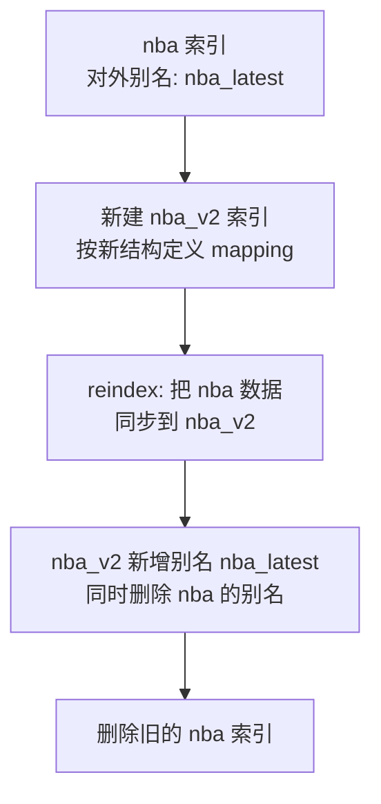

---
{"dg-publish":true,"permalink":"/01.专项学习/ES学习/ES索引别名/","dg-note-properties":{"时间":"2026-03-23"}}
---

#ES #索引别名 #Elasticsearch #零停机

```ad-summary
title: 总结

- 索引别名是指向真实索引的快捷方式，对外暴露别名，内部可以随时切换索引
- 核心用途：零停机重建索引（改字段类型、调整分片数等）
- 多个索引可以共享一个别名，写入时需要指定 `is_write_index`
```

## 1. 别名是什么？

别名就是给索引起个外号。对外暴露别名，内部真实索引可以随时换，业务代码不用改。

常见场景：
- 索引需要重建（改字段类型、调整分片数）
- 多个索引合并查询（比如按月分索引的日志）

## 2. 基本操作

**查询别名**
```
GET /nba/_alias
```

**新增 / 删除别名**
```
POST /_aliases
```
```json
{
  "actions": [
    {
      "add": {
        "index": "nba",
        "alias": "nba_latest",
        "is_write_index": true
      }
    },
    {
      "remove": {
        "index": "nba_old",
        "alias": "nba_latest"
      }
    }
  ]
}
```

多个索引共享同一个别名时，**必须指定 `is_write_index: true`** 标记写入索引，否则写入会报错。查询时会同时查所有关联索引，如果有相同 ID 的文档会出问题。

## 3. 零停机重建索引

这是别名最核心的用途，流程如下：



**第一步**：给现有索引加别名，业务切到别名访问
```
POST /_aliases
```
```json
{
  "actions": [
    { "add": { "index": "nba", "alias": "nba_latest", "is_write_index": true } }
  ]
}
```

**第二步**：新建索引，按新结构定义 mapping

**第三步**：reindex 迁移数据（异步执行，数据量大时加 `?wait_for_completion=false`）
```
POST /_reindex?wait_for_completion=false
```
```json
{
  "source": {
    "index": "nba"
  },
  "dest": {
    "index": "nba_v2"
  }
}
```

**第四步**：原子切换别名
```json
{
  "actions": [
    { "add": { "index": "nba_v2", "alias": "nba_latest", "is_write_index": true } },
    { "remove": { "index": "nba", "alias": "nba_latest" } }
  ]
}
```

**第五步**：确认没问题后删除旧索引
```
DELETE /nba
```

## 4. 面试相关

索引别名是 ES 零停机重建索引的核心方案，如果你被问到索引设计或数据迁移，可以重点准备 [[01.专项学习/ES学习/ES面试题\|ES面试题]] 中的分片设计、数据迁移相关问题。
