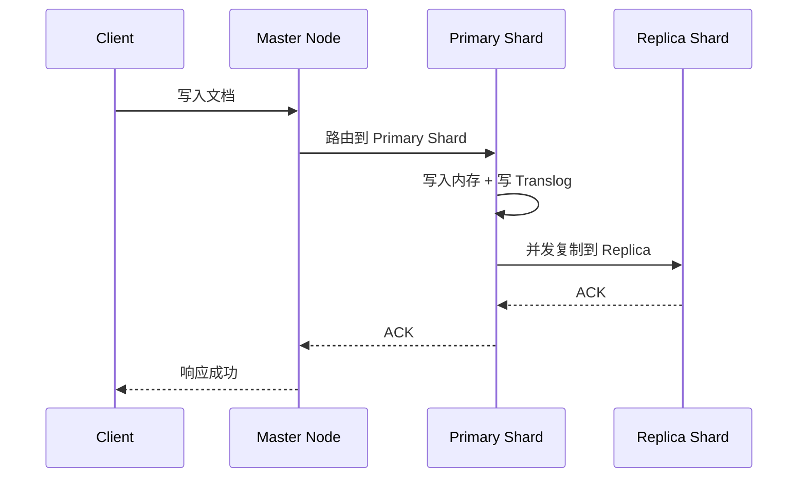
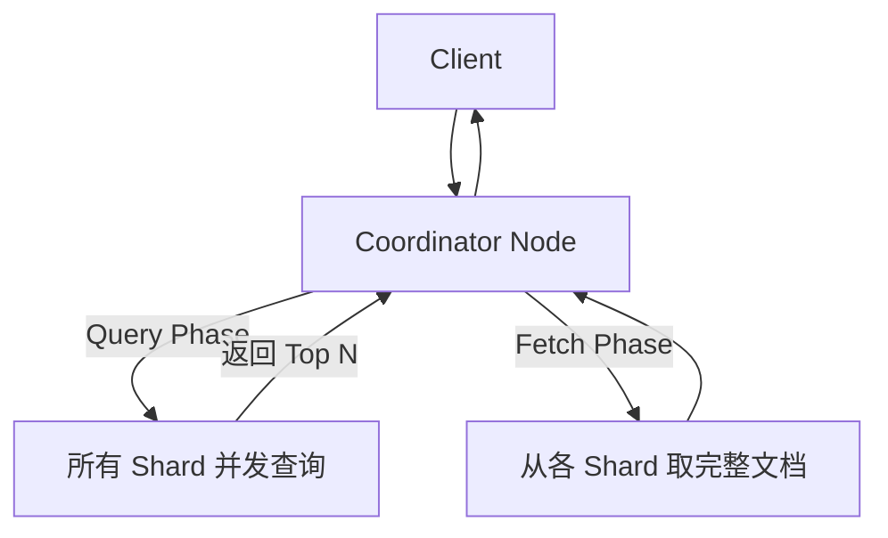

---
{"dg-publish":true,"permalink":"/01.专项学习/ES学习/ES面试题/","dg-note-properties":{"时间":"2026-03-23"}}
---

#ES #Elasticsearch #面试题

```ad-summary
title: 总结

- 倒排索引是 ES 快的核心，分片 + 副本实现分布式和高可用
- 文档写入流程：Primary Shard → Replica 复制 → 响应客户端
- 调优思路：减少分片数、预热 PageCache、使用 SSD
```

## 1. 基础概念

### 1.1 ES 是什么？和 Lucene 什么关系？

Elasticsearch 是基于 Lucene 的分布式搜索引擎，本质上是对 Lucene 的封装：

- **Lucene**：单机器的搜索引擎库，提供倒排索引、搜索核心功能
- **ES**：在 Lucene 基础上加了分布式能力（分片、副本、集群管理）、REST API、聚合分析等

### 1.2 为什么要用 ES？ES 和 MySQL 的区别？

MySQL 的 LIKE 查询是全表扫描，ES 用倒排索引，查"关键词"时直接定位到文档 ID：

| 对比 | MySQL | ES |
|------|-------|-----|
| 查询方式 | LIKE 全表扫描 | 倒排索引 |
| 性能 | 数据量大时慢 | 支持亿级数据毫秒级响应 |
| 用途 | 事务、关联查询 | 全文搜索、聚合分析 |

### 1.3 ES 的核心概念？

| 概念 | 说明 |
|------|------|
| Index | 索引，相当于数据库 |
| Document | 文档，相当于一行数据 |
| Mapping | 映射，相当于表结构 |
| Shard | 分片，数据的物理分片 |
| Replica | 副本，分片的备份 |

详见 [[01.专项学习/ES学习/ES核心概念\|ES核心概念]]。

### 1.4 ES 的分布式架构？

ES 天生分布式：

- **Cluster**：多个 Node 组成
- **Node**：物理机器，分 Master Node（管理）、Data Node（存数据）
- **Shard**：Primary Shard + Replica Shard，分布在不同 Node 上

详见 [[01.专项学习/ES学习/ES核心概念#3. 分布式架构\|ES核心概念#3. 分布式架构]]。

## 2. 倒排索引

### 2.1 什么是倒排索引？

普通索引是"文档 ID → 词"，倒排索引是"词 → 文档 ID 列表"。

搜"火箭"时，直接从倒排索引找到包含"火箭"的文档 ID 列表，不用遍历全表。

### 2.2 倒排索引的结构？

倒排索引由两部分组成：
- **词典（Terms Dictionary）**：所有 Term 的列表，按字母排序
- **倒排列表（Postings List）**：每个 Term 对应的文档 ID 列表，还包含词频、位置等信息

### 2.3 分词器的作用？

分词器负责把文本拆成 Term，写入时建倒排索引，查询时先分词再匹配。

详见 [[01.专项学习/ES学习/分词器介绍\|分词器介绍]]。

中文分词需要安装 IK 等插件，详见 [[01.专项学习/ES学习/分词器介绍#2. 中文分词器\|分词器介绍#2. 中文分词器]]。

### 2.4 文档写入流程？



注意：写入 Primary Shard 后同步到 Replica，不是同步到所有 Replica 才返回。

## 3. 分片与副本

### 3.1 为什么要分片？

- **横向扩展**：数据量大时加分片，把数据分散到多台机器
- **并行查询**：查询可以同时搜多个分片，结果汇总

### 3.2 副本的作用？

- **高可用**：Primary 挂了，Replica 顶上来
- **提升查询吞吐**：查询可以路由到任意副本

### 3.3 文档路由到哪个分片？

`shard_num = hash(_routing) % num_primary_shards`

默认 `_routing` 是文档 ID，也可以自定义。

> **重要**：主分片数一旦确定就不能改，改了会导致数据查询不到。建索引时要规划好分片数。

## 4. 搜索原理

### 4.1 搜索流程？



分两个阶段：
- **Query Phase**：并发搜所有分片，返回匹配的文档 ID + 分数
- **Fetch Phase**：根据 ID 取完整文档，返回给客户端

### 4.2 搜索性能为什么快？

1. **倒排索引**：词直接对应文档，不用全表扫描
2. **并行查询**：多个分片同时搜
3. **Top N 优化**：每个分片只返回 Top N，不是全部

### 4.3 为什么 ES 不适合做存储？

- **不支持事务**：ES 是最终一致性，没有 ACID
- **不支持关联查询**：不能 JOIN，不能跨索引关联
- **不支持强一致**：写入可以不等所有副本确认

详见 [[01.专项学习/ES学习/映射的操作\|映射的操作]]。

## 5. 写入原理

### 5.1 写入流程？

1. 写入内存 Buffer（默认 1 秒刷新到文件系统缓存）
2. 写 Translog（保证不丢数据）
3. refresh：刷新到文件系统缓存，变成可搜索
4. flush：定期刷到磁盘，删除 Translog

### 5.2 为什么 ES 写入这么慢？

ES 默认 1 秒 refresh 一次，不是写入即搜。

如果需要立即搜到，可以调小 refresh_interval：
```json
PUT /my_index/_settings
{
  "refresh_interval": "100ms"
}
```

但频繁 refresh 会影响写入性能，需要权衡。

### 5.3 什么是 Translog？

类似 MySQL 的 Binlog，保证写入不丢数据。

写入流程：先写 Translog 再返回成功，即使机器挂了也能从 Translog 恢复。

### 5.4 merge 是什么？

ES 定期把多个小 Segment 合并成大 Segment，删除重复数据。

后台自动执行，详见 [[01.专项学习/ES学习/ES核心概念\|ES核心概念]]。

## 6. 调优与面试题

### 6.1 写入性能怎么优化？

- **批量写入**：用 Bulk API，每次 1000~5000 条
- **减少副本数**：写入时只同步 1 个副本，查询再加副本
- **禁用 refresh**：写入期间关闭 refresh，写完再开
- **使用 SSD**：机械硬盘会成为瓶颈

### 6.2 查询性能怎么优化？

- **减少分片数**：分片越多查询越慢，默认 5 个，可以根据数据量调
- **预热**：对热门查询用 Pre-search cache
- **使用 filter**：filter 不打分，比 match 快
- **禁止 wildcard**：`%abc%` 这种查询无法用倒排索引，尽量避免

### 6.3 分片数怎么设计？

- **数据量**：一般每个分片 30~50GB 比较合理
- **查询并发**：分片多可以并行查，但也不是越多越好
- **集群规模**：小集群（3~5 节点）设 3~5 个主分片，大集群可以适当增加

> **原则**：分片数宁少勿多，后期可以通过 Reindex 调整。

### 6.4 常见面试题汇总

| 类别 | 问题 |
|------|------|
| 基础 | ES 和 Lucene 的关系 |
| 基础 | ES 和 MySQL 的区别 |
| 原理 | 倒排索引是什么 |
| 原理 | 文档写入流程 |
| 原理 | 搜索流程（Query + Fetch） |
| 原理 | Translog 的作用 |
| 集群 | 分片和副本的区别 |
| 集群 | 分片数为什么不能改 |
| 调优 | 写入性能怎么优化 |
| 调优 | 查询性能怎么优化 |
| 调优 | 分片数怎么设计 |

## 7. 常见问题

### 7.1 文档 ID 怎么生成的？

两种方式：
- **自动生成**：POST /index/_doc，自动生成 UUID
- **指定 ID**：PUT /index/_doc/1，自己指定

### 7.2 怎么保证数据不丢？

- 写入时等 Primary 和 Replica 都写完（wait_for_active_shards）
- 定期 snapshot 备份

### 7.3 集群脑裂问题？

多个 Node 都认为自己是 Master。

解决：设置 `minimum_master_nodes = (master_nodes / 2) + 1`，避免多个 Master。

### 7.4 为什么搜不到刚写入的数据？

ES 默认 1 秒 refresh 一次，写入后 1 秒才能搜到。

可以手动刷新：
```
POST /index/_refresh
```
