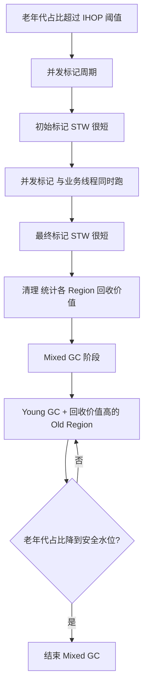

---
{"dg-publish":true,"permalink":"/01.专项学习/JavaVirtualMachine/6.G1垃圾回收器/"}
---

#jvm #gc #g1

```ad-summary
title: 总结

- G1 把堆拆成等大的 Region，不再是连续的年轻代/老年代，靠回收价值优先策略控制停顿时间
- Young GC 回收年轻代，Mixed GC 同时回收年轻代 + 部分老年代，Full GC 是兜底
- 核心调优参数只有三个：`-XX:MaxGCPauseMillis`、`-XX:G1HeapRegionSize`、`-XX:InitiatingHeapOccupancyPercent`
- 停顿时间目标设太激进会适得其反，200ms 是个合理起点
- 堆超过 16G 且停顿要求更严格，考虑升级到 [[01.专项学习/JavaVirtualMachine/5.ZGC学习\|5.ZGC学习]]
```


## 1. G1 和传统 GC 的区别

传统的 ParNew + CMS 把堆物理上分成年轻代和老年代两块连续区域，年轻代满了触发 Young GC，老年代满了触发 Full GC，停顿时间和堆大小强相关，堆越大停顿越长。

G1（Garbage First）把整个堆切成 2048 个等大的 Region，每个 Region 逻辑上扮演 Eden、Survivor 或 Old 的角色，但物理上可以不连续。GC 时优先回收"垃圾最多、回收价值最高"的 Region，在可控的停顿时间内尽量多回收内存。

传统 GC 的详细对比见 [[01.专项学习/JavaVirtualMachine/3.垃圾回收#4.1 ParNew + CMS（JDK 8 常用）\|3.垃圾回收#4.1 ParNew + CMS（JDK 8 常用）]]。

## 2. Region 模型

```
堆内存（比如 8G）
┌──────────────────────────────────────────────┐
│ E  E  E  S  S  O  O  O  E  H  O  E  S  O  … │
└──────────────────────────────────────────────┘
  E=Eden  S=Survivor  O=Old  H=Humongous（大对象）
```

- Region 大小由 `-XX:G1HeapRegionSize` 控制，范围 1M~32M，必须是 2 的幂
- 默认值 = 堆大小 / 2048，比如 8G 堆默认 Region 大小 = 4M
- 大对象（超过 Region 大小 50%）直接分配到 Humongous Region，可能跨多个连续 Region

## 3. GC 类型

### 3.1 Young GC

只回收 Eden 和 Survivor Region，存活对象复制到新的 Survivor 或晋升 Old。触发条件：Eden Region 用完。

这个阶段是 STW 的，停顿时间通常几十毫秒，G1 会根据 `MaxGCPauseMillis` 动态调整年轻代 Region 数量来控制停顿。

### 3.2 Mixed GC

同时回收年轻代 + 部分老年代 Region。触发条件：老年代占堆的比例超过 `InitiatingHeapOccupancyPercent`（默认 45%）。

Mixed GC 分两个阶段：



### 3.3 Full GC

G1 的兜底机制，单线程 Serial Old，停顿时间很长。触发场景：

- 并发标记期间老年代空间不足（对象分配速度 > 回收速度）
- Mixed GC 后老年代仍然不够用
- Humongous 对象分配失败

**Full GC 是需要极力避免的**，出现 Full GC 说明 G1 的并发回收跟不上分配速度，需要调参或扩内存。

## 4. 核心参数详解

### 4.1 停顿时间目标

```bash
-XX:MaxGCPauseMillis=200   # 默认 200ms
```

G1 会根据这个目标动态调整年轻代大小和每次 Mixed GC 回收的 Old Region 数量。

注意：这是个"尽力而为"的目标，不是硬保证。设太小（比如 50ms）反而会让 G1 频繁 GC、吞吐量下降。一般建议：
- 延迟敏感型应用：100~200ms
- 吞吐量优先型应用：200~500ms

### 4.2 Region 大小

```bash
-XX:G1HeapRegionSize=4m   # 建议显式设置，不依赖自动计算
```

Region 太小：Region 数量多，管理开销大，大对象容易变成 Humongous。
Region 太大：回收粒度粗，停顿时间难以控制。

经验值：堆 4G 以下用 2M，4~8G 用 4M，8G 以上用 8M 或 16M。

### 4.3 Mixed GC 触发阈值

```bash
-XX:InitiatingHeapOccupancyPercent=45   # 默认 45%
```

老年代占整个堆的比例超过这个值，触发并发标记周期，进而触发 Mixed GC。

调低（比如 30%）：更早触发 Mixed GC，老年代压力小，但 GC 更频繁。
调高（比如 60%）：减少 GC 频率，但老年代压力大，容易触发 Full GC。

### 4.4 其他常用参数

```bash
-XX:G1MixedGCCountTarget=8          # 一次并发标记后，分几次 Mixed GC 完成回收，默认 8
-XX:G1HeapWastePercent=5            # 老年代可回收垃圾低于 5% 时停止 Mixed GC，默认 5%
-XX:G1OldCSetRegionThresholdPercent=10  # 每次 Mixed GC 最多回收老年代 Region 的比例，默认 10%
-XX:ConcGCThreads=4                 # 并发标记线程数，默认 CPU核数/4
```

## 5. 生产环境推荐配置

### 5.1 通用模板（JDK 11+）

```bash
-XX:+UseG1GC
-Xms8g -Xmx8g                              # 堆大小固定，避免动态扩缩
-XX:G1HeapRegionSize=4m
-XX:MaxGCPauseMillis=200
-XX:InitiatingHeapOccupancyPercent=40       # 比默认值低一点，更早触发 Mixed GC
-XX:G1MixedGCCountTarget=8
-XX:G1HeapWastePercent=5
-XX:ConcGCThreads=4
-XX:+ParallelRefProcEnabled                # 并行处理引用，减少 STW 时间
-XX:+UnlockExperimentalVMOptions
-XX:G1NewSizePercent=20                    # 年轻代最小占比 20%
-XX:G1MaxNewSizePercent=40                 # 年轻代最大占比 40%
```

### 5.2 GC 日志（必须开启，用于排查问题）

```bash
# JDK 9+
-Xlog:gc*:file=/logs/gc.log:time,uptime,level,tags:filecount=10,filesize=50m

# JDK 8
-XX:+PrintGCDetails -XX:+PrintGCDateStamps
-Xloggc:/logs/gc.log
-XX:+UseGCLogFileRotation -XX:NumberOfGCLogFiles=10 -XX:GCLogFileSize=50m
```

### 5.3 大堆场景（16G+）

```bash
-XX:+UseG1GC
-Xms16g -Xmx16g
-XX:G1HeapRegionSize=8m                    # Region 调大
-XX:MaxGCPauseMillis=300
-XX:InitiatingHeapOccupancyPercent=35
-XX:ConcGCThreads=8
```

堆超过 32G 且停顿要求在 10ms 以内，建议直接上 [[5.ZGC学习]]。

## 6. 常见问题排查

### 6.1 频繁 Full GC

先看 GC 日志确认是哪种 Full GC：

```
[GC pause (G1 Evacuation Pause)]   → 正常 Young/Mixed GC
[Full GC (Allocation Failure)]     → 分配失败，内存不够
[Full GC (Ergonomics)]             → G1 自己判断需要 Full GC
```

排查方向：
- `Allocation Failure`：堆太小或对象分配速度太快，先扩堆
- 并发标记跟不上：调低 `InitiatingHeapOccupancyPercent`，更早开始并发标记
- Humongous 对象太多：用 `-XX:+G1TraceHumongousAllocation` 找出大对象，看能否拆分

### 6.2 Young GC 停顿过长

年轻代 Region 太多，每次 Young GC 要扫描的 Region 多。

```bash
-XX:G1NewSizePercent=10    # 调小年轻代最小占比
-XX:G1MaxNewSizePercent=30 # 调小年轻代最大占比
```

### 6.3 Mixed GC 不触发

老年代一直涨但没有触发 Mixed GC，通常是 `InitiatingHeapOccupancyPercent` 设太高了，或者并发标记线程数不够。

```bash
-XX:InitiatingHeapOccupancyPercent=30   # 调低触发阈值
-XX:ConcGCThreads=6                     # 增加并发标记线程
```

## 7. G1 vs CMS vs ZGC

| 对比项 | CMS | G1 | ZGC |
|--------|-----|-----|-----|
| 适用 JDK | 8 | 9+ | 15+（生产可用） |
| 堆大小 | < 4G | 4G~32G | 不限 |
| 停顿时间 | 几十~几百 ms | 可控，通常 < 200ms | < 10ms |
| 吞吐量 | 高 | 高 | 略低（读屏障开销） |
| 内存碎片 | 有 | 无 | 无 |
| 调优难度 | 高 | 中 | 低 |
| Full GC | 有 | 有（概率低） | 极少 |

调优参数细节见 [[01.专项学习/JavaVirtualMachine/4.JVM调优\|4.JVM调优]]。

