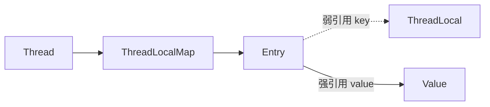

---
{"dg-publish":true,"permalink":"/01.专项学习/Java并发编程实战-极客/11.ThreadLocal/"}
---

#原理 #锁 #线程通信

```ad-summary
title: 总结

- ThreadLocal 让每个线程持有自己的变量副本，以空间换安全，避免加锁
- JDK 8 改为 Thread 持有 ThreadLocalMap，线程销毁时 Map 随之回收
- key 是弱引用，value 是强引用，不手动 remove() 就会内存泄漏
- 线程池中线程复用，任务结束必须 remove()，否则数据污染
```

## 1. 是什么

每个线程持有自己的变量副本，线程间互不影响，以**空间换安全性**，避免同步。这是 [[01.专项学习/Java并发编程实战-极客/10.并发设计模式#线程本地存储模式（Thread Local Storage）\|线程本地存储模式]] 的具体实现。

```java
private static final ThreadLocal<Integer> threadLocal = new ThreadLocal<>();
threadLocal.set(10);
// 其他线程 get() 返回 null，互不影响
```

## 2. 内部结构（JDK 8）

每个 `Thread` 内部维护一个 `ThreadLocalMap`，**key 是 ThreadLocal 对象本身**，value 是存储的值。

- 底层是数组，用**线性探测法**解决 Hash 冲突
- Hash 值通过魔数 `0x61c88647` 累加，分布均匀

JDK 8 之前是 ThreadLocal 维护一个 Map，key 是 Thread，线程数多的时候线程销毁后 key 变悬空引用，内存利用率低。
JDK 8 改为 Thread 持有 Map，线程销毁时整个 Map 随之回收。

## 3. 为什么会内存泄漏？

`ThreadLocalMap` 的 Entry 结构：



ThreadLocal 对象被 GC 回收后，key 变为 null，但 value 还被 Entry 强引用着，**访问不到却回收不了**，就泄漏了。

就算 ThreadLocal 没被回收，只要线程一直活着，Entry 也不会被回收，同样泄漏。

根本原因是 ThreadLocalMap 的生命周期跟 Thread 一样长，不手动删就一直在。

**解决办法**：用完调 `threadLocal.remove()`。

## 4. 线程池里要特别注意

[[66.归档发布/04.并发/线程池ThreadPoolExecutor\|线程池]] 里线程会复用，上一个任务设的值可能被下一个任务读到，数据污染且内存泄漏。**任务结束时务必 `remove()`**。
