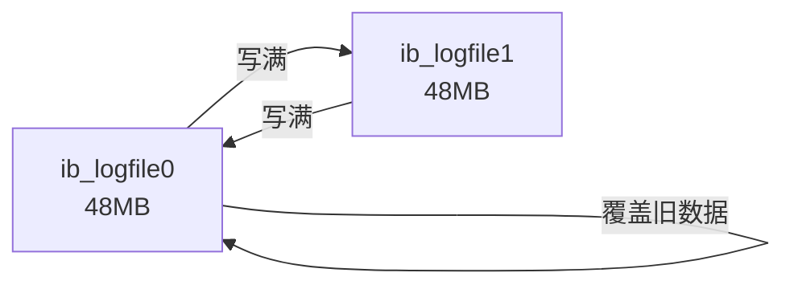
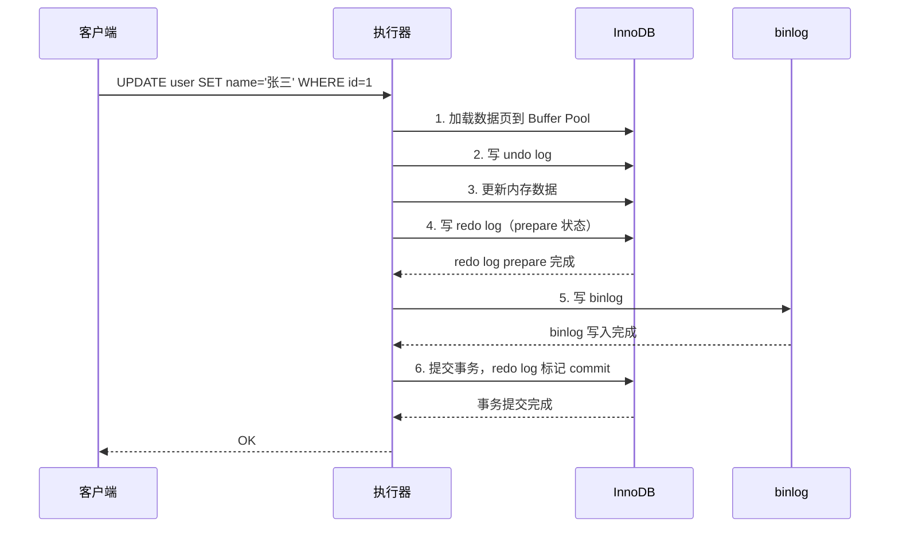

---
{"dg-publish":true,"permalink":"/01.专项学习/MySQL实战高手/04-日志系统/","dg-note-properties":{"时间":"2026-03-22"}}
---

#mysql #数据库 #日志

```ad-summary
title: 总结

- redo log 是物理日志，记录"数据页改了什么"，用于崩溃恢复
- undo log 用于事务回滚和 MVCC，记录修改前的旧值
- binlog 是逻辑日志，记录"执行了什么 SQL"，用于主从复制和数据恢复
- 二阶段提交（prepare + commit）保证 redo log 和 binlog 的一致性
- redo log 刷盘策略建议设为 1，binlog 同步策略建议设为 1
```

## 1. MySQL 有哪些日志？

| 日志 | 所属层 | 类型 | 作用 |
|------|--------|------|------|
| redo log | InnoDB | 物理日志 | 崩溃恢复 |
| undo log | InnoDB | 逻辑日志 | 事务回滚、MVCC |
| binlog | Server | 逻辑日志 | 主从复制、数据恢复 |
| slow query log | Server | - | 慢查询记录 |
| error log | Server | - | 错误日志 |

## 2. redo log

### 2.1 为什么需要 redo log？

更新操作是在 [[01.专项学习/MySQL实战高手/02-BufferPool与内存管理\|Buffer Pool]] 的缓存页里改的，改完不会马上刷回磁盘。万一这时候宕机了，内存里的修改就丢了。

redo log 就是解决这个问题的：**事务提交时，先把修改记录写入 redo log 日志文件**。MySQL 重启后，根据 redo log 重做一遍，数据就恢复了。

关键点：redo log 是**顺序写**，直接刷缓存页回磁盘是**随机写**，顺序写快得多。这就是 WAL（Write-Ahead Logging）的核心思想。

### 2.2 redo log 记录了什么？

记录的是物理层面的修改信息：

```
日志类型 + 表空间号 + 数据页号 + 偏移量 + 修改字节数 + 具体值
```

| 类型 | 说明 |
|------|------|
| MLOG_1BYTE | 修改了 1 个字节 |
| MLOG_2BYTE | 修改了 2 个字节 |
| MLOG_4BYTE | 修改了 4 个字节 |
| MLOG_8BYTE | 修改了 8 个字节 |
| MLOG_WRITE_STRING | 写入一串值 |

### 2.3 redo log block 和 buffer

redo log 不是直接写文件的，而是先写到 **block** 里，每个 block 512 字节：

| 区域 | 大小 | 说明 |
|------|------|------|
| header | 12 字节 | block_no、data_length、first_record_group、checkpoint_no |
| body | 496 字节 | 实际日志数据 |
| trailer | 4 字节 | 校验信息 |

内存中有一块 **redo log buffer**（默认 16MB），里面存放着多个 block。


### 2.4 redo log 什么时候刷盘？

| 时机 | 说明 |
|------|------|
| buffer 占用过半 | redo log buffer 超过总容量一半 |
| 事务提交 | 该事务的所有 redo log block 都刷盘 |
| 后台定时任务 | 每隔 1 秒刷一次 |
| MySQL 关闭 | 正常关闭时刷盘 |

### 2.5 磁盘文件怎么组织？

默认两个文件（`ib_logfile0` 和 `ib_logfile1`），每个 48MB，共 96MB。**循环写**：file0 写满写 file1，file1 写满覆盖 file0。



## 3. undo log

### 3.1 用途

- **事务回滚**：事务失败时，根据 undo log 恢复到修改前的状态
- **MVCC**：多版本并发控制，让读操作不用阻塞写操作

### 3.2 长什么样？

以 insert 的 undo log 为例，类型是 `TRX_UNDO_INSERT_REC`，包含：

- 日志开始位置
- 主键各列的长度和值
- 表 ID
- undo log 编号和类型
- 日志结束位置

回滚时，根据表 ID + 主键找到对应的缓存页，删除插入的数据就行。

undo log 本身也存在 Buffer Pool 里，它的修改也会产生 redo log（undo log 也需要崩溃恢复保护）。

## 4. binlog

### 4.1 binlog 是什么？

binlog 是 **MySQL Server 层**的日志，记录的是逻辑操作：

- **Statement 格式**：记录 SQL 语句原文
- **Row 格式**：记录每一行数据的变化（修改前的值、修改后的值）
- **Mixed 格式**：MySQL 自动选择 Statement 或 Row

### 4.2 binlog 的作用

1. **主从复制**：从库通过 binlog 同步主库的数据变更
2. **数据恢复**：误删数据可以用 binlog 回放到某个时间点

### 4.3 binlog 刷盘策略

通过 `sync_binlog` 控制：

| 值 | 行为 | 适用场景 |
|---|------|---------|
| 0（默认） | 写入 OS cache，由 OS 刷盘 | 性能优先 |
| 1 | 每次事务提交都强制落盘 | 安全优先 |

**建议**：生产环境设为 1，和 redo log 配合保证数据不丢。

## 5. 二阶段提交（重点）

### 5.1 为什么需要二阶段提交？

一个更新事务要同时写 redo log 和 binlog。如果只写了一个就宕机，会导致两个日志不一致：

- **redo log 有，binlog 没有**：重启恢复了数据，但从库没同步到，主从不一致
- **binlog 有，redo log 没有**：从库同步了数据，但主库重启后丢了，主从不一致

**二阶段提交**就是为了解决这个问题，保证 redo log 和 binlog 要么都有，要么都没有。

### 5.2 执行流程



### 5.3 崩溃恢复怎么判断？

重启时根据 redo log 和 binlog 的状态决定：

| redo log 状态 | binlog 是否存在 | 处理 |
|--------------|----------------|------|
| prepare | 存在 | 提交事务（说明 binlog 已写完） |
| prepare | 不存在 | 回滚事务（说明 binlog 没写完） |
| commit | - | 已提交，无需处理 |

这样就保证了 redo log 和 binlog 的一致性。

### 5.4 刷盘策略组合

| redo log | binlog | 安全性 | 性能 |
|----------|--------|--------|------|
| 1 | 1 | 最安全 | 最慢 |
| 1 | 0 | 主库安全，从库可能丢数据 | 中等 |
| 0 | 1 | 可能丢 1 秒数据 | 中等 |
| 0 | 0 | 最危险 | 最快 |

**生产环境建议**：`innodb_flush_log_at_trx_commit=1` + `sync_binlog=1`

## 6. 各日志对比总结

| 对比项 | redo log | undo log | binlog |
|--------|----------|----------|--------|
| 所属层 | InnoDB | InnoDB | Server |
| 日志类型 | 物理日志 | 逻辑日志 | 逻辑日志 |
| 记录内容 | 数据页的修改 | 修改前的旧值 | SQL 或行变更 |
| 用途 | 崩溃恢复 | 事务回滚、MVCC | 主从复制、数据恢复 |
| 写入方式 | 循环写 | 追加写 | 追加写 |
| 是否可关闭 | 不可 | 不可 | 可以（但不建议） |