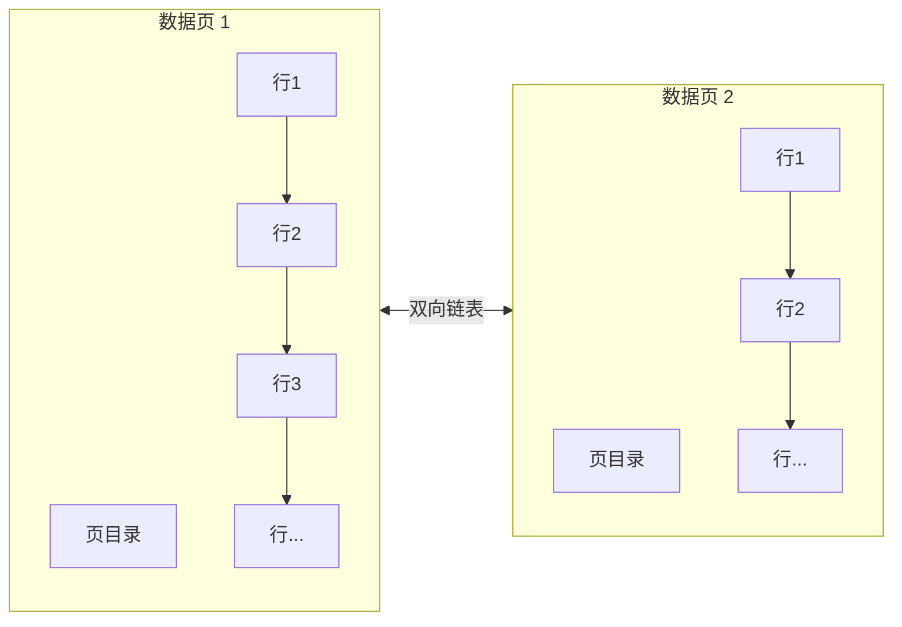
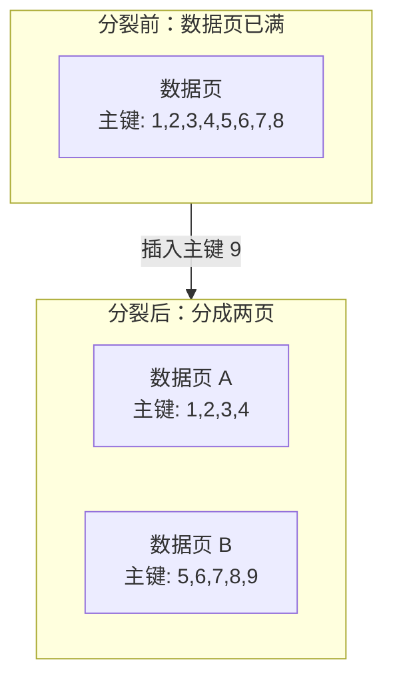
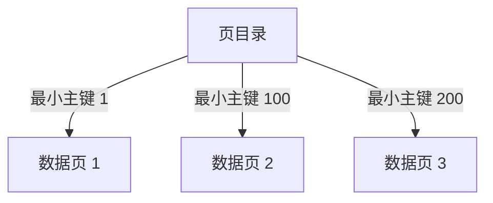
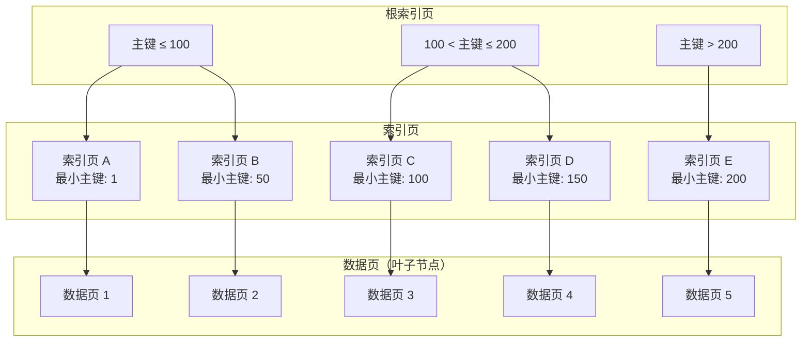
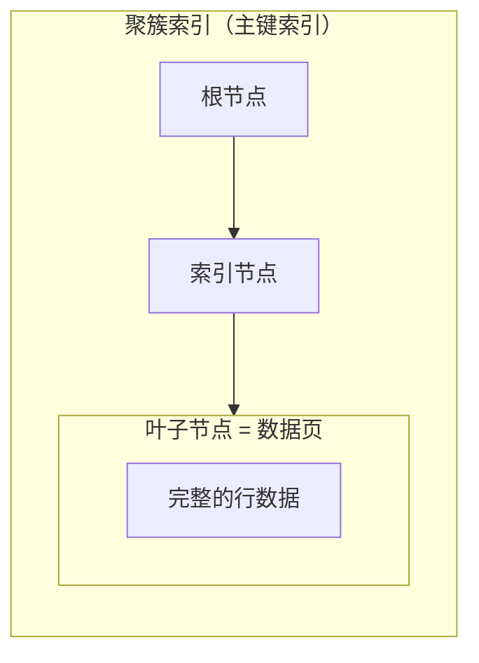
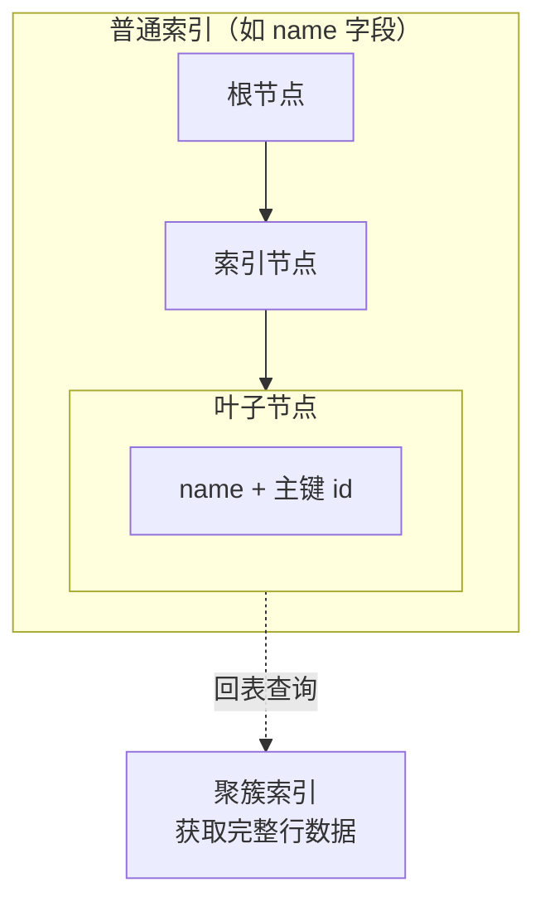

---
{"dg-publish":true,"permalink":"/01.专项学习/MySQL实战高手/06-索引原理/","dg-note-properties":{"时间":"2026-03-22"}}
---

#mysql #数据库 #索引

```ad-summary
title: 总结

- 数据页之间用双向链表连接，页内数据用单向链表+页目录组织，主键查询走二分查找
- 数据满了会发生页分裂，自增主键能避免随机插入导致的频繁分裂
- B+树是索引的核心结构：根节点 → 索引页 → 数据页，亿级大表也就 3-4 层
- 聚簇索引叶子节点就是数据本身，普通索引叶子节点存主键，需要回表
- 联合索引遵循最左前缀原则，order by 也能利用索引的有序性
- 覆盖索引避免回表，是优化查询的重要手段
```

## 1. 数据页怎么存的？

InnoDB 数据按页组织，每页 16KB：



- **数据页之间**：双向链表连接
- **页内数据行**：单向链表串起来
- **页目录**：按主键分槽，支持二分查找

按主键查询时，先在页目录里二分查找定位到槽位，再在槽位内遍历。没有索引就得全表扫描，一行行找，效率极低。

## 2. 页分裂

数据页满了再插入新数据，就要**页分裂**——把一个页拆成两个，保证后一个页的主键值都比前一个大。



所以**推荐用自增主键**：新插入的数据主键总是最大的，直接往最后一个页追加就行，不用分裂、不用移动数据。如果用随机值做主键，插入时可能要插到中间，频繁触发页分裂，性能差很多。

## 3. 主键索引怎么找数据？

每个数据页有一个最小主键值，把这些信息收集起来就是**页目录**（主键索引）：



查询 id=150 时，先在页目录里二分查找，定位到数据页 2，再在页 2 内部查找。

## 4. B+ 树是怎么组织的？

页目录多了之后，一层放不下，就再加一层索引页，形成 **B+ 树**：



**查找 id=46 的过程**：
1. 根索引页 35：46 ≤ 100，走左边
2. 索引页 28：46 在 1-99 范围，找到页号 8
3. 数据页 8：二分查找，定位数据

即使亿级大表，B+ 树也就 3-4 层，几次 IO 就能定位到数据。

## 5. 聚簇索引 vs 普通索引

### 5.1 聚簇索引

叶子节点就是**数据页本身**，索引和数据放在一起。



一张表只有一个聚簇索引，就是主键索引。

### 5.2 普通索引（二级索引）

叶子节点只存**索引字段 + 主键值**，不存完整数据。



用普通索引查到主键后，还要**回表**——再去聚簇索引查完整数据。如果索引已经包含了需要的所有字段，就不需要回表（见第 7 节覆盖索引）。

## 6. 联合索引的匹配规则

多个字段组成的联合索引，遵循**最左前缀原则**：

| 规则 | 示例 | 能否命中 |
|------|------|---------|
| 等值匹配 | `WHERE a=1 AND b=2 AND c=3` | ✓ 字段名和顺序与索引一致 |
| 最左侧列匹配 | `WHERE a=1` 或 `WHERE a=1 AND b=2` | ✓ 用了最左边的部分字段 |
| 最左前缀匹配 | `WHERE name LIKE '张%'` | ✓ 字符串前缀匹配 |
| 范围查找 | `WHERE a>1 AND a<10` | ✓ 范围字段命中索引 |
| 等值+范围 | `WHERE a=1 AND b>2 AND c=3` | 部分命中：a 精确匹配，b 范围扫描，c 逐行过滤 |

**注意**：跳过中间字段（`WHERE a=1 AND c=3`，跳过 b）或顺序不对（`WHERE b=2 AND a=1`），可能无法完全命中索引。

## 7. Order By / Group By 怎么用索引？

联合索引的字段值在 B+ 树里是**从小到大有序排列**的，所以排序可以利用索引：

| 写法 | 能否用索引 |
|------|-----------|
| `ORDER BY a, b, c` | ✓ |
| `ORDER BY a DESC, b DESC, c DESC` | ✓ |
| `ORDER BY a ASC, b DESC` | ✗ 方向不一致 |
| `ORDER BY a, d`（d 不在索引中） | ✗ |

Group By 同理，本质也是排序分组。

**经验**：设计联合索引时，把等值查询的字段放前面，范围查询的放后面，order by 的字段也考虑进去。

## 8. 覆盖索引

如果查询需要的字段**都在索引里**，就不用回表，直接从索引树里拿数据返回。这就是**覆盖索引**。

```sql
-- 联合索引 (name, age)
SELECT name, age FROM user WHERE name = '张三';
-- 命中覆盖索引，不回表

SELECT * FROM user WHERE name = '张三';
-- 需要回表拿其他字段
```

覆盖索引是优化查询的重要手段，能减少 IO，提升性能。