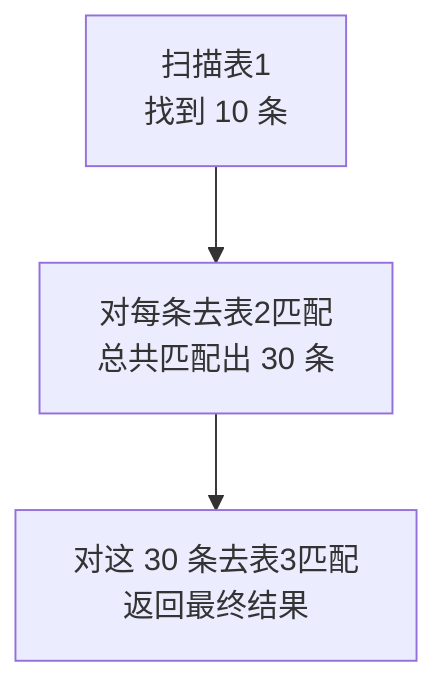

---
{"dg-publish":true,"permalink":"/01.专项学习/MySQL实战高手/08-执行计划分析/","dg-note-properties":{"时间":"2026-03-22"}}
---

#mysql #数据库 #调优 #执行计划

```ad-summary
title: 总结

- EXPLAIN 各字段重点关注：type（访问类型）、key（用到的索引）、rows（扫描行数）、Extra（额外信息）
- type 从好到差：const > ref > range > index > ALL，尽量避免 ALL
- 关联查询用嵌套循环，驱动表的数据量直接影响性能
- 调优核心：消灭全表扫描，保证每个步骤都能基于索引执行
```

## 1. EXPLAIN 怎么用？

SQL 语句前加 `EXPLAIN` 就能看到执行计划：

```sql
EXPLAIN SELECT * FROM user WHERE id = 1;
```

返回一张表，每行代表一个查询步骤（多表关联会有多个步骤）。

## 2. 各字段详解

### 2.1 id

查询序号，id 相同表示同一层级（多表关联），id 不同表示有子查询，id 大的先执行。

### 2.2 select_type

| 值 | 含义 |
|---|------|
| SIMPLE | 简单查询，没有子查询或 UNION |
| PRIMARY | 最外层的查询 |
| SUBQUERY | SELECT 或 WHERE 中的子查询 |
| DERIVED | FROM 子句中的子查询（派生表） |
| UNION | UNION 中第二个及之后的 SELECT |
| UNION RESULT | UNION 的结果集 |

### 2.3 table

这一步访问的表名，或者派生表的别名。

### 2.4 partitions

匹配的分区，没分区表通常为 NULL。

### 2.5 type（重点）

访问类型，**最重要的字段之一**，从好到差：

| 值 | 含义 | 说明 |
|---|------|------|
| const | 主键/唯一索引等值匹配 | 最快，一次命中 |
| eq_ref | 多表关联时，用主键/唯一索引关联 | 每次只匹配一行 |
| ref | 普通索引等值匹配 | 可能匹配多行 |
| range | 索引范围查找 | `>`、`<`、`BETWEEN`、`IN` 等 |
| index | 扫描整个二级索引树 | 比 ALL 好一点，但也不理想 |
| ALL | 全表扫描 | 最差，必须优化 |

**底线**：至少到 `range`，最好到 `ref`。出现 `ALL` 一定要想办法消灭。

### 2.6 possible_keys

可能用到的索引（MySQL 认为可能用到的），最终实际用哪个看 `key` 字段。

### 2.7 key

**实际使用的索引**。NULL 表示没用索引，要注意了。

### 2.8 key_len

实际使用的索引长度（字节数）。联合索引时可以根据这个判断用了几个字段。

```
key_len = 字段长度 + 是否允许 NULL（1字节）+ 变长字段长度（2字节）
```

比如 `varchar(20) utf8`，key_len = 20×3 + 2 = 62（utf8 每字符 3 字节，varchar 额外 2 字节记录长度）。

### 2.9 ref

显示索引的哪一列被使用了。const 表示用常量值匹配，如果是列名则表示用某列关联。

### 2.10 rows（重点）

**预估需要扫描的行数**。不是精确值，但能反映查询效率。

- 走索引：rows 通常很小
- 全表扫描：rows 接近表总行数

### 2.11 filtered

经过 WHERE 条件过滤后，剩余数据占 `rows` 的百分比。值越小说明过滤效果越好。

### 2.12 Extra（重点）

额外信息，常见值：

| 值 | 含义 | 好坏 |
|---|------|------|
| Using index | 覆盖索引，不用回表 | 好 |
| Using index condition | 索引下推（[[7.索引设计与生产经验#6\|ICP]]） | 好 |
| Using where | Server 层过滤，存储引擎返回的数据还需要再筛 | 一般 |
| Using temporary | 用了临时表（常见于 GROUP BY） | 差 |
| Using filesort | 额外排序，没用上索引的有序性 | 差 |
| Using join buffer | 关联查询没用索引，用内存缓冲 | 差 |
| Select tables optimized away | 聚合查询直接从索引取结果，不用访问表 | 好 |
| Impossible WHERE | WHERE 条件永远为 false | - |

## 3. 关联查询怎么执行的？

MySQL 用**嵌套循环关联**（Nested-Loop Join）：



假设三表关联：表 1 查出 10 条，每条在表 2 匹配 3 条，共 30 条再去表 3 查。

**关键点**：驱动表（最外层的表）的数据量要尽量小，否则内层循环次数爆炸。

```sql
-- 优化思路：让数据量小的表做驱动表
SELECT * FROM small_table s 
JOIN big_table b ON s.id = b.small_id 
WHERE s.status = 1;
```

`EXPLAIN` 里靠前的行是驱动表，确保它能走索引快速过滤。

## 4. 成本估算

MySQL 优化器会估算成本，选择执行计划：

| 操作 | 成本 |
|------|------|
| 读取一个数据页 | 1.0 |
| 读取并检测一行数据 | 0.2 |

可以用以下命令查看表的页数和行数：

```sql
SHOW TABLE STATUS LIKE '表名';
```

```
页数 = Data_length / 1024 / 16
行数 = Rows
```

优化器根据这些信息选择成本最低的执行计划（走哪个索引、表的关联顺序等）。

## 5. 调优思路

执行计划调优的核心就一句话：**消灭全表扫描，保证每个步骤都能基于索引执行**。

具体步骤：

1. **先看 type**：有没有 ALL？有没有 index？
2. **再看 key**：该用的索引用上了没？possible_keys 里有但 key 是 NULL？
3. **看 rows**：扫描行数是不是太大？
4. **看 Extra**：有没有 Using filesort、Using temporary 这些不好的标志？

常见优化手段：
- 索引没建对 → 补索引或调整联合索引字段顺序
- 索引失效 → 检查 [[7.索引设计与生产经验#5\|索引失效场景]]
- 排序没用索引 → 把排序字段加入联合索引
- 关联查询驱动表太大 → 调整关联顺序或加条件过滤