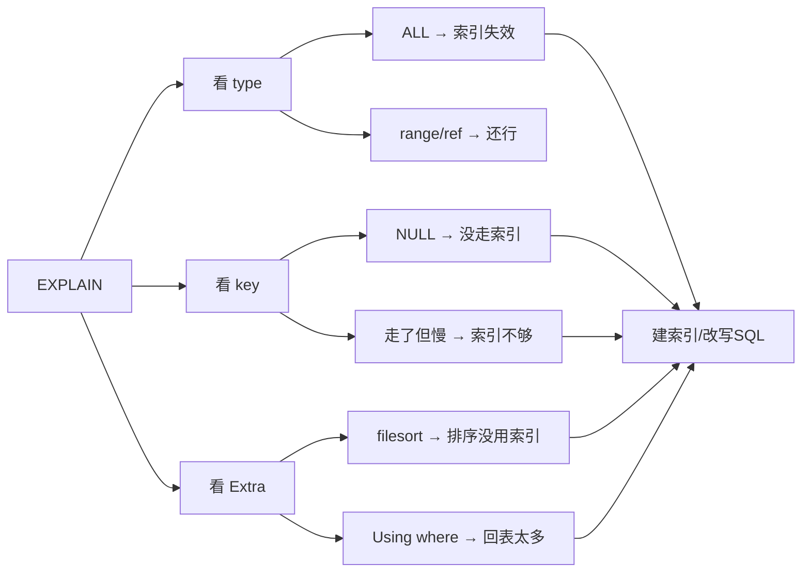

---
{"dg-publish":true,"permalink":"/01.专项学习/MySQL实战高手/09-SQL调优案例/","dg-note-properties":{"时间":"2026-03-22","sr-due":"2026-03-29","sr-interval":3,"sr-ease":250}}
---

#mysql #数据库 #调优 #案例 #review 

```ad-summary
title: 总结

- semi join 有时会让优化器选错执行计划，关闭后反而更快
- 亿级大表上索引不一定比主键扫描快，优化器可能因为排序成本放弃索引
- 深分页用子查询先查 ID 再回表，避免回表几十万次
- SQL 调优套路：先 EXPLAIN → 看 type/key/Extra → 针对性优化
```

## 1. 千万级用户：semi join 坑

**场景**：查最近没登录的用户

```sql
SELECT id, name 
FROM users 
WHERE id IN (SELECT user_id FROM users_extent_info WHERE latest_login_time < xxxxx);
```

**怎么发现走了 semi join**：

```sql
EXPLAIN SELECT id, name 
FROM users 
WHERE id IN (SELECT user_id FROM users_extent_info WHERE latest_login_time < xxxxx);

-- 看完执行计划后，再执行：
SHOW WARNINGS;
```

看执行计划：
- `Extra` 列出现 `Start temporary`、`End temporary` → 说明用了临时表做 semi join
- `type` 列是 `ALL`（全表扫描）+ `Using join buffer` → 坏信号

`SHOW WARNINGS` 会显示 MySQL 实际执行的 SQL，能看到 `semi join` 关键字。

**发生了什么**：
- MySQL 把子查询改成了 semi join
- 逻辑：拿 users 表每一行，去临时表里找有没有匹配的
- 问题：users 几千万行，**全都要过一遍**，太慢

**解决**：关掉 semi join

```sql
SET optimizer_switch='semijoin=off';
```

关掉后，MySQL 老老实实用子查询：先查出 4561 条 id，再用主键去 users 表匹配，**快了 10 倍**。

## 2. 亿级商品：有索引却不用

**场景**：按分类查商品

```sql
SELECT * 
FROM products 
WHERE category='电子产品' AND sub_category='手机' 
ORDER BY id DESC 
LIMIT 0, 10;
```

**有索引** `(category, sub_category)`，但 EXPLAIN 显示走的是主键全表扫描。

**为什么**：优化器算了一笔账
- 索引查出几万条 → 还要排序 → 成本高
- 主键扫 → 扫到 10 条就返回 → 可能更快
- 优化器选了它认为"更划算"的方式，但实际不是

**解决**：
1. 强制用索引：`FORCE INDEX (idx_category)`
2. 更好的方案：建联合索引 `(category, sub_category, id)`，WHERE 和 ORDER BY 都能用

## 3. 评论系统：深分页太慢

**场景**：翻到第 5000 页

```sql
SELECT * 
FROM comments 
WHERE product_id = 'xxx' AND is_good_comment = '1' 
ORDER BY id DESC 
LIMIT 100000, 20;
```

**慢在哪**：`SELECT *` 要所有字段，索引里没有，必须回表取完整行。10 万条回表只是为了跳过它们，真正要的只有 20 条。

**为什么子查询能避免回表**：

索引的叶子节点长这样：

```
(product_id, is_good_comment) 索引
├── xxx, 1 → 主键id=1001
├── xxx, 1 → 主键id=1000
└── xxx, 0 → 主键id=999
```

- `SELECT *`：要所有字段，索引里只有 id，必须去主键拿完整行（回表）
- `SELECT id`：只要主键，**主键就在索引叶子节点上，不用回表**

所以子查询 `SELECT id FROM comments ...` 走索引时，扫的是纯索引，不碰主键。

**优化**：

```sql
SELECT * 
FROM comments a,
(
    SELECT id 
    FROM comments 
    WHERE product_id = 'xxx' AND is_good_comment = '1' 
    ORDER BY id DESC 
    LIMIT 100000, 20
) b 
WHERE a.id = b.id;
```

**效果**：子查询扫 10 万条索引（不回表）→ 只对最终 20 条 id 回表取完整数据。回表从 10 万次降到 20 次。

**更优方案**：记住上一页最后一条 id，用 `WHERE id < last_id` 替代 LIMIT，彻底避免深分页。

## 4. 调优套路

遇到慢 SQL，按这个顺序查：



常见手段：
- 索引没建对 → 补索引（参考 [[01.专项学习/MySQL实战高手/07-索引设计与调优\|07-索引设计与调优]]）
- 索引失效 → 检查函数、隐式转换（参考 [[01.专项学习/MySQL实战高手/07-索引设计与调优#5. 常见索引失效场景\|07-索引设计与调优#5. 常见索引失效场景]]）
- 深分页 → 子查询先查 ID 再回表
- 排序慢 → 排序字段加入联合索引
- 优化器选错 → `FORCE INDEX` 或关闭某些优化
