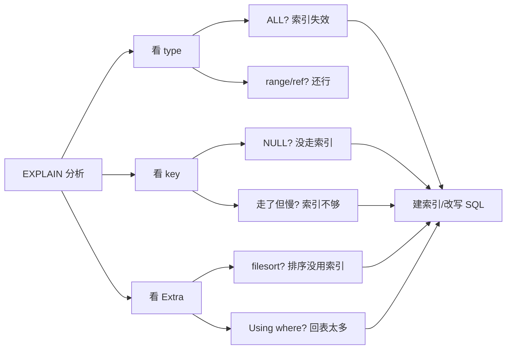

---
{"dg-publish":true,"permalink":"/01.专项学习/MySQL实战高手/09-SQL调优案例/","dg-note-properties":{"时间":"2026-03-22"}}
---

#mysql #数据库 #调优 #案例

```ad-summary
title: 总结

- semi join 有时会让优化器选错执行计划，关闭后反而更快
- 亿级大表上索引不一定比主键扫描快，优化器可能因为排序成本放弃索引
- 深分页用子查询先查 ID 再回表，避免回表几十万次
- SQL 调优套路：先 EXPLAIN → 看 type/key/Extra → 针对性优化
```

## 1. 千万级用户：semi join 坑

**场景**：运营系统查最近没登录的用户

```sql
SELECT id, name 
FROM users 
WHERE id IN (SELECT user_id FROM users_extent_info WHERE latest_login_time < xxxxx);
```

**问题**：看执行计划，`users_extent_info` 走了 `idx_login_time` 索引，查出 4561 条，物化为临时表。但 `users` 表是全表扫描 + `Using join buffer`。


用 `SHOW WARNINGS` 可以看到 MySQL 把这个子查询转成了 **semi join**。

semi join 的逻辑：对 users 表每一行，去物化表里找有没有匹配的，有就返回。但 users 是全表扫描，几千万行都要过一遍，太慢了。

**解决**：关闭 semi join 优化

```sql
SET optimizer_switch='semijoin=off';
```

关掉后执行计划变成标准的子查询：先 range 查出 4561 条，再用主键索引 id 去 users 表匹配，**性能提升 10 倍**。

**变体写法**（效果一样）：

```sql
SELECT COUNT(id)
FROM users 
WHERE id IN (SELECT user_id FROM users_extent_info WHERE latest_login_time < xxxxx)
   OR id IN (SELECT user_id FROM users_extent_info WHERE latest_login_time < -1);
```

多加一个永假的 OR 条件，让优化器走子查询而不是 semi join。

## 2. 亿级商品：索引不生效

**场景**：按分类查商品，分页

```sql
SELECT * 
FROM products 
WHERE category='电子产品' AND sub_category='手机' 
ORDER BY id DESC 
LIMIT 0, 10;
```

**索引**：存在 `(category, sub_category)` 联合索引

**问题**：`EXPLAIN` 看到 `possible_keys` 里有索引，但实际 `key` 走的是 PRIMARY，`Extra` 里是 `Using where`（全表扫描）。索引没生效！

**原因**：虽然有索引，但 MySQL 优化器认为：
- category + sub_category 过滤后可能还有几万条数据
- 还要 `ORDER BY id` 排序
- 用索引查完几万条再排序，不如直接走主键扫，扫到 10 条就返回

**解决**：强制使用索引

```sql
SELECT * 
FROM products FORCE INDEX (idx_category)
WHERE category='电子产品' AND sub_category='手机' 
ORDER BY id DESC 
LIMIT 0, 10;
```

**更好的方案**：建联合索引 `(category, sub_category, id)`，这样 WHERE 过滤和 ORDER BY 都能用上索引，避免排序。

## 3. 评论系统：深分页优化

**场景**：查某个商品的好评，翻到第 5000 页

```sql
SELECT * 
FROM comments 
WHERE product_id = 'xxx' AND is_good_comment = '1' 
ORDER BY id DESC 
LIMIT 100000, 20;
```

**索引**：只有 `(product_id)`

**问题**：
1. 走 `product_id` 索引找到所有该商品的记录
2. 每条都要**回表**拿 `is_good_comment` 字段判断是不是好评
3. 还要排序、跳过 100000 条、取 20 条

深分页时，前面 100000 条的回表全是浪费，只是为了跳过它们。

**优化**：先用子查询查 ID，再回表

```sql
SELECT * 
FROM comments a,
(
    SELECT id 
    FROM comments 
    WHERE product_id = 'xxx' AND is_good_comment = '1' 
    ORDER BY id DESC 
    LIMIT 100000, 20
) b 
WHERE a.id = b.id;
```

**原理**：
1. 子查询只查 `id` 字段，如果 `id` 是主键或者索引覆盖了，就**不需要回表**
2. 子查询跳过 100000 条（纯索引操作，很快）
3. 只对最终的 20 条 id 做回表

回表次数从 10 万+ 降到 20 次，性能天差地别。

**进阶方案**：如果知道上一页的最后一条 id，可以用 `WHERE id < last_id` 替代 `LIMIT offset`，彻底避免深分页。

```sql
SELECT * 
FROM comments 
WHERE product_id = 'xxx' AND is_good_comment = '1' AND id < 100020
ORDER BY id DESC 
LIMIT 20;
```

## 4. 调优套路总结

遇到慢 SQL，按这个流程走：



常见优化手段：
- 索引没建对 → 补索引或调整字段顺序（参考 [[7.索引设计与生产经验\|7.索引设计与生产经验]]）
- 索引失效 → 检查函数、隐式转换、左模糊等（参考 [[7.索引设计与生产经验#5\|7.索引设计与生产经验#5]]）
- 深分页 → 子查询先查 ID 再回表
- 排序没用索引 → 把排序字段加入联合索引
- 优化器选错 → `FORCE INDEX` 或关闭某些优化