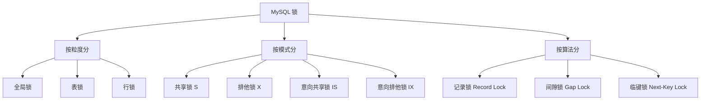
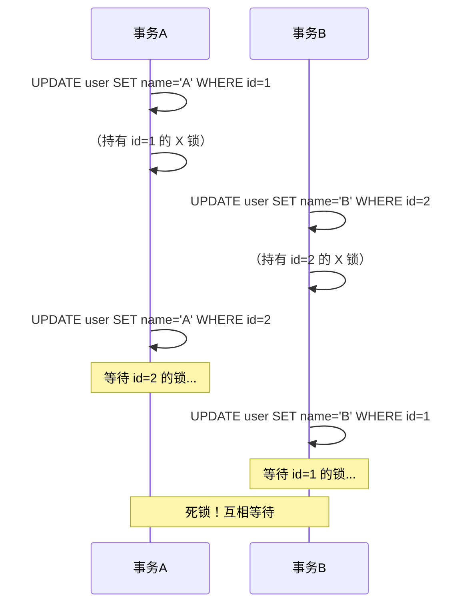

---
{"dg-publish":true,"permalink":"/01.专项学习/MySQL实战高手/10-锁机制详解/","dg-note-properties":{"时间":"2026-03-22"}}
---

#mysql #数据库 #锁 #并发

```ad-summary
title: 总结

- InnoDB 支持行锁和表锁，行锁基于索引实现，没走索引会升级为表锁
- 共享锁（S）不互斥，排他锁（X）和所有锁都互斥
- 意向锁是表级锁，用于快速判断表里有没有行被锁
- 记录锁锁单行，间隙锁锁范围（防止幻读），临键锁是两者结合
- 死锁检测开启时会自动回滚代价小的事务，也可以设置超时
```

## 1. 锁的分类



## 2. 全局锁

对整个数据库实例加锁，所有表都只能读，不能写。

```sql
FLUSH TABLES WITH READ LOCK;  -- 加锁
UNLOCK TABLES;                 -- 解锁
```

**用途**：全库逻辑备份（mysqldump 时会自动加）。

**缺点**：整个库都不能写，业务停摆。生产环境建议用 `--single-transaction` 参数，利用 MVCC 做一致性快照，不用加全局锁。

## 3. 表锁

### 3.1 表级共享锁和排他锁

```sql
LOCK TABLES table_name READ;   -- 表级共享锁
LOCK TABLES table_name WRITE;  -- 表级排他锁
UNLOCK TABLES;
```

**实际很少用**，因为粒度太粗，影响并发。InnoDB 的行锁更实用。

### 3.2 元数据锁（MDL）

DDL 操作（ALTER TABLE 等）会自动加 MDL 读锁或写锁，防止改表结构时有人在读写。

- 对表做增删改查：自动加 **MDL 读锁**
- 对表做 DDL：自动加 **MDL 写锁**

MDL 读锁之间不互斥，MDL 写锁和所有锁互斥。所以 DDL 会阻塞所有增删改查，反之亦然。

### 3.3 意向锁

InnoDB 在加行锁时，会同时在表级加一个**意向锁**：

- 加行级共享锁 → 表级加**意向共享锁（IS）**
- 加行级排他锁 → 表级加**意向排他锁（IX）**

意向锁之间不互斥，只是用来快速判断"这张表里有没有行被锁"，不用一行行检查。

| | IS | IX |
|-|----|----|
| S（表级共享锁） | 不互斥 | 互斥 |
| X（表级排他锁） | 互斥 | 互斥 |

## 4. 行锁（重点）

InnoDB 的行锁是**基于索引**实现的。锁的是索引记录，不是数据行。

### 4.1 共享锁和排他锁

```sql
-- 共享锁（S）：其他事务也能加 S 锁，但不能加 X 锁
SELECT * FROM user WHERE id = 1 LOCK IN SHARE MODE;
SELECT * FROM user WHERE id = 1 FOR SHARE;  -- MySQL 8.0 语法

-- 排他锁（X）：其他事务什么都不能加
SELECT * FROM user WHERE id = 1 FOR UPDATE;
```

**互斥关系**：

| | S 锁 | X 锁 |
|-|------|------|
| S 锁 | 不互斥 | 互斥 |
| X 锁 | 互斥 | 互斥 |

**注意**：普通的 SELECT 不加锁，走 MVCC 读快照。

### 4.2 行锁的三种算法

#### 记录锁（Record Lock）

锁的是**索引记录**，防止其他事务修改这行。

```sql
SELECT * FROM user WHERE id = 1 FOR UPDATE;  -- 锁 id=1 这一行
```

#### 间隙锁（Gap Lock）

锁的是**索引记录之间的间隙**，防止其他事务在间隙里插入数据。

```sql
-- 假设 id 有 10, 20, 30
SELECT * FROM user WHERE id > 15 AND id < 25 FOR UPDATE;
-- 锁的间隙：(10, 20) 和 (20, 30)
```

间隙锁只在 **RR 隔离级别**下存在，用于解决幻读。

#### 临键锁（Next-Key Lock）

**记录锁 + 间隙锁**的组合，锁的是左开右闭区间 `(prev_key, current_key]`。

```sql
-- 假设 id 有 10, 20, 30
SELECT * FROM user WHERE id = 20 FOR UPDATE;
-- 临键锁：(10, 20]，同时锁住 20 这行和 (10, 20) 的间隙
```

InnoDB 默认使用临键锁（Next-Key Lock）来防止幻读。

### 4.3 插入意向锁

插入数据时，会先检查有没有间隙锁。如果有，就等待，同时自己加一个**插入意向锁**。

这是一种特殊的间隙锁，多个事务在不同位置插入时不互斥，只有插入同一间隙时才互斥。

## 5. 行锁的陷阱

### 5.1 没走索引会锁全表

```sql
-- name 字段没有索引
SELECT * FROM user WHERE name = '张三' FOR UPDATE;
```

name 没有索引，只能全表扫描，每一行的索引都会被锁住，相当于**表锁**。

**解决**：确保 WHERE 条件用上了索引。

### 5.2 范围查询锁太多

```sql
SELECT * FROM user WHERE id > 100 FOR UPDATE;
```

会锁住 id > 100 的所有记录和间隙，其他事务插入 id > 100 的数据都会阻塞。

**解决**：尽量缩小范围，或者用等值查询。

## 6. 死锁

### 6.1 什么是死锁？

两个事务互相等待对方持有的锁：



### 6.2 怎么处理？

**自动处理**：MySQL 开启死锁检测（默认开启），检测到死锁后自动回滚代价小的事务。

```sql
SHOW VARIABLES LIKE 'innodb_deadlock_detect';  -- 默认 ON
```

**超时处理**：设置锁等待超时时间

```sql
SHOW VARIABLES LIKE 'innodb_lock_wait_timeout';  -- 默认 50 秒
SET innodb_lock_wait_timeout = 10;
```

**主动处理**：
- 尽量按相同顺序访问表和行
- 大事务拆成小事务
- 减少锁定范围（用索引、缩小范围）

## 7. 查看锁信息

```sql
-- 查看当前锁等待
SELECT * FROM information_schema.INNODB_LOCK_WAITS;

-- 查看当前持有的锁
SELECT * FROM information_schema.INNODB_LOCKS;

-- 查看事务状态
SELECT * FROM information_schema.INNODB_TRX;

-- MySQL 8.0+ 用 performance_schema
SELECT * FROM performance_schema.data_locks;
SELECT * FROM performance_schema.data_lock_waits;
```