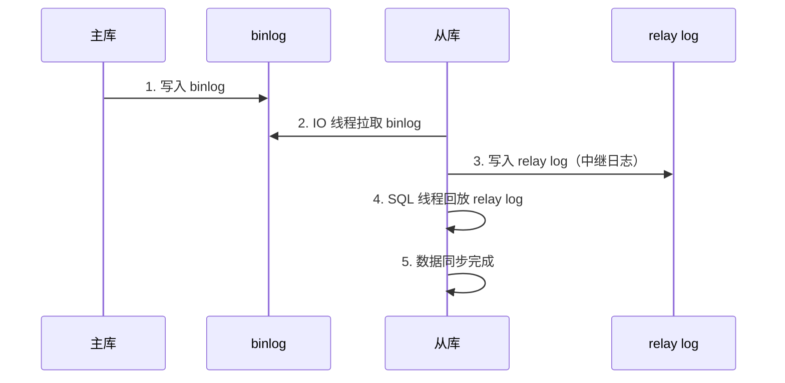
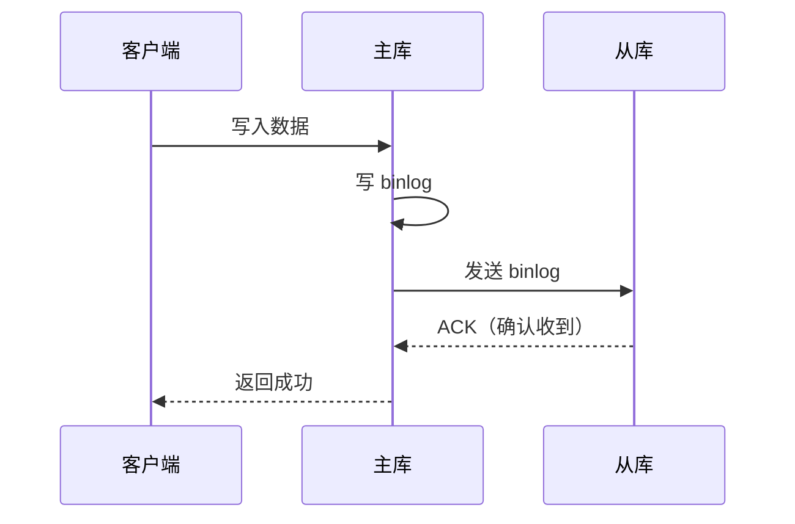
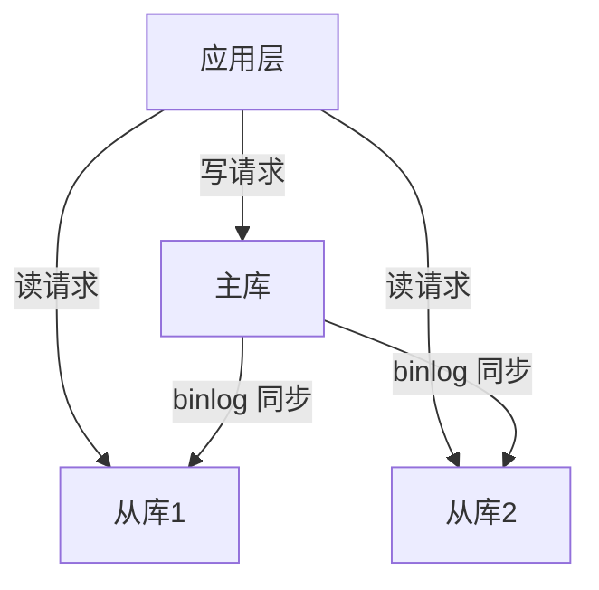

---
{"dg-publish":true,"permalink":"/01.专项学习/MySQL实战高手/11-主从复制/","dg-note-properties":{"时间":"2026-03-22"}}
---

#mysql #数据库 #主从复制 #高可用

```ad-summary
title: 总结

- 主从复制基于 binlog：主库写 binlog → 从库拉取 → 从库回放
- 三种模式：异步（默认）、半同步、全同步，安全性和性能递增/减
- 读写分离要注意主从延迟：关键读走主库，普通读走从库
- 常见问题：主从延迟（秒级常见）、数据不一致、从库挂了怎么办
```

## 1. 主从复制原理

主从复制的核心就是**binlog**。主库把所有写操作记录到 binlog，从库拉取 binlog 并回放，保持数据同步。



三个关键线程：
- **主库 binlog dump 线程**：读取 binlog 发送给从库
- **从库 IO 线程**：连接主库，拉取 binlog 写入 relay log
- **从库 SQL 线程**：读取 relay log，回放到从库数据

## 2. 复制模式

### 2.1 异步复制（默认）

主库写完 binlog 就返回客户端，不等从库确认。

**优点**：性能好，主库不受从库影响
**缺点**：主库挂了，还没同步到从库的数据会丢

### 2.2 半同步复制

主库写完 binlog 后，**至少等一个从库确认收到**才返回客户端。



**优点**：数据安全性比异步高
**缺点**：比异步慢一点（要等网络往返）

### 2.3 全同步复制

主库写完 binlog，**等所有从库都回放完成**才返回客户端。

**优点**：数据最安全
**缺点**：最慢，任何一个从库慢都会拖累主库

### 2.4 对比

| 模式 | 数据安全 | 性能 | 适用场景 |
|------|---------|------|---------|
| 异步 | 低 | 最快 | 对数据丢失不敏感 |
| 半同步 | 中 | 中 | 大多数生产环境 |
| 全同步 | 高 | 最慢 | 金融等强一致性要求 |

## 3. 读写分离

写操作走主库，读操作走从库，分摊主库压力。



### 3.1 主从延迟怎么办？

异步复制下，主从之间有延迟（通常几百毫秒到几秒），刚写入的数据可能从从库查不到。

**解决方案**：

1. **关键读走主库**：写完马上要读的场景，强制走主库
2. **判断主从延迟**：从库执行 `SHOW SLAVE STATUS`，看 `Seconds_Behind_Master`，如果 > 0 说明有延迟
3. **强制走主库一段时间**：写完后 1-2 秒内的读请求走主库
4. **GTID 方案**：检查从库是否已经回放到指定 GTID

### 3.2 怎么路由读写？

- **应用层**：代码里判断 SQL 类型，SELECT 走从库，其他走主库
- **中间件**：用 ShardingSphere、MyCat 等中间件自动路由
- **代理层**：用 ProxySQL、MySQL Router 做透明代理

## 4. 常见问题

### 4.1 主从数据不一致

**原因**：
- 从库挂了一段时间，重启后追赶 binlog
- 主从用了不同的 SQL 模式
- 主库执行了不记录 binlog 的操作（如 `SET SQL_LOG_BIN=0`）

**处理**：
- 用 `pt-table-checksum` 检查不一致
- 用 `pt-table-sync` 修复不一致
- 从库重建：`mysqldump` 从主库导出，恢复到从库

### 4.2 从库挂了怎么办？

1. 检查 relay log 位置：`SHOW SLAVE STATUS` 看 `Relay_Master_Log_File` 和 `Exec_Master_Log_Pos`
2. 重启从库，自动从断点继续同步
3. 如果数据丢了，从主库重新全量同步

### 4.3 主库挂了怎么办？

1. 选一个从库提升为主库
2. 其他从库指向新主库
3. 应用切到新主库

自动化方案用 MHA、Orchestrator 等工具做故障转移。

## 5. GTID 复制

MySQL 5.6+ 引入 GTID（Global Transaction ID），每个事务有全局唯一 ID：

```
GTID = server_uuid:transaction_id
```

**优势**：
- 从库自动定位同步位置，不用手动指定 binlog 文件和偏移量
- 故障转移更简单，自动找到正确的起点

```sql
-- 开启 GTID
gtid_mode = ON
enforce_gtid_consistency = ON
```