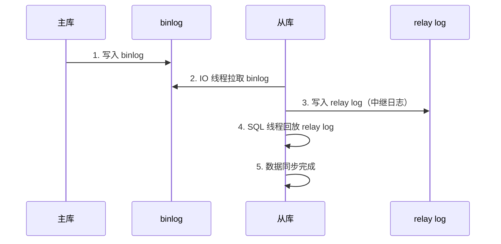
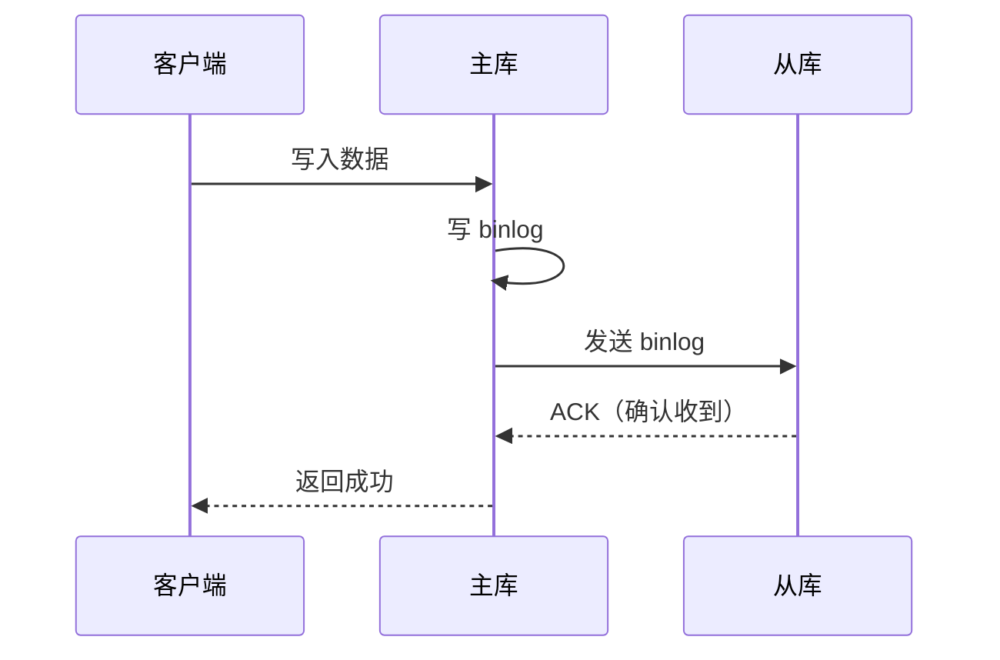
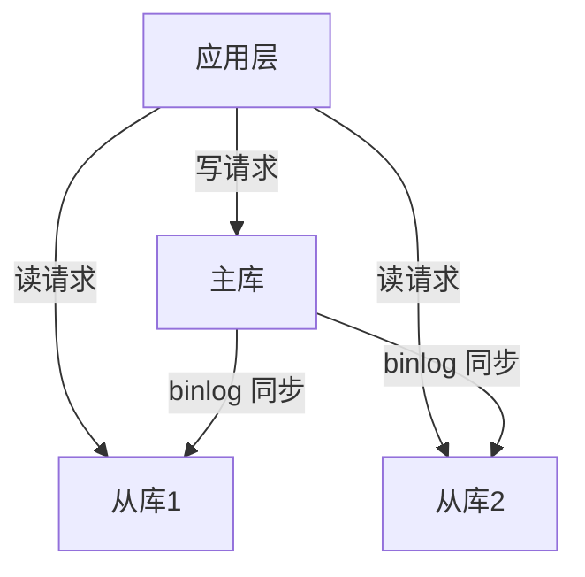

---
{"dg-publish":true,"permalink":"/01.专项学习/MySQL实战高手/11-主从复制/","dg-note-properties":{"时间":"2026-03-22","sr-due":"2026-03-29","sr-interval":3,"sr-ease":250}}
---

#mysql #数据库 #主从复制 #高可用 #review 

```ad-summary
title: 总结

- 主从复制基于 binlog：主库写 binlog → 从库拉取 → 从库回放
- 三种模式：异步（默认）、半同步、全同步，安全性和性能递增/减
- 读写分离要注意主从延迟：关键读走主库，普通读走从库
- 常见问题：主从延迟（秒级常见）、数据不一致、从库挂了怎么办
```

## 1. 主从复制原理

主从复制的核心就是**binlog**。主库把所有写操作记录到 binlog，从库拉取 binlog 并回放，保持数据同步。



三个关键线程：
- **主库 binlog dump 线程**：读取 binlog 发送给从库
- **从库 IO 线程**：连接主库，拉取 binlog 写入 relay log
- **从库 SQL 线程**：读取 relay log，回放到从库数据

## 2. 复制模式

### 2.1 异步复制（默认）

主库写完 binlog 就返回客户端，不等从库确认。

**优点**：性能好，主库不受从库影响
**缺点**：主库挂了，还没同步到从库的数据会丢

#### 主库配置

```ini
[mysqld]
server-id = 1
log-bin = mysql-bin
binlog-format = ROW
sync_binlog = 1
gtid_mode = ON
enforce_gtid_consistency = ON
```

- `server-id`：集群内唯一，主从不能重复
- `log-bin`：开启 binlog，文件名前缀
- `binlog-format`：建议用 `ROW`，比 `STATEMENT` 安全，不会出现主从数据不一致
- `sync_binlog`：每次事务提交都刷盘，设成 1 最安全；设 0 性能好但可能丢数据
- `gtid_mode`：开启 GTID，每个事务有全局唯一 ID（`server_uuid:transaction_id`）
- `enforce_gtid_consistency`：强制事务安全，会禁止 `CREATE TABLE ... SELECT` 这种不安全语句

#### 从库配置

```ini
[mysqld]
server-id = 2
relay-log = relay-bin
read_only = ON
super_read_only = ON
gtid_mode = ON
enforce_gtid_consistency = ON
```

- `read_only`：禁止普通用户写从库，防止误操作
- `super_read_only`：连 root 也禁写，更彻底

#### 从库执行同步

```sql
CHANGE MASTER TO
  MASTER_HOST = '192.168.1.100',
  MASTER_PORT = 3306,
  MASTER_USER = 'repl',
  MASTER_PASSWORD = 'repl_password',
  MASTER_AUTO_POSITION = 1;

START SLAVE;
```

`MASTER_AUTO_POSITION = 1` 就是 GTID 模式的关键，从库自动找同步起点，**不用记 binlog 文件名和偏移量**。

### 2.2 半同步复制

主库写完 binlog 后，**至少等一个从库确认收到**才返回客户端。



**优点**：数据安全性比异步高
**缺点**：比异步慢一点（要等网络往返）

#### 主库配置

```ini
[mysqld]
server-id = 1
log-bin = mysql-bin
binlog-format = ROW
gtid_mode = ON
enforce_gtid_consistency = ON

# 半同步插件
plugin-load = "rpl_semi_sync_master=semisync_master.so"
rpl_semi_sync_master_enabled = 1
rpl_semi_sync_master_timeout = 10000
rpl_semi_sync_master_wait_point = AFTER_SYNC
```

- `rpl_semi_sync_master_timeout`：超时时间（毫秒），等不到从库 ACK 就降级成异步。**默认 10 秒**，网络差的环境可以适当调大
- `rpl_semi_sync_master_wait_point`：
  - `AFTER_SYNC`（默认）：先写 binlog 再等 ACK，最后写引擎，数据更安全
  - `AFTER_COMMIT`：先写 binlog + 引擎再等 ACK，性能稍好但可能幻读

#### 从库配置

```ini
[mysqld]
server-id = 2
relay-log = relay-bin
read_only = ON
super_read_only = ON
gtid_mode = ON
enforce_gtid_consistency = ON

# 半同步插件
plugin-load = "rpl_semi_sync_slave=semisync_slave.so"
rpl_semi_sync_slave_enabled = 1
```

#### 从库执行同步

```sql
CHANGE MASTER TO
  MASTER_HOST = '192.168.1.100',
  MASTER_PORT = 3306,
  MASTER_USER = 'repl',
  MASTER_PASSWORD = 'repl_password',
  MASTER_AUTO_POSITION = 1;

START SLAVE;
```

#### 验证是否生效

```sql
-- 主库查看
SHOW STATUS LIKE 'Rpl_semi_sync_master_status';
-- 值为 ON 说明半同步生效

SHOW STATUS LIKE 'Rpl_semi_sync_master_yes_tx';
-- 已经走半同步的事务数

-- 从库查看
SHOW STATUS LIKE 'Rpl_semi_sync_slave_status';
```

> 如果所有从库都挂了，超时后主库会**自动降级为异步**，不会阻塞业务。从库恢复后会自动切回半同步。

### 2.3 全同步复制

主库写完 binlog，**等所有从库都回放完成**才返回客户端。

**优点**：数据最安全
**缺点**：最慢，任何一个从库慢都会拖累主库

MySQL 原生全同步用 **Group Replication**（MySQL 5.7.17+），也叫 MGR。

#### 节点配置（每个节点都要配）

```ini
[mysqld]
server-id = 1
log-bin = mysql-bin
binlog-format = ROW
gtid-mode = ON
enforce-gtid-consistency = ON
master-info-repository = TABLE
relay-log-info-repository = TABLE

# Group Replication
plugin-load = "group_replication=group_replication.so"
group_replication_group_name = "aaaaaaaa-bbbb-cccc-dddd-eeeeeeeeeeee"
group_replication_start_on_boot = OFF
group_replication_local_address = "192.168.1.100:33061"
group_replication_group_seeds = "192.168.1.100:33061,192.168.1.101:33061,192.168.1.102:33061"
group_replication_bootstrap_group = OFF
```

- `group_replication_group_name`：组名，36 位 UUID，**同组内所有节点必须一样**
- `group_replication_local_address`：本节点的内部通信地址，端口随便选别冲突就行
- `group_replication_group_seeds`：组内所有节点地址，用逗号分隔
- `group_replication_bootstrap_group`：只在**第一个节点启动时设 ON**，启动后立刻改回 OFF

#### 启动流程

```sql
-- 第一个节点
SET GLOBAL group_replication_bootstrap_group = ON;
START GROUP_REPLICATION;
SET GLOBAL group_replication_bootstrap_group = OFF;

-- 其他节点（直接加入）
START GROUP_REPLICATION;
```

#### 验证集群状态

```sql
SELECT * FROM performance_schema.replication_group_members;
-- MEMBER_STATE 列：ONLINE 说明正常
```

> Group Replication 默认是**多主模式**（所有节点都能写），也可以切换单主模式（只有一个主节点写，其他只读）。大多数场景用单主模式更稳妥。

### 2.4 对比

| 模式 | 数据安全 | 性能 | 适用场景 |
|------|---------|------|---------|
| 异步 | 低 | 最快 | 对数据丢失不敏感 |
| 半同步 | 中 | 中 | 大多数生产环境 |
| 全同步 | 高 | 最慢 | 金融等强一致性要求 |

## 3. 读写分离

写操作走主库，读操作走从库，分摊主库压力。



### 3.1 主从延迟怎么办？

异步复制下，主从之间有延迟（通常几百毫秒到几秒），刚写入的数据可能从从库查不到。

**解决方案**：

1. **关键读走主库**：写完马上要读的场景，强制走主库
2. **判断主从延迟**：从库执行 `SHOW SLAVE STATUS`，看 `Seconds_Behind_Master`，如果 > 0 说明有延迟
3. **强制走主库一段时间**：写完后 1-2 秒内的读请求走主库
4. **GTID 方案**：检查从库是否已经回放到指定 GTID

### 3.2 怎么路由读写？

- **应用层**：代码里判断 SQL 类型，SELECT 走从库，其他走主库
- **中间件**：用 ShardingSphere、MyCat 等中间件自动路由
- **代理层**：用 ProxySQL、MySQL Router 做透明代理

## 4. 常见问题

### 4.1 主从数据不一致

**原因**：
- 从库挂了一段时间，重启后追赶 binlog
- 主从用了不同的 SQL 模式
- 主库执行了不记录 binlog 的操作（如 `SET SQL_LOG_BIN=0`）

**处理**：
- 用 `pt-table-checksum` 检查不一致
- 用 `pt-table-sync` 修复不一致
- 从库重建：`mysqldump` 从主库导出，恢复到从库

### 4.2 从库挂了怎么办？

1. 检查同步位置：`SHOW SLAVE STATUS` 看 `Executed_Gtid_Set`
2. 重启从库，自动从断点继续同步（GTID 模式下自动定位）
3. 如果数据丢了，从主库重新全量同步

### 4.3 从库跳过指定事务

主库执行了从库不支持的操作（比如 DDL 在从库报错），可以用 GTID 跳过：

```sql
SET GTID_NEXT = 'aaaaaaaa-bbbb-cccc-dddd-eeeeeeeeeeee:100';
BEGIN; COMMIT;
SET GTID_NEXT = 'AUTOMATIC';
```

跳过后重启同步：`START SLAVE;`

### 4.4 主库挂了怎么办？

1. 选一个从库提升为主库
2. 其他从库指向新主库
3. 应用切到新主库

自动化方案用 MHA、Orchestrator 等工具做故障转移。
