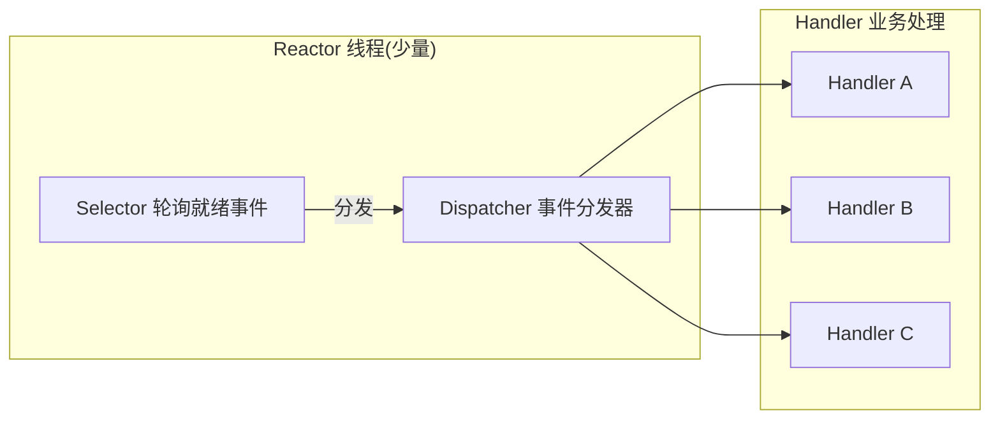

---
{"dg-publish":true,"permalink":"/01.专项学习/Netty学习/1.为什么选择Netty/"}
---

#review #netty 
```ad-summary
title: 总结

- Netty 基于 NIO 多路复用，一个线程可以处理成千上万连接，资源消耗远低于传统 BIO
- 事件分发用 Reactor 模型（同步 I/O），耗时任务交给线程池，避免阻塞 I/O 线程
- 对象池复用 + 零拷贝，进一步降低内存开销
```

## 1. NIO 多路复用

传统 BIO 每个连接需要一个线程，连接一多线程数就爆了。Netty 底层用 JDK NIO 的 `Selector` 实现多路复用，一个 `Selector` 可以同时轮询多个 `Channel`。

切换到 epoll 模式后，只需要**一个线程**就能轮询成千上万的客户端连接，不再是一连接一线程的模式。


图里的 ThreadPool 是专门处理 I/O 上耗时任务的，目的是防止业务逻辑阻塞 I/O 线程。

## 2. Reactor 事件模型

多路复用解决了"谁就绪了"的问题，但就绪之后还需要一个**事件分发器**把读写事件派发给对应的处理器，这就是 Reactor 模式要做的事。

### 2.1 传统 BIO 的问题

传统服务端是这样处理的：

```
while (true) {
    socket = accept();        // 阻塞等待连接
    handle(socket);           // 处理请求（读数据、业务逻辑、写响应）
}
```

每个连接独占一个线程，连接多了线程数爆炸，大量线程在等待 I/O 时白白占用内存，线程切换开销也很大。

### 2.2 Reactor 怎么解决的

Reactor 的核心思路是**把 I/O 等待和业务处理分开**：



- **Reactor 线程**：只负责监听事件（accept、read、write），不做业务处理，永远不阻塞
- **Handler**：只在事件真正就绪时才被调用，不需要傻等 I/O

这样少量 Reactor 线程就能撑起大量并发连接，业务处理扔给线程池，两边互不干扰。

### 2.3 Reactor vs Proactor

| 模式 | I/O 方式 | 谁来等 I/O | 特点 |
|------|---------|-----------|------|
| Reactor | 同步 I/O | Reactor 线程等就绪，就绪后 Handler 自己读写 | 实现简单，Linux epoll 原生支持，主流选择 |
| Proactor | 异步 I/O | OS 完成读写后通知 Handler | 性能理论更高，但实现复杂，Linux 支持不完善 |

Reactor 是"**就绪通知**"：OS 告诉你"可以读了"，你自己去读。
Proactor 是"**完成通知**"：OS 帮你读完，告诉你"读好了，数据在这"。

Linux 的 AIO 实现一直不够成熟，所以实际上 Netty、Redis、Nginx 这些高性能框架都选了 Reactor + epoll，而不是 Proactor。

### 2.4 耗时操作怎么办

Reactor 线程不能阻塞，一旦某个 Handler 里有耗时操作（数据库查询、RPC 调用），就会卡住整个 Reactor，后续所有事件都积压。

解决办法是把耗时操作扔到**业务线程池**里异步处理：

```
Reactor 线程：接收数据 → 解码 → 提交任务给线程池
业务线程池：执行业务逻辑 → 编码 → 写回结果
```

这也是 [[01.专项学习/Netty学习/5.Netty的EventLoop\|5.Netty的EventLoop]] 里强调"不能在 EventLoop 里跑耗时操作"的原因。

## 3. 更低的资源消耗

**对象池复用**：Netty 内部维护对象池，[[01.专项学习/Netty学习/8.Netty的ByteBuf\|ByteBuf]] 等对象用完归还而不是直接 GC，避免频繁创建销毁的开销。

**零拷贝**：除了 OS 层面的零拷贝，Netty 还在用户态做了优化，详见 [[01.专项学习/Netty学习/9.Netty的零拷贝\|9.Netty的零拷贝]]：
- 读写 I/O 时直接用 `DirectBuffer`（[[66.归档发布/02.编码相关/JAVA的堆外内存\|堆外内存]]），省掉数据在堆内和堆外之间的一次拷贝
- `CompositeByteBuf` 把多个 buffer 逻辑合并，不需要实际内存拷贝
- `FileRegion` 封装 `transferTo`，文件传输走 OS 零拷贝通道
