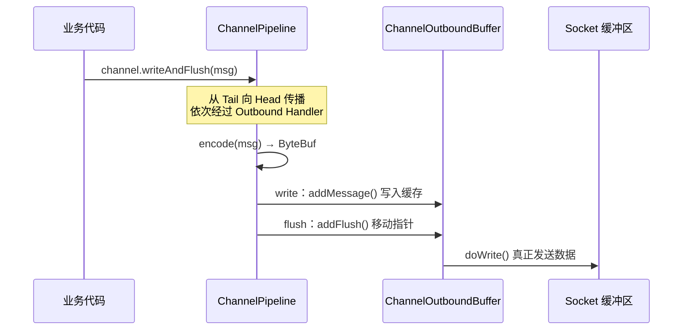

---
{"dg-publish":true,"permalink":"/01.专项学习/Netty学习/11.Netty的WriteAndFlush/","dg-note-properties":{}}
---

```ad-summary
title: 总结

- writeAndFlush 分两步：write 把数据写入 ChannelOutboundBuffer 缓存，flush 才真正发到 Socket
- 出站事件从 Tail → Head 传播，每个 Outbound Handler 依次处理，encode 就发生在这个过程中
- ChannelOutboundBuffer 有三个指针：flushedEntry、unflushedEntry、tailEntry，flush 时才移动 flushedEntry
- 写缓冲区有高低水位线（默认 64KB/32KB），超过高水位标记不可写，降到低水位恢复可写
- doWrite 用自旋锁次数控制单次写入量，防止大数据写入时长期占用 EventLoop
```

## 1. writeAndFlush 整体流程

`writeAndFlush` 不是一步完成的，内部分两个阶段：



`ctx.channel().writeAndFlush()` 和 `ctx.writeAndFlush()` 的区别：

| 调用方式 | 传播起点 | 说明 |
|---|---|---|
| `ctx.channel().writeAndFlush(msg)` | Tail 节点 | 走完整个 Pipeline，所有 Outbound Handler 都会执行 |
| `ctx.writeAndFlush(msg)` | 当前节点向前找 | 跳过当前节点之后的 Handler，性能更好但要注意顺序 |

## 2. 事件传播：从 Tail 到 Head

`channel.writeAndFlush()` 最终调用的是 `tail.writeAndFlush()`：

```java
// DefaultChannelPipeline
@Override
public final ChannelFuture writeAndFlush(Object msg) {
    return tail.writeAndFlush(msg);
}
```

然后进入 `AbstractChannelHandlerContext.write()`，这是链式传播的核心：

```java
private void write(Object msg, boolean flush, ChannelPromise promise) {
    // 找到 Pipeline 中下一个 Outbound 类型的 Handler 节点
    final AbstractChannelHandlerContext next = findContextOutbound(flush ?
            (MASK_WRITE | MASK_FLUSH) : MASK_WRITE);
    final Object m = pipeline.touch(msg, next);
    EventExecutor executor = next.executor();

    if (executor.inEventLoop()) {
        if (flush) {
            next.invokeWriteAndFlush(m, promise); // 当前线程直接执行
        } else {
            next.invokeWrite(m, promise);
        }
    } else {
        // 不在 EventLoop 线程，封装成 WriteTask 提交
        final WriteTask task = WriteTask.newInstance(next, m, promise, flush);
        if (!safeExecute(executor, task, promise, m, !flush)) {
            task.cancel();
        }
    }
}
```

`invokeWriteAndFlush` 会调用下一个 Handler 的 `write()` 方法，然后流程又回到 `AbstractChannelHandlerContext.write()`，继续找下一个 Outbound 节点，这就是链式传播的实现。

### 2.1 encode 在哪里执行？

`MessageToByteEncoder` 就是一个 Outbound Handler，它的 `write()` 方法里调用了我们实现的 `encode()`：

```java
// MessageToByteEncoder
@Override
public void write(ChannelHandlerContext ctx, Object msg, ChannelPromise promise) throws Exception {
    ByteBuf buf = null;
    try {
        if (acceptOutboundMessage(msg)) {
            I cast = (I) msg;
            buf = allocateBuffer(ctx, cast, preferDirect);
            try {
                encode(ctx, cast, buf); // 调用我们实现的 encode 方法
            } finally {
                ReferenceCountUtil.release(cast); // 释放原始 msg
            }

            if (buf.isReadable()) {
                ctx.write(buf, promise); // 编码后继续向前传播
            } else {
                buf.release();
                ctx.write(Unpooled.EMPTY_BUFFER, promise);
            }
            buf = null;
        } else {
            ctx.write(msg, promise); // 不匹配的消息类型直接透传
        }
    } finally {
        if (buf != null) {
            buf.release();
        }
    }
}
```

encode 完成后，编码后的 `ByteBuf` 继续向前传播，最终到达 HeadContext。

## 3. write：写入 Buffer 队列

HeadContext 是出站事件的最后一站，它把数据交给 `unsafe.write()`：

```java
// HeadContext
@Override
public void write(ChannelHandlerContext ctx, Object msg, ChannelPromise promise) {
    unsafe.write(msg, promise);
}

// AbstractChannel.AbstractUnsafe
@Override
public final void write(Object msg, ChannelPromise promise) {
    assertEventLoop();
    ChannelOutboundBuffer outboundBuffer = this.outboundBuffer;
    if (outboundBuffer == null) {
        // Channel 已关闭
        safeSetFailure(promise, newClosedChannelException(initialCloseCause));
        ReferenceCountUtil.release(msg);
        return;
    }
    int size;
    try {
        msg = filterOutboundMessage(msg); // 非 DirectByteBuf 会被转换成 DirectByteBuf
        size = pipeline.estimatorHandle().size(msg);
        if (size < 0) size = 0;
    } catch (Throwable t) {
        safeSetFailure(promise, t);
        ReferenceCountUtil.release(msg);
        return;
    }
    outboundBuffer.addMessage(msg, size, promise); // 写入缓存，还没发到 Socket
}
```

`filterOutboundMessage` 会把堆内存的 ByteBuf 转成 DirectByteBuf（[[66.归档发布/02.编码相关/JAVA的堆外内存\|堆外内存]]），因为 JDK NIO 在写 Socket 时需要堆外内存，避免一次额外的内存拷贝。

### 3.1 ChannelOutboundBuffer 三指针

`ChannelOutboundBuffer` 是一个链表结构的缓存，有三个关键指针：

| 指针 | 含义 |
|---|---|
| `flushedEntry` | 第一个已标记为待发送的节点（flush 后才指向这里） |
| `unflushedEntry` | 第一个还没被 flush 的节点 |
| `tailEntry` | 链表尾节点 |

每次调用 `write()` 都会执行 `addMessage()`，改变这三个指针的指向：

```java
public void addMessage(Object msg, int size, ChannelPromise promise) {
    Entry entry = Entry.newInstance(msg, size, total(msg), promise);
    if (tailEntry == null) {
        flushedEntry = null;
    } else {
        tailEntry.next = entry;
    }
    tailEntry = entry;
    if (unflushedEntry == null) {
        unflushedEntry = entry;
    }
    incrementPendingOutboundBytes(entry.pendingSize, false); // 检查水位线
}
```


### 3.2 高低水位线

缓存不能无限增长，每次 `addMessage` 后都会检查水位线：

```java
private static final int DEFAULT_LOW_WATER_MARK  = 32 * 1024;  // 32KB
private static final int DEFAULT_HIGH_WATER_MARK = 64 * 1024;  // 64KB

private void incrementPendingOutboundBytes(long size, boolean invokeLater) {
    if (size == 0) return;
    long newWriteBufferSize = TOTAL_PENDING_SIZE_UPDATER.addAndGet(this, size);
    // 超过 64KB，标记 Channel 为不可写
    if (newWriteBufferSize > channel.config().getWriteBufferHighWaterMark()) {
        setUnwritable(invokeLater);
    }
}
```

水位线机制：
- 缓存超过 **64KB（高水位）**：Channel 标记为不可写，触发 `channelWritabilityChanged` 回调
- 缓存降到 **32KB（低水位）**以下：Channel 恢复可写

业务代码里写数据前应该检查 `channel.isWritable()`，避免在 Channel 不可写时继续堆积数据：

```java
// 正确做法：写之前检查可写状态
if (ctx.channel().isWritable()) {
    ctx.writeAndFlush(msg);
} else {
    // 可以丢弃、排队或者关闭连接，视业务而定
    msg.release();
}
```

## 4. flush：真正发送数据

`invokeWriteAndFlush` 在 write 之后立即执行 flush：

```java
void invokeWriteAndFlush(Object msg, ChannelPromise promise) {
    if (invokeHandler()) {
        invokeWrite0(msg, promise);
        invokeFlush0(); // write 完紧接着 flush
    } else {
        writeAndFlush(msg, promise);
    }
}
```

flush 同样从 Tail 向 Head 传播，最终到 HeadContext：

```java
// HeadContext
@Override
public void flush(ChannelHandlerContext ctx) {
    unsafe.flush();
}

// AbstractChannel.AbstractUnsafe
@Override
public final void flush() {
    assertEventLoop();
    ChannelOutboundBuffer outboundBuffer = this.outboundBuffer;
    if (outboundBuffer == null) return;
    outboundBuffer.addFlush(); // 移动指针
    flush0();                  // 真正写 Socket
}
```

### 4.1 addFlush：移动指针

```java
public void addFlush() {
    Entry entry = unflushedEntry;
    if (entry != null) {
        if (flushedEntry == null) {
            flushedEntry = entry; // flushedEntry 指向原来的 unflushedEntry
        }
        do {
            flushed++;
            if (!entry.promise.setUncancellable()) {
                int pending = entry.cancel();
                decrementPendingOutboundBytes(pending, false, true); // 低于低水位则恢复可写
            }
            entry = entry.next;
        } while (entry != null);
        unflushedEntry = null; // unflushedEntry 清空
    }
}
```


`addFlush` 之后，`flushedEntry` 指向了原来 `unflushedEntry` 的位置，`unflushedEntry` 置为 null。只有 `flushedEntry` 指向的数据才会被真正发到 Socket。

### 4.2 doWrite：写入 Socket

```java
// AbstractNioByteChannel
@Override
protected void doWrite(ChannelOutboundBuffer in) throws Exception {
    int writeSpinCount = config().getWriteSpinCount(); // 默认 16 次
    do {
        Object msg = in.current();
        if (msg == null) {
            clearOpWrite(); // 数据写完，清除 OP_WRITE 事件
            return;
        }
        writeSpinCount -= doWriteInternal(in, msg); // 每成功写一次，自旋次数减 1
    } while (writeSpinCount > 0);
    incompleteWrite(writeSpinCount < 0); // 没写完，注册 OP_WRITE 等待下次继续
}
```

自旋次数（默认 16）的作用：大数据量时不可能一次写完，如果一直循环等待会长期占用 EventLoop，导致其他 Channel 的事件无法处理。所以限制最多自旋 16 次，超出后暂停写入，注册 `OP_WRITE` 事件，等 Selector 通知 Socket 可写时再继续。

整体调用链路：


## 5. write 和 flush 分离的好处

实际业务中可以把 write 和 flush 分开调用，批量写入后统一 flush，减少系统调用次数：

```java
// 批量写入，最后统一 flush，比每次 writeAndFlush 性能更好
for (Object msg : messages) {
    ctx.write(msg); // 只写缓存，不发 Socket
}
ctx.flush(); // 统一发送，一次系统调用
```

`writeAndFlush` 等价于 `write` + `flush`，适合单条消息发送。批量场景下分开调用性能更好。
