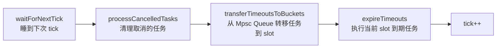

---
{"dg-publish":true,"permalink":"/01.专项学习/Netty学习/13.Netty的HashedWheelTimer/","dg-note-properties":{}}
---

```ad-summary
title: 总结

- 时间轮是环形结构，任务新增和取消都是 O(1)，只需一个线程驱动，适合大量短延迟定时任务
- HashedWheelTimer 用 Mpsc Queue 保证多线程添加任务的线程安全，Worker 线程懒启动
- 任务执行是串行的，耗时任务会阻塞后续调度，不适合执行时间长的任务
- Netty 时间轮有空推进问题，Kafka 用 DelayQueue + 层级时间轮解决
```

## 1. 时间轮原理

时间轮是一种环形结构，像钟表一样被分为多个 slot。每个 slot 代表一个时间段，内部用链表保存该时间段到期的所有任务。时间轮通过一个时针随着时间一个个 slot 转动，并执行 slot 中的所有到期任务。


举个例子：时间轮被划分为 8 个 slot，每个 slot 代表 1s，当前时针指向 2。

- 调度一个 3s 后执行的任务 → 放入 slot `(2+3) % 8 = 5`
- 调度一个 12s 后执行的任务 → 放入 slot `(2+12) % 8 = 6`，但需要等时针走完整整一圈再多 4 格，所以任务里要记录 `remainingRounds = 1`

多个任务落在同一个 slot 时，用拉链法解决冲突（和 [[66.归档发布/00-0其他/Hash冲突的解决方案\|Hash冲突的解决方案]] 一样）。任务量大时适当增加 slot 数量，可以减少每次 tick 时遍历的任务数。

时间轮最大的优势：**任务新增和取消都是 O(1)，只需一个线程驱动**。相比 `ScheduledThreadPoolExecutor` 用堆实现（O(log n)），在任务量大的场景下性能优势明显。

| 方案 | 新增/取消复杂度 | 适用场景 |
|---|---|---|
| ScheduledThreadPoolExecutor | O(log n) | 任务量少，精度要求高 |
| HashedWheelTimer（时间轮） | O(1) | 任务量大，允许毫秒级误差 |
| Kafka 层级时间轮 | O(1) | 任务时间跨度大，需要精细控制 |

## 2. HashedWheelTimer 核心接口

HashedWheelTimer 实现了 `io.netty.util.Timer` 接口：

```java
public interface Timer {
    Timeout newTimeout(TimerTask task, long delay, TimeUnit unit); // 创建任务
    Set<Timeout> stop();                                           // 停止未执行的任务
}

public interface TimerTask {
    void run(Timeout timeout) throws Exception;
}

public interface Timeout {
    Timer timer();
    TimerTask task();
    boolean isExpired();
    boolean isCancelled();
    boolean cancel(); // 取消任务
}
```

`Timeout` 持有 `Timer` 和 `TimerTask` 的引用，通过它可以取消任务。三者关系如下：


> [!warning] 注意
> 时间轮中的任务是**串行执行**的，一个任务耗时过长会阻塞后续任务调度，容易产生任务堆积。耗时操作要在任务里异步处理。

## 3. 构造函数与核心参数

```java
public HashedWheelTimer(
        ThreadFactory threadFactory,
        long tickDuration, TimeUnit unit, int ticksPerWheel, boolean leakDetection,
        long maxPendingTimeouts) {

    wheel = createWheel(ticksPerWheel);  // 创建时间轮环形数组
    mask = wheel.length - 1;             // 用于快速取模的掩码（位运算代替 %）

    long duration = unit.toNanos(tickDuration);
    if (duration < MILLISECOND_NANOS) {
        logger.warn("Configured tickDuration {} smaller then {}, using 1ms.", tickDuration, MILLISECOND_NANOS);
        this.tickDuration = MILLISECOND_NANOS;
    } else {
        this.tickDuration = duration;
    }

    workerThread = threadFactory.newThread(worker);  // 创建工作线程（懒启动）
    leak = leakDetection || !workerThread.isDaemon() ? leakDetector.track(this) : null;
    this.maxPendingTimeouts = maxPendingTimeouts;

    // 实例数超过 64 会打印错误日志，HashedWheelTimer 不应该创建太多实例
    if (INSTANCE_COUNTER.incrementAndGet() > INSTANCE_COUNT_LIMIT &&
        WARNED_TOO_MANY_INSTANCES.compareAndSet(false, true)) {
        reportTooManyInstances();
    }
}
```

核心参数说明：

| 参数 | 说明 |
|---|---|
| `threadFactory` | 线程工厂，但只创建一个工作线程 |
| `tickDuration` | 时针每次 tick 的间隔时间 |
| `ticksPerWheel` | 时间轮 slot 数量，默认 512，必须是 2 的幂 |
| `leakDetection` | 是否开启内存泄漏检测 |
| `maxPendingTimeouts` | 最大等待任务数，超出会抛 `RejectedExecutionException` |

slot 数组长度强制为 2 的幂，是为了用位运算 `tick & mask` 代替取模 `tick % length`，性能更好：

```java
private static HashedWheelBucket[] createWheel(int ticksPerWheel) {
    ticksPerWheel = normalizeTicksPerWheel(ticksPerWheel); // 向上取最近的 2 的幂
    HashedWheelBucket[] wheel = new HashedWheelBucket[ticksPerWheel];
    for (int i = 0; i < wheel.length; i++) {
        wheel[i] = new HashedWheelBucket(); // 每个 slot 是一个双向链表
    }
    return wheel;
}

private static final class HashedWheelBucket {
    private HashedWheelTimeout head;
    private HashedWheelTimeout tail;
    // ...
}
```

整体数据结构：


## 4. 添加任务

```java
public Timeout newTimeout(TimerTask task, long delay, TimeUnit unit) {
    // 超出最大等待任务数，直接拒绝
    long pendingTimeoutsCount = pendingTimeouts.incrementAndGet();
    if (maxPendingTimeouts > 0 && pendingTimeoutsCount > maxPendingTimeouts) {
        pendingTimeouts.decrementAndGet();
        throw new RejectedExecutionException("...");
    }

    start(); // 懒启动工作线程

    long deadline = System.nanoTime() + unit.toNanos(delay) - startTime;
    if (delay > 0 && deadline < 0) {
        deadline = Long.MAX_VALUE; // 防止溢出
    }

    HashedWheelTimeout timeout = new HashedWheelTimeout(this, task, deadline);
    timeouts.add(timeout); // 先放入 Mpsc Queue，不直接操作 slot
    return timeout;
}

// Mpsc Queue：多生产者单消费者，保证多线程添加任务的线程安全
private final Queue<HashedWheelTimeout> timeouts = PlatformDependent.newMpscQueue();
```

任务不是直接放进 slot，而是先进 Mpsc Queue，由 Worker 线程在每次 tick 时批量转移到对应 slot。这样设计是为了**把多线程写入和单线程消费隔离开**，避免加锁。

工作线程懒启动，用 CAS 保证只启动一次：

```java
public void start() {
    switch (WORKER_STATE_UPDATER.get(this)) {
        case WORKER_STATE_INIT:
            if (WORKER_STATE_UPDATER.compareAndSet(this, WORKER_STATE_INIT, WORKER_STATE_STARTED)) {
                workerThread.start();
            }
            break;
        case WORKER_STATE_STARTED:
            break;
        case WORKER_STATE_SHUTDOWN:
            throw new IllegalStateException("cannot be started once stopped");
    }
    // 等待 startTime 初始化完成
    while (startTime == 0) {
        try {
            startTimeInitialized.await();
        } catch (InterruptedException ignore) {}
    }
}
```

## 5. Worker 工作线程

Worker 是时间轮的核心引擎，每次 tick 做五件事：



```java
private final class Worker implements Runnable {
    @Override
    public void run() {
        startTime = System.nanoTime();
        startTimeInitialized.countDown();

        do {
            final long deadline = waitForNextTick(); // 1. sleep 到下次 tick
            if (deadline > 0) {
                int idx = (int) (tick & mask);       // 2. 计算当前 slot 下标
                processCancelledTasks();              // 3. 清理取消的任务
                HashedWheelBucket bucket = wheel[idx];
                transferTimeoutsToBuckets();          // 4. Mpsc Queue → slot
                bucket.expireTimeouts(deadline);      // 5. 执行到期任务
                tick++;
            }
        } while (WORKER_STATE_UPDATER.get(HashedWheelTimer.this) == WORKER_STATE_STARTED);

        // 时间轮停止后，收集未执行的任务供 stop() 返回
        for (HashedWheelBucket bucket : wheel) {
            bucket.clearTimeouts(unprocessedTimeouts);
        }
        for (;;) {
            HashedWheelTimeout timeout = timeouts.poll();
            if (timeout == null) break;
            if (!timeout.isCancelled()) unprocessedTimeouts.add(timeout);
        }
        processCancelledTasks();
    }
}
```

`transferTimeoutsToBuckets` 每次最多处理 10 万个任务，防止阻塞 Worker：

```java
private void transferTimeoutsToBuckets() {
    for (int i = 0; i < 100000; i++) {
        HashedWheelTimeout timeout = timeouts.poll();
        if (timeout == null) break;
        if (timeout.state() == HashedWheelTimeout.ST_CANCELLED) continue;

        long calculated = timeout.deadline / tickDuration;
        timeout.remainingRounds = (calculated - tick) / wheel.length; // 计算还需转几圈

        final long ticks = Math.max(calculated, tick);
        int stopIndex = (int) (ticks & mask);
        wheel[stopIndex].addTimeout(timeout);
    }
}
```

`expireTimeouts` 遍历当前 slot 的链表，`remainingRounds <= 0` 才真正执行：

```java
public void expireTimeouts(long deadline) {
    HashedWheelTimeout timeout = head;
    while (timeout != null) {
        HashedWheelTimeout next = timeout.next;
        if (timeout.remainingRounds <= 0) {
            next = remove(timeout);
            if (timeout.deadline <= deadline) {
                timeout.expire(); // 串行执行 task.run()
            }
        } else if (timeout.isCancelled()) {
            next = remove(timeout);
        } else {
            timeout.remainingRounds--; // 还没到，圈数减 1
        }
        timeout = next;
    }
}
```

三个核心内部类的职责：

| 类 | 职责 |
|---|---|
| `HashedWheelTimeout` | 任务封装，持有 deadline、remainingRounds 等属性 |
| `HashedWheelBucket` | 对应一个 slot，内部是双向链表 |
| `Worker` | 核心引擎，驱动时针转动并执行到期任务 |

## 6. Kafka 的时间轮优化

Netty 的时间轮有两个问题：

**问题一：空推进**

时针按固定间隔 tickDuration 推进，长时间没有到期任务时，Worker 线程仍然在空转，浪费 CPU。

**问题二：时间跨度大**

比如 A 任务 1s 后执行，B 任务 6 小时后执行，B 任务要等时针转很多圈，期间大量空推进。

### 6.1 DelayQueue 解决空推进

Kafka 用 JDK 的 `DelayQueue` 来驱动时间轮推进，而不是固定 sleep。DelayQueue 保存每个 Bucket，按到期时间排序，最近到期的放队头。没有任务到期时，读取线程会一直阻塞，彻底消除空推进。

DelayQueue 插入删除是 O(log n)，但 Bucket 数量远少于任务数量，这点开销完全可以接受。

### 6.2 层级时间轮解决跨度大


Kafka 引入多层时间轮，每层的 tickDuration 不同，精度逐层降低：

- 第一层：1ms × 20 格，覆盖 20ms
- 第二层：20ms × 20 格，覆盖 400ms
- 第三层：400ms × 20 格，覆盖 8000ms

比如一个 450ms 后执行的任务，先放在第三层第一格。时针转到该格时，任务还剩 50ms，触发**降级**：重新提交到时间轮，这次落在第二层第三格（40ms 粒度）。再过 40ms 再次降级，落入第一层，最后精确执行。

层级时间轮的好处是时间粒度可以精细控制，能应对跨度从毫秒到小时的各种定时任务场景。
