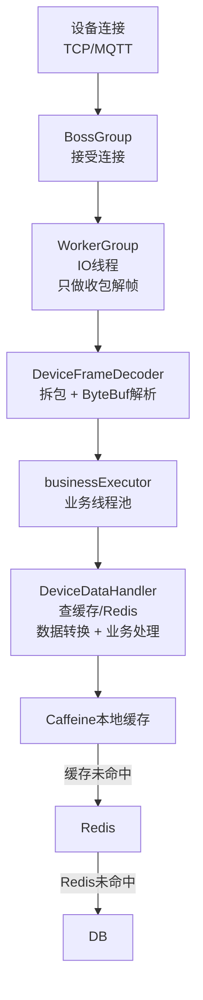

---
{"dg-publish":true,"permalink":"/01.专项学习/Netty学习/19.Netty-IoT服务端优化实践/","dg-note-properties":{}}
---

```ad-summary
title: 总结

- IoT 场景下大量设备频繁上报，ByteBuf 转 POJO 产生海量短命对象，是 FullGC 的主要根源
- IO 线程只负责收包解帧，所有业务逻辑（含 Redis 查询）必须放业务线程池
- 用 Netty Recycler 对象池复用 POJO，避免频繁 new/GC
- 设备元数据等读多写少的数据，用 Caffeine 本地缓存挡住高频 Redis 查询
- 多实例部署时，通过 Redis Pub/Sub 广播缓存失效通知，保证各节点本地缓存一致
- 开启 PooledByteBufAllocator，ByteBuf 内存复用，减少堆外内存申请/释放开销
- IdleStateHandler 检测僵尸连接，防止大量空闲连接耗尽文件描述符
- WriteBufferWaterMark 做写缓冲背压，防止慢设备把服务端内存撑爆
```

## 1. 问题根源分析

IoT 服务端面对大量设备频繁上报时，典型的 GC 问题链路如下：

```
大量设备上报 → 每条消息 new 一个 POJO → 短命对象堆积
→ Eden 区撑满 → Minor GC 频繁 → 部分对象晋升老年代 → FullGC
```

同时，如果在 Netty IO 线程里直接查 Redis（网络 IO，毫秒级延迟），会导致整个 EventLoop 阻塞，影响该 EventLoop 上所有连接的收包。

**优化的三个核心方向：**

1. IO 线程只收包解帧，业务逻辑放业务线程池
2. 用对象池复用 POJO，减少 GC 压力
3. 本地缓存挡住高频 Redis 查询

---

## 2. 整体架构



---

## 3. 服务端启动与线程池构建

```java
public class IoTServer {

    // 业务线程池：独立于 Netty IO 线程，专门处理业务逻辑
    private static final EventExecutorGroup BUSINESS_EXECUTOR =
        new DefaultEventExecutorGroup(
            Runtime.getRuntime().availableProcessors() * 2,
            new DefaultThreadFactory("iot-business")
        );

    public void start(int port) throws InterruptedException {
        EventLoopGroup bossGroup = new NioEventLoopGroup(1);
        // workerGroup 线程数默认 CPU*2，只做 IO，不做业务
        EventLoopGroup workerGroup = new NioEventLoopGroup();

        try {
            ServerBootstrap bootstrap = new ServerBootstrap();
            bootstrap.group(bossGroup, workerGroup)
                .channel(NioServerSocketChannel.class)
                .option(ChannelOption.SO_BACKLOG, 1024)
                .childOption(ChannelOption.SO_KEEPALIVE, true)
                .childOption(ChannelOption.TCP_NODELAY, true)
                .childHandler(new ChannelInitializer<SocketChannel>() {
                    @Override
                    protected void initChannel(SocketChannel ch) {
                        ch.pipeline()
                            // 解帧器：在 IO 线程执行，只做拆包
                            .addLast("frameDecoder", new DeviceFrameDecoder())
                            // 业务 Handler：指定在 BUSINESS_EXECUTOR 中执行
                            .addLast(BUSINESS_EXECUTOR, "dataHandler",
                                new DeviceDataHandler(deviceMetaCache(), redisService()));
                    }
                });

            ChannelFuture future = bootstrap.bind(port).sync();
            future.channel().closeFuture().sync();
        } finally {
            bossGroup.shutdownGracefully();
            workerGroup.shutdownGracefully();
            BUSINESS_EXECUTOR.shutdownGracefully();
        }
    }
}
```

---

## 4. 解码器：IO 线程只做拆包

解码器运行在 IO 线程，职责只有一个：**把 TCP 字节流拆成完整的帧**，不做任何业务逻辑。

以自定义二进制协议为例（协议头 4 字节表示消息体长度）：

```java
/**
 * 帧解码器：运行在 IO 线程
 * 协议格式：[4字节长度][消息体]
 */
public class DeviceFrameDecoder extends LengthFieldBasedFrameDecoder {

    public DeviceFrameDecoder() {
        super(
            65535,  // 最大帧长度
            0,      // 长度字段偏移
            4,      // 长度字段字节数
            0,      // 长度调整值
            4       // 跳过长度字段本身
        );
    }

    @Override
    protected Object decode(ChannelHandlerContext ctx, ByteBuf in) throws Exception {
        // 父类已处理拆包，这里直接返回完整帧
        // 注意：不在这里做 ByteBuf → POJO 转换，那是业务线程的事
        return super.decode(ctx, in);
    }
}
```

> [!tip] 为什么不在解码器里转 POJO？
> 解码器运行在 IO 线程。如果在这里 new POJO，对象创建的压力直接打在 IO 线程上，而且 IO 线程数量少（通常 CPU*2），吞吐量会成为瓶颈。把转换放到业务线程池，可以水平扩展处理能力。

---

## 5. POJO 对象池

用 [[01.专项学习/Netty学习/15.Netty的对象池Recycler\|Netty Recycler]] 复用 POJO，避免每条消息都 new 一个新对象：

```java
public class DeviceMessage {

    private static final Recycler<DeviceMessage> RECYCLER = new Recycler<>() {
        @Override
        protected DeviceMessage newObject(Handle<DeviceMessage> handle) {
            return new DeviceMessage(handle);
        }
    };

    private final Recycler.Handle<DeviceMessage> handle;

    // 业务字段
    private String deviceId;
    private int messageType;
    private long timestamp;
    private byte[] payload;

    private DeviceMessage(Recycler.Handle<DeviceMessage> handle) {
        this.handle = handle;
    }

    /** 从对象池获取实例，池中有则复用，没有则新建 */
    public static DeviceMessage newInstance() {
        return RECYCLER.get();
    }

    /** 用完后归还对象池，必须先清空字段 */
    public void recycle() {
        this.deviceId = null;
        this.messageType = 0;
        this.timestamp = 0;
        this.payload = null;
        handle.recycle(this);
    }

    // getter/setter 省略
}
```

---

## 6. 本地缓存构建

设备元数据（设备类型、协议版本、字段映射等）是典型的**读多写少**数据，用 Caffeine 做本地缓存：

```java
@Component
public class DeviceMetaCacheConfig {

    @Autowired
    private RedisService redisService;

    @Bean
    public LoadingCache<String, DeviceMeta> deviceMetaCache() {
        return Caffeine.newBuilder()
            .maximumSize(100_000)                          // 按设备规模调整
            .expireAfterWrite(10, TimeUnit.MINUTES)        // 写入后过期
            .refreshAfterWrite(2, TimeUnit.MINUTES)        // 异步刷新，不阻塞读
            .recordStats()                                 // 开启统计，便于监控命中率
            .build(deviceId -> redisService.getDeviceMeta(deviceId));
    }
}
```

**缓存什么、不缓存什么：**

| 数据类型 | 是否本地缓存 | 原因 |
|---|---|---|
| 设备元数据、协议配置 | ✅ 缓存 | 变化极少，读极频繁 |
| 数据点字段映射规则 | ✅ 缓存 | 变化极少，读极频繁 |
| 设备实时状态 | ❌ 不缓存 | 需要强一致，本地缓存会读到旧值 |
| 上报的业务数据 | ❌ 不缓存 | 写多读少，缓存无意义 |

---

## 7. 业务 Handler：数据转换核心

```java
/**
 * 业务 Handler：运行在 businessExecutor 线程池
 * 负责：ByteBuf → POJO → 结合 Redis/本地缓存做数据转换 → 业务处理
 */
@ChannelHandler.Sharable
public class DeviceDataHandler extends SimpleChannelInboundHandler<ByteBuf> {

    private final LoadingCache<String, DeviceMeta> deviceMetaCache;
    private final RedisService redisService;

    public DeviceDataHandler(LoadingCache<String, DeviceMeta> deviceMetaCache,
                             RedisService redisService) {
        this.deviceMetaCache = deviceMetaCache;
        this.redisService = redisService;
    }

    @Override
    protected void channelRead0(ChannelHandlerContext ctx, ByteBuf frame) {
        DeviceMessage msg = DeviceMessage.newInstance(); // 从对象池取
        try {
            // 1. ByteBuf → POJO（直接读二进制，不走 JSON 中间对象）
            parseFrame(frame, msg);

            // 2. 查本地缓存获取设备元数据（缓存未命中才打 Redis）
            DeviceMeta meta = deviceMetaCache.get(msg.getDeviceId());
            if (meta == null) {
                // 设备未注册，丢弃或告警
                return;
            }

            // 3. 结合元数据做业务转换
            BusinessData data = convertToBusinessData(msg, meta);

            // 4. 业务处理（存库、推送、告警等）
            processBusinessData(ctx, data);

        } catch (Exception e) {
            // 异常处理，避免影响其他消息
            ctx.fireExceptionCaught(e);
        } finally {
            msg.recycle(); // 必须归还对象池
        }
    }

    /**
     * 直接从 ByteBuf 读字段，避免 ByteBuf → String → POJO 的两次中间对象
     */
    private void parseFrame(ByteBuf frame, DeviceMessage msg) {
        // 示例：自定义二进制协议解析
        int deviceIdLen = frame.readShort();
        byte[] deviceIdBytes = new byte[deviceIdLen];
        frame.readBytes(deviceIdBytes);
        msg.setDeviceId(new String(deviceIdBytes, StandardCharsets.UTF_8));

        msg.setMessageType(frame.readByte());
        msg.setTimestamp(frame.readLong());

        int payloadLen = frame.readInt();
        byte[] payload = new byte[payloadLen];
        frame.readBytes(payload);
        msg.setPayload(payload);
    }

    private BusinessData convertToBusinessData(DeviceMessage msg, DeviceMeta meta) {
        // 根据 meta 中的字段映射规则，把原始 payload 转换为业务可识别的数据
        // 具体实现依赖业务协议，此处省略
        return new BusinessData(msg.getDeviceId(), msg.getTimestamp(), msg.getPayload(), meta);
    }

    private void processBusinessData(ChannelHandlerContext ctx, BusinessData data) {
        // 存库、推送下游、触发告警等
    }

    @Override
    public void exceptionCaught(ChannelHandlerContext ctx, Throwable cause) {
        // 全局异常处理，记录日志，关闭异常连接
        ctx.close();
    }
}
```

---

## 8. 缓存失效同步（多实例部署）

多实例部署时，设备配置变更后需要通知所有实例清除本地缓存，否则各节点会用旧数据转换：

```java
@Component
public class DeviceMetaInvalidateListener {

    private static final String CHANNEL = "device:meta:invalidate";

    @Autowired
    private LoadingCache<String, DeviceMeta> deviceMetaCache;

    @Autowired
    private RedisTemplate<String, String> redisTemplate;

    /** 订阅 Redis Pub/Sub，收到通知后清除本地缓存 */
    @PostConstruct
    public void subscribe() {
        redisTemplate.execute((RedisCallback<Void>) connection -> {
            connection.subscribe((message, pattern) -> {
                String deviceId = new String(message.getBody());
                deviceMetaCache.invalidate(deviceId);
            }, CHANNEL.getBytes());
            return null;
        });
    }

    /** 设备配置变更时调用，广播失效通知 */
    public void invalidate(String deviceId) {
        // 先更新 Redis
        redisService.updateDeviceMeta(deviceId);
        // 再广播，让所有实例清除本地缓存
        redisTemplate.convertAndSend(CHANNEL, deviceId);
    }
}
```

---

## 9. JVM 参数调优

```bash
# 增大年轻代，让短命对象在 Minor GC 前就死掉，减少晋升老年代的概率
-XX:NewRatio=1              # 年轻代:老年代 = 1:1

# 推荐使用 G1（稳定）或 ZGC（低延迟）
-XX:+UseG1GC
-XX:MaxGCPauseMillis=200

# 或者 ZGC，适合对延迟敏感的 IoT 场景
# -XX:+UseZGC
```

---

## 10. 优化效果对比

| 优化点 | 优化前 | 优化后 |
|---|---|---|
| POJO 创建 | 每条消息 new 一个 | 对象池复用，GC 压力大幅下降 |
| Redis 查询 | 每条消息打一次 Redis | 本地缓存命中，Redis 查询减少 90%+ |
| IO 线程 | 业务逻辑阻塞 IO 线程 | IO 线程只收包，吞吐量提升 |
| FullGC | 频繁 FullGC，服务抖动 | FullGC 基本消除 |

> [!warning] 注意事项
> - `DeviceMessage.recycle()` 必须在 `finally` 块中调用，防止异常时对象泄漏
> - `@ChannelHandler.Sharable` 注解要求 Handler 是无状态的，所有状态通过方法参数传递
> - 本地缓存的 `maximumSize` 要根据实际设备数量评估，避免内存溢出
> - 缓存命中率建议通过 `cache.stats()` 监控，低于 80% 说明缓存配置需要调整

---

## 11. ByteBuf 内存池

前面的优化都在减少 POJO 的 GC 压力，但 ByteBuf 本身也是高频分配的对象。每次收到数据包，Netty 都要分配一块内存来存放字节流，用完就释放。1 万台设备每秒上报，就是每秒 1 万次内存申请/释放，堆外内存的碎片化问题会越来越严重。

Netty 内置了 `PooledByteBufAllocator`，用内存池管理 ByteBuf，原理和对象池类似：预先申请一大块内存，按需切分，用完归还，避免频繁向 OS 申请/释放。

在 `ServerBootstrap` 里加一行配置就能开启：

```java
bootstrap.group(bossGroup, workerGroup)
    .channel(NioServerSocketChannel.class)
    // 开启 ByteBuf 内存池，复用内存块，减少堆外内存碎片
    .childOption(ChannelOption.ALLOCATOR, PooledByteBufAllocator.DEFAULT)
    // ... 其他配置
```

> [!tip] 堆内存 vs 堆外内存
> `PooledByteBufAllocator.DEFAULT` 在 64 位 JVM 上默认分配堆外内存（DirectByteBuf），数据从网卡到 Netty 不需要经过 JVM 堆的拷贝，零拷贝效果更好。如果你的场景需要频繁把 ByteBuf 内容转成 `byte[]`，可以改用 `PooledByteBufAllocator(false)` 强制走堆内存，避免堆外内存和堆内存之间的拷贝反而更慢。

---

## 12. 僵尸连接清理

IoT 设备网络环境复杂，设备断电、网络中断、信号丢失都可能导致 TCP 连接没有正常关闭，服务端却还维持着这条"僵尸连接"。10 万台设备里哪怕 1% 是僵尸连接，就是 1000 个无效连接占着文件描述符，时间长了会把 fd 耗尽。

`IdleStateHandler` 检测连接空闲时间，超时后触发 `IdleStateEvent`，在后续 Handler 里关掉这条连接：

```java
.childHandler(new ChannelInitializer<SocketChannel>() {
    @Override
    protected void initChannel(SocketChannel ch) {
        ch.pipeline()
            // 读空闲超过 90 秒，触发 IdleStateEvent（设备正常应每 30 秒发一次心跳）
            .addLast("idleHandler", new IdleStateHandler(90, 0, 0, TimeUnit.SECONDS))
            .addLast("heartbeatHandler", new HeartbeatHandler())
            .addLast("frameDecoder", new DeviceFrameDecoder())
            .addLast(BUSINESS_EXECUTOR, "dataHandler",
                new DeviceDataHandler(deviceMetaCache(), redisService()));
    }
});
```

```java
/**
 * 心跳检测 Handler：运行在 IO 线程
 * 收到 IdleStateEvent 说明设备长时间没有上报，关闭连接
 */
public class HeartbeatHandler extends ChannelInboundHandlerAdapter {

    private static final Logger log = LoggerFactory.getLogger(HeartbeatHandler.class);

    @Override
    public void userEventTriggered(ChannelHandlerContext ctx, Object evt) throws Exception {
        if (evt instanceof IdleStateEvent) {
            IdleStateEvent event = (IdleStateEvent) evt;
            if (event.state() == IdleState.READER_IDLE) {
                // 90 秒没收到任何数据，判定为僵尸连接，主动关闭
                log.warn("设备连接空闲超时，关闭连接: {}", ctx.channel().remoteAddress());
                ctx.close();
                return;
            }
        }
        super.userEventTriggered(ctx, evt);
    }
}
```

心跳超时时间的设置原则：**超时时间 = 心跳间隔 × 3**，给网络抖动留足余量。设备每 30 秒发一次心跳，超时就设 90 秒。

---

## 13. 写缓冲背压控制

服务端给设备下发指令时，如果设备网络很慢（比如 NB-IoT 设备），数据写不出去就会堆在 Netty 的写缓冲区里。业务线程还在不停地往里写，缓冲区越来越大，最终把堆内存撑爆。

`WriteBufferWaterMark` 设置写缓冲的高低水位线：

```java
bootstrap.group(bossGroup, workerGroup)
    .channel(NioServerSocketChannel.class)
    .childOption(ChannelOption.ALLOCATOR, PooledByteBufAllocator.DEFAULT)
    // 写缓冲低水位 32KB，高水位 64KB
    // 超过高水位时 channel.isWritable() 返回 false，业务层应停止写入
    .childOption(ChannelOption.WRITE_BUFFER_WATER_MARK,
        new WriteBufferWaterMark(32 * 1024, 64 * 1024))
```

业务层下发指令前先检查 `isWritable()`：

```java
public void sendCommand(Channel channel, byte[] command) {
    if (!channel.isWritable()) {
        // 写缓冲已满，丢弃或放入重试队列，不能继续往里塞
        log.warn("设备写缓冲已满，丢弃指令: {}", channel.remoteAddress());
        return;
    }
    channel.writeAndFlush(Unpooled.wrappedBuffer(command));
}
```

> [!warning] 背压是双向的
> 这里只控制了服务端→设备方向的背压。如果设备上报速度超过业务线程处理速度，业务线程池队列会积压。建议给业务线程池配置有界队列（如 `LinkedBlockingQueue(10000)`），队列满时用 `CallerRunsPolicy` 让 IO 线程降速，而不是无限堆积任务。

---

## 14. 关键指标监控

优化做完，怎么知道效果好不好？几个必须暴露的指标：

```java
@Component
public class IoTMetrics {

    @Autowired
    private LoadingCache<String, DeviceMeta> deviceMetaCache;

    @Autowired
    private ThreadPoolExecutor businessExecutor;

    /** 每分钟打一次关键指标日志，或接入 Micrometer 暴露给 Prometheus */
    @Scheduled(fixedRate = 60_000)
    public void reportMetrics() {
        CacheStats stats = deviceMetaCache.stats();

        // 缓存命中率低于 80% 说明 maximumSize 太小或 TTL 太短
        log.info("本地缓存命中率: {:.1f}%", stats.hitRate() * 100);

        // 业务线程池队列深度，持续增长说明处理能力不足，需要扩容
        log.info("业务线程池队列深度: {}", businessExecutor.getQueue().size());

        // 活跃线程数，接近 maximumPoolSize 说明线程池快撑满了
        log.info("业务线程池活跃线程: {}/{}", 
            businessExecutor.getActiveCount(), 
            businessExecutor.getMaximumPoolSize());
    }
}
```

| 指标 | 健康阈值 | 异常说明 |
|---|---|---|
| 本地缓存命中率 | > 90% | 低于 80% 需扩大 `maximumSize` 或延长 TTL |
| 业务线程池队列深度 | < 1000 | 持续增长说明处理能力不足 |
| Minor GC 频率 | < 1次/分钟 | 频繁 Minor GC 说明对象池或 ByteBuf 池未生效 |
| FullGC 次数 | 0 | 出现 FullGC 立即排查老年代对象来源 |
