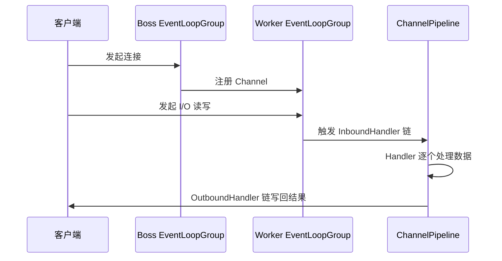

---
{"dg-publish":true,"permalink":"/01.专项学习/Netty学习/2.Netty整体架构/"}
---

#review #netty 
```ad-summary
title: 总结

- Netty 分三层：网络层（连接）→ 事件调度层（分发）→ 服务编排层（处理）
- Boss EventLoopGroup 负责接受连接，Worker EventLoopGroup 负责读写，职责分离
- 数据流向：入站经 InboundHandler 链处理，出站经 OutboundHandler 链写回
```

## 1. 逻辑架构


### 1.1 网络层

负责执行网络 I/O 操作，支持多种协议和 I/O 模型。内核缓冲区有数据就绪后，触发网络事件，往上交给事件调度层处理。

两个核心组件：
- **Bootstrap / ServerBootStrap**：客户端和服务端的启动入口，详见 [[01.专项学习/Netty学习/3.Netty全局入口Bootstrap\|3.Netty全局入口Bootstrap]]
- **Channel**：网络通信的载体，封装了底层 Socket 交互能力，详见 [[01.专项学习/Netty学习/4.Netty的Channel\|4.Netty的Channel]]

### 1.2 事件调度层

基于 Reactor 线程模型，用 `Selector` 主循环聚合 I/O 事件、信号事件、定时事件等，然后把实际业务处理交给服务编排层的 Handler 去做。

- **EventLoopGroup**：本质是个线程池，负责接收 I/O 请求并分配线程处理，详见 [[01.专项学习/Netty学习/5.Netty的EventLoop\|5.Netty的EventLoop]]

### 1.3 服务编排层

Netty 的核心处理链，负责把各种 Handler 组装起来，实现网络事件的动态编排和有序传播。

三个组件各司其职：

| 组件                                                            | 职责                                                      |
| ------------------------------------------------------------- | ------------------------------------------------------- |
| **[[01.专项学习/Netty学习/6.Netty的ChannelPipeline\|ChannelPipeline]]**              | 有状态的处理链，与 Channel 一一绑定，负责组装 ChannelHandler              |
| **[[01.专项学习/Netty学习/7.Netty的ChannelHandler与Context\|ChannelHandler]]**        | 无状态的处理单元，做编解码和业务逻辑，可以被多个 Channel 复用                     |
| **[[01.专项学习/Netty学习/7.Netty的ChannelHandler与Context\|ChannelHandlerContext]]** | 连接 Pipeline 和 Handler 的中间角色，保存两者的关联关系，事件在 Handler 间传递靠它 |

Handler 设计成无状态是为了复用，Pipeline 是有状态的所以和 Channel 绑定，ChannelHandlerContext 就是把这两者粘在一起的胶水。

### 1.4 组件协作流程




- **Boss EventLoopGroup**：只负责监听新连接，连接建立后把 Channel 注册给 Worker
- **Worker EventLoopGroup**：每个 Channel 分配一个 EventLoop（单线程），通过 Selector 做事件循环
- 入站数据从第一个 `ChannelInboundHandler` 开始往后传，出站数据从最后一个 `ChannelOutboundHandler` 开始往前传，最终写回客户端

## 2. 代码包结构


### 2.1 Core 核心层

| 模块               | 作用                                                                                                                                                               |
| ---------------- | ---------------------------------------------------------------------------------------------------------------------------------------------------------------- |
| `netty-common`   | 基础工具包，其他模块都依赖它。包含定时器 `TimerTask`、时间轮 [[01.专项学习/Netty学习/13.Netty的HashedWheelTimer\|HashedWheelTimer]]、异步模型 `Future & Promise`、增强版 [[01.专项学习/Netty学习/14.Netty的FastThreadLocal\|FastThreadLocal]] 等 |
| `netty-buffer`   | 自研 [[01.专项学习/Netty学习/8.Netty的ByteBuf\|ByteBuf]]，比 JDK 的 `ByteBuffer` 更好用，是网络通信的数据载体                                                                                              |
| `netty-resolver` | 基础设施解析工具，处理 IP、Hostname、DNS 等                                                                                                                                    |

### 2.2 Protocol Support 协议支持层

| 模块 | 作用 |
|------|------|
| `netty-codec` | 编解码，原始字节 ↔ 业务对象。内置 HTTP、HTTP/2、Redis、XML 等主流协议；[[01.专项学习/Netty学习/10.Netty自定义协议实现\|自定义协议]]继承 `ByteToMessageDecoder` / `MessageToByteEncoder` 即可 |
| `netty-handler` | 数据处理，提供开箱即用的 Handler，如日志、IP 过滤、流量整形 |

### 2.3 Transport Service 传输服务层

Netty 数据处理和传输的核心模块，定义了所有关键接口：`Bootstrap`、`Channel`、`ChannelHandler`、`EventLoop`、`EventLoopGroup`、[[01.专项学习/Netty学习/6.Netty的ChannelPipeline\|ChannelPipeline]]。

这层是逻辑架构的具体实现，逻辑架构里提到的组件都在这里落地。
