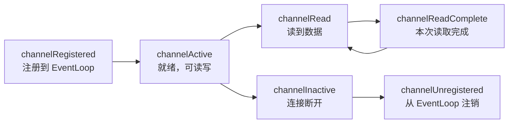

---
{"dg-publish":true,"permalink":"/01.专项学习/Netty学习/4.Netty的Channel/","dg-note-properties":{}}
---

#review 
```ad-summary
title: 总结

- Channel 是 Netty 对 JDK NIO Channel 的封装，屏蔽了底层 Socket 复杂性
- 生产环境基本只用 NioServerSocketChannel（服务端）和 NioSocketChannel（客户端）
- Channel 有完整的生命周期，状态变化会触发对应的 ChannelHandler 回调
```

## 1. Channel 是什么？

Channel 是网络通信的载体，封装了底层 Socket，提供了 `register`、`bind`、`connect`、`read`、`write`、`flush` 等基础 API。

Netty 的 Channel 以 JDK NIO Channel 为基础，但做了更高层次的抽象，用起来比原生 NIO 简单很多。


常用的就两个，其他基本不用：

| Channel 类型 | 协议 | 模式 | 场景 |
|---|---|---|---|
| **NioServerSocketChannel** | TCP | 异步 | 服务端监听端口，常用 |
| **NioSocketChannel** | TCP | 异步 | 客户端连接，常用 |
| OioServerSocketChannel | TCP | 同步阻塞 | 已废弃，不用 |
| OioSocketChannel | TCP | 同步阻塞 | 已废弃，不用 |
| NioDatagramChannel | UDP | 异步 | UDP 场景 |

## 2. Channel 生命周期

Channel 从创建到销毁会经历多个状态，每个状态变化都会触发对应的 ChannelHandler 回调：



| 回调方法 | 触发时机 |
|---|---|
| `channelRegistered` | Channel 创建后注册到 EventLoop |
| `channelActive` | Channel 就绪，可以读写（连接建立完成） |
| `channelRead` | 从远端读到数据 |
| `channelReadComplete` | 本次读取完成（一次事件可能触发多次 channelRead） |
| `channelInactive` | 连接断开，Channel 不可用 |
| `channelUnregistered` | 从 EventLoop 注销 |

## 3. Channel 参数配置

在 [[01.专项学习/Netty学习/3.Netty全局入口Bootstrap\|3.Netty全局入口Bootstrap]] 里，`option` 配置 Boss 的 ServerChannel，`childOption` 配置 Worker 处理的 SocketChannel：

```java
serverBootstrap
    .option(ChannelOption.SO_BACKLOG, 1024)          // Boss：连接队列长度
    .childOption(ChannelOption.SO_KEEPALIVE, true)   // Worker：连接保活
    .childOption(ChannelOption.TCP_NODELAY, true);   // Worker：禁用 Nagle 算法
```

常用参数说明：

| 参数 | 默认值 | 说明 |
|---|---|---|
| `SO_KEEPALIVE` | false | TCP 连接保活探测，长连接场景建议开启 |
| `SO_BACKLOG` | 系统默认 | 已完成三次握手的等待队列长度，高并发场景适当调大 |
| `TCP_NODELAY` | true | 禁用 Nagle 算法，数据立即发送；设为 false 会攒包发送，延迟换吞吐 |
| `SO_SNDBUF` | 系统默认 | TCP 发送缓冲区大小 |
| `SO_RCVBUF` | 系统默认 | TCP 接收缓冲区大小 |
| `SO_LINGER` | -1 | 延迟关闭，等缓冲区数据发完再关；-1 表示立即关闭 |
| `CONNECT_TIMEOUT_MILLIS` | 30000 | 建立连接的超时时间（毫秒） |

`TCP_NODELAY` 是 Netty 默认开启的，因为 Netty 的场景大多是低延迟优先，Nagle 算法攒包虽然能减少报文数量，但会引入额外延迟，不适合。
