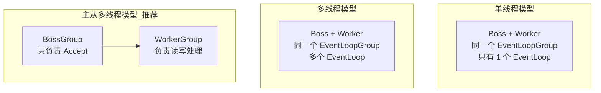

---
{"dg-publish":true,"permalink":"/01.专项学习/Netty学习/5.Netty的EventLoop/","dg-note-properties":{}}
---

```ad-summary
title: 总结

- EventLoopGroup 是线程池，EventLoop 是单线程，Channel 生命周期绑定同一个 EventLoop
- NioEventLoop 采用无锁串行化设计，每次循环做三件事：select → processSelectedKeys → runAllTasks
- 推荐主从多线程模型：BossGroup 只负责 Accept，WorkerGroup 负责读写
- 耗时操作不能放在 EventLoop 里，会阻塞整条链路，要扔到业务线程池异步处理
- 任务队列分三类：普通任务（taskQueue）、定时任务（scheduledTaskQueue）、尾部任务（tailTasks）
```

## 1. EventLoopGroup 和 EventLoop 的关系

EventLoopGroup 本质是一个线程池，负责接收 I/O 请求并分配线程处理。


三者关系：

1. 一个 EventLoopGroup 包含一个或多个 EventLoop。EventLoop 处理 Channel 生命周期内的所有 I/O 事件，如 accept、connect、read、write
2. **EventLoop 同一时间只绑定一个线程**，但可以负责多个 Channel
3. 每新建一个 Channel，EventLoopGroup 会选一个 EventLoop 与其绑定，**此后该 Channel 的所有事件都由这个 EventLoop 处理**


NioEventLoopGroup 是 Netty 中**最推荐使用的线程模型**，基于 NIO 实现，继承自 MultithreadEventLoopGroup。可以把它理解为一个线程池，每个线程负责多个 Channel，同一个 Channel 只对应一个线程。

## 2. Reactor 三种线程模型



| 模型    | 配置方式                                       | 缺点                           |
| ----- | ------------------------------------------ | ---------------------------- |
| 单线程   | Boss 和 Worker 共用同一个 Group，只有 1 个 EventLoop | 连接数有限，一个事件阻塞就全卡死             |
| 多线程   | Boss 和 Worker 共用同一个 Group，多个 EventLoop     | Boss 仍是单线程，高并发下 Accept 可能成瓶颈 |
| 主从多线程 | Boss 和 Worker 用不同的 Group                   | 无明显缺点，生产推荐                   |

主从多线程模型中，BossGroup 只负责监听 Accept 事件，连接建立后把 Channel 注册到 WorkerGroup 的某个 EventLoop 上，后续读写全由 Worker 处理。三次握手、SSL 认证这些耗时操作不会拖累 Worker。

```java
// 主从多线程模型标准写法
EventLoopGroup bossGroup = new NioEventLoopGroup(1);      // 通常 1 个就够
EventLoopGroup workerGroup = new NioEventLoopGroup();     // 默认 CPU 核数 × 2

ServerBootstrap bootstrap = new ServerBootstrap();
bootstrap.group(bossGroup, workerGroup)
         .channel(NioServerSocketChannel.class)
         .childHandler(new ChannelInitializer<SocketChannel>() {
             @Override
             protected void initChannel(SocketChannel ch) {
                 ch.pipeline().addLast(new MyHandler());
             }
         });
```

## 3. EventLoop 工作原理


事件发生时，应用程序把事件放入事件队列，EventLoop 轮询取出并执行，支持**立即执行、延后执行、定期执行**三种方式。

### 3.1 NioEventLoop 核心 run() 方法

每次循环做三件事：**select → processSelectedKeys → runAllTasks**

```java
protected void run() {
    int selectCnt = 0;
    for (;;) {
        try {
            int strategy;
            try {
                strategy = selectStrategy.calculateStrategy(selectNowSupplier, hasTasks());
                switch (strategy) {
                case SelectStrategy.CONTINUE:
                    continue;
                case SelectStrategy.BUSY_WAIT:
                    // NIO 不支持 busy-wait，fall-through 到 SELECT
                case SelectStrategy.SELECT:
                    long curDeadlineNanos = nextScheduledTaskDeadlineNanos();
                    if (curDeadlineNanos == -1L) {
                        curDeadlineNanos = NONE;
                    }
                    nextWakeupNanos.set(curDeadlineNanos);
                    try {
                        if (!hasTasks()) {
                            strategy = select(curDeadlineNanos);
                        }
                    } finally {
                        nextWakeupNanos.lazySet(AWAKE);
                    }
                default:
                }
            } catch (IOException e) {
                // Selector 出问题了，重建后重试
                rebuildSelector0();
                selectCnt = 0;
                handleLoopException(e);
                continue;
            }

            selectCnt++;
            cancelledKeys = 0;
            needsToSelectAgain = false;
            final int ioRatio = this.ioRatio;
            boolean ranTasks;
            if (ioRatio == 100) {
                try {
                    if (strategy > 0) {
                        processSelectedKeys();
                    }
                } finally {
                    ranTasks = runAllTasks();
                }
            } else if (strategy > 0) {
                final long ioStartTime = System.nanoTime();
                try {
                    processSelectedKeys();
                } finally {
                    // 按 ioRatio 比例分配 I/O 和任务的执行时间
                    final long ioTime = System.nanoTime() - ioStartTime;
                    ranTasks = runAllTasks(ioTime * (100 - ioRatio) / ioRatio);
                }
            } else {
                ranTasks = runAllTasks(0); // 只跑最少量的任务
            }

            if (ranTasks || strategy > 0) {
                selectCnt = 0;
            } else if (unexpectedSelectorWakeup(selectCnt)) {
                selectCnt = 0;
            }
        } catch (CancelledKeyException e) {
            if (logger.isDebugEnabled()) {
                logger.debug(CancelledKeyException.class.getSimpleName() + " raised by a Selector {} - JDK bug?",
                        selector, e);
            }
        } catch (Error e) {
            throw (Error) e;
        } catch (Throwable t) {
            handleLoopException(t);
        } finally {
            try {
                if (isShuttingDown()) {
                    closeAll();
                    if (confirmShutdown()) {
                        return;
                    }
                }
            } catch (Error e) {
                throw (Error) e;
            } catch (Throwable t) {
                handleLoopException(t);
            }
        }
    }
}
```

其中 `ioRatio` 控制 I/O 处理和任务处理的时间比例，默认 50，即各占一半。调高 ioRatio 意味着更多时间用于 I/O，适合 I/O 密集型场景。

调整方式：在 Bootstrap 配置阶段通过 `NioEventLoop` 直接设置，或者在 `workerGroup` 初始化后遍历设置：

```java
// 方式一：启动时对 workerGroup 中每个 EventLoop 设置
EventLoopGroup workerGroup = new NioEventLoopGroup();
workerGroup.forEach(eventLoop -> {
    if (eventLoop instanceof NioEventLoop) {
        ((NioEventLoop) eventLoop).setIoRatio(70); // I/O 占 70%，任务占 30%
    }
});

// 方式二：通过 childOption 在 handler 里动态调整（运行时也可修改）
((NioEventLoop) ctx.channel().eventLoop()).setIoRatio(70);
```

| ioRatio 值 | 含义 | 适用场景 |
|---|---|---|
| 50（默认） | I/O 和任务各占一半 | 通用场景 |
| 调高（如 70-90） | 更多时间处理 I/O 事件 | 高并发连接、I/O 密集型 |
| 调低（如 20-30） | 更多时间处理任务队列 | 任务队列积压、计算密集型 |
| 100 | 全部时间处理 I/O，任务处理不限时 | 极端 I/O 优先场景 |

## 4. 事件处理机制


NioEventLoop 采用**无锁串行化**设计：

- BossEventLoopGroup 监听 Accept 事件，连接建立后注册到 WorkerEventLoopGroup 的某个 NioEventLoop
- **每个 Channel 只绑定一个 NioEventLoop**，Channel 生命周期内的所有事件都由同一个线程处理，不同 NioEventLoop 之间完全隔离
- 数据读取完成后，NioEventLoop 调用 [[01.专项学习/Netty学习/6.Netty的ChannelPipeline\|ChannelPipeline]] 进行串行事件传播，整个过程不会发生线程上下文切换

无锁串行化的好处是吞吐量高、业务逻辑不用关心线程安全。代价是**不能在 EventLoop 里跑耗时操作**，一旦某个 Handler 阻塞，后续所有事件都会积压。

另外 JDK NIO 有个经典 bug：Selector 空轮询导致 CPU 飙到 100%，Netty 对此有专门的解决方案，见 [[01.专项学习/Netty学习/12.Netty如何解决空轮询的\|12.Netty如何解决空轮询的]]。

## 5. 任务处理机制

NioEventLoop 除了处理 I/O 事件，还要跑任务队列里的任务，分三类：

| 类型   | 队列实现                            | 添加方式                                    | 典型用途                |
| ---- | ------------------------------- | --------------------------------------- | ------------------- |
| 普通任务 | MpscChunkedArrayQueue（多生产者单消费者） | `eventLoop.execute(task)`               | WriteAndFlushTask 等 |
| 定时任务 | PriorityQueue（优先队列）             | `eventLoop.schedule(task, delay, unit)` | 心跳发送、超时检测           |
| 尾部任务 | tailTasks                       | 内部使用                                    | 统计耗时、监控上报           |

尾部任务优先级最低，每次跑完 taskQueue 后才会执行，适合做收尾工作。

### 5.1 业务场景举例

以一个**即时聊天服务器**为例，三类任务队列都会用到：

**场景**：用户 A 发消息给用户 B，同时服务器需要维持心跳、统计消息量。

```
用户 A 发消息
    │
    ▼
Worker EventLoop 收到 OP_READ 事件（I/O 事件，直接处理）
    │  解码消息内容
    │
    ▼
业务线程池处理（查数据库、鉴权...）
    │  处理完后需要把结果写回给用户 B
    │  但写操作必须在 EventLoop 线程里执行
    │
    ▼
eventLoop.execute(() -> ctx.writeAndFlush(msg))   ← 提交普通任务
    │  放入 taskQueue，等当前 I/O 轮询结束后执行
    │
    ▼
eventLoop.schedule(() -> sendHeartbeat(), 30, SECONDS)  ← 提交定时任务
    │  放入 scheduledTaskQueue，30s 后触发
```

三类任务对应的具体代码：

```java
// 1. 普通任务：业务线程处理完后，把写操作提交回 EventLoop 线程
businessThreadPool.submit(() -> {
    String result = queryDatabase(msg);
    // 不能直接在业务线程写，要提交给 EventLoop
    ctx.channel().eventLoop().execute(() -> {
        ctx.writeAndFlush(result);
    });
});

// 2. 定时任务：连接建立时注册一次，每 30s 发一次心跳（不是每次收消息都注册！）
@Override
public void channelActive(ChannelHandlerContext ctx) {
    ctx.channel().eventLoop().scheduleAtFixedRate(() -> {
        ctx.writeAndFlush(HEARTBEAT_FRAME);
    }, 30, 30, TimeUnit.SECONDS);
}

// 3. 尾部任务：每轮循环结束后统计消息量（Netty 内部使用，业务代码较少直接用）
//    比如 Netty 内部用它来上报当前 EventLoop 的执行耗时监控数据
```

为什么写操作要提交回 EventLoop？因为 [[01.专项学习/Netty学习/11.Netty的WriteAndFlush\|writeAndFlush]] 最终会操作 `ChannelOutboundBuffer`，这个对象不是线程安全的，必须在绑定的 EventLoop 线程里操作。Netty 在 `write()` 方法里会检查当前线程是否是 EventLoop 线程，不是的话就自动封装成 task 提交到 taskQueue。

```java
protected boolean runAllTasks(long timeoutNanos) {
    // 1. 把到期的定时任务合并到普通任务队列
    fetchFromScheduledTaskQueue();
    Runnable task = pollTask();
    if (task == null) {
        afterRunningAllTasks();
        return false;
    }
    // 2. 计算超时截止时间
    final long deadline = ScheduledFutureTask.nanoTime() + timeoutNanos;
    long runTasks = 0;
    long lastExecutionTime;
    for (;;) {
        // 3. 执行任务
        safeExecute(task);
        runTasks++;
        // 4. 每执行 64 个任务检查一次是否超时，避免任务执行时间过长影响下一轮 I/O
        if ((runTasks & 0x3F) == 0) {
            lastExecutionTime = ScheduledFutureTask.nanoTime();
            if (lastExecutionTime >= deadline) {
                break;
            }
        }
        task = pollTask();
        if (task == null) {
            lastExecutionTime = ScheduledFutureTask.nanoTime();
            break;
        }
    }
    // 5. 执行尾部任务
    afterRunningAllTasks();
    this.lastExecutionTime = lastExecutionTime;
    return true;
}
```

每 64 个任务检查一次超时是个小优化，避免每次都调用 `nanoTime()`（系统调用有开销）。

## 6. 最佳实践

**1. 用主从多线程模型**

Boss 和 Worker 分开，三次握手、SSL 认证这些耗时操作不会拖累 Worker 的读写处理。

**2. 耗时操作扔到业务线程池**

编解码之后的业务逻辑如果耗时较长，封装成 Task 异步处理，别堵在 EventLoop 里：

```java
public void channelRead(ChannelHandlerContext ctx, Object msg) {
    // 耗时业务逻辑扔到业务线程池
    businessThreadPool.submit(() -> {
        Object result = doBusinessLogic(msg);
        // 处理完再写回
        ctx.channel().writeAndFlush(result);
    });
}
```

**3. 短耗时操作直接在 Handler 里跑**

编解码这类操作耗时很短，直接在 ChannelHandler 里执行就行，没必要再搞一层异步，过度设计反而增加复杂度。

**4. 别堆太多 ChannelHandler**

Handler 多了既影响性能也难维护。要明确业务分层和 Netty 分层的边界，不要把所有业务逻辑都往 Handler 里塞。
