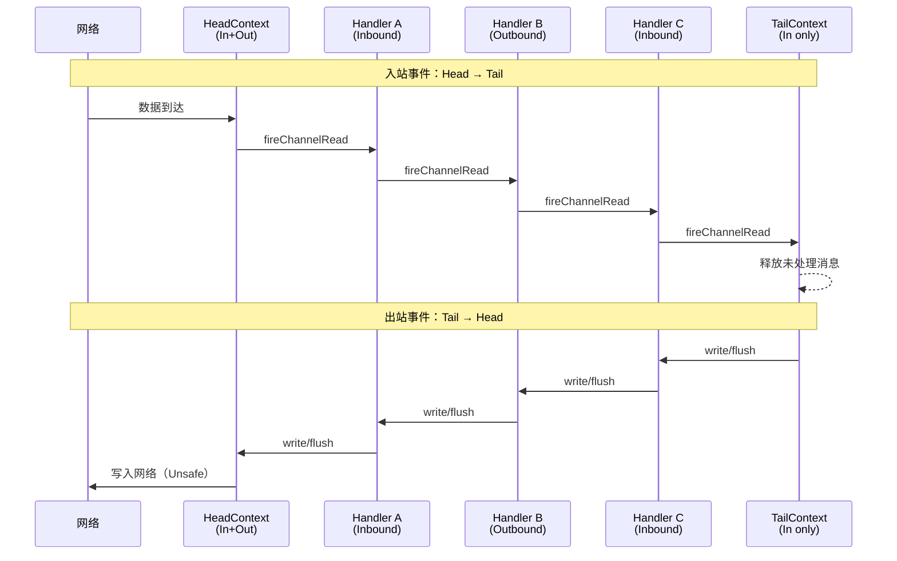

---
{"dg-publish":true,"permalink":"/01.专项学习/Netty学习/6.Netty的ChannelPipeline/"}
---

#netty #review 
```ad-summary
title: 总结

- ChannelPipeline 是 ChannelHandler 的双向链表容器，负责编排和调度所有 Handler
- 每个 Channel 独占一个 Pipeline，Pipeline 绑定单一 EventLoop 线程，天然线程安全
- 入站事件从 Head → Tail 传播，出站事件从 Tail → Head 传播
- HeadContext 和 TailContext 是 Netty 内置的头尾节点，自定义 Handler 插在中间
- ctx.writeAndFlush() 从当前节点向前找，channel.writeAndFlush() 从 Tail 开始走全程
```


## 1. ChannelPipeline 是什么？

ChannelPipeline 是 Netty 的核心编排组件，**负责组装各种 ChannelHandler**，实际的数据编解码和业务处理都由 Handler 完成，Pipeline 本身只负责"把 Handler 串起来、按顺序调用"。Handler 本身的设计、回调方法和异常处理见 [[01.专项学习/Netty学习/7.Netty的ChannelHandler与Context\|7.Netty的ChannelHandler与Context]]。

内部通过**双向链表**将不同的 ChannelHandler 链接在一起。当 I/O 读写事件触发时，Pipeline 会依次调用链表中的 Handler 对数据进行拦截和处理。


Pipeline 是**线程安全**的，原因很简单：每个 Channel 都绑定一个独立的 Pipeline，一个 Pipeline 关联一个 [[01.专项学习/Netty学习/5.Netty的EventLoop\|EventLoop]]，一个 EventLoop 只绑定一个线程，所以不存在多线程竞争。

## 2. 内部结构


Pipeline 的双向链表维护了 **HeadContext** 和 **TailContext** 两个固定节点，自定义的 Handler 插在它们中间。

### 2.1 HeadContext

- 同时实现了 `ChannelInboundHandler` 和 `ChannelOutboundHandler`
- 是**出站事件的最后一站**，网络数据写入操作的入口就在这里完成（最终调用 Unsafe 写数据）
- 在传递事件之前会执行一些前置操作，比如 flush 前的内存管理

### 2.2 TailContext

- 只实现了 `ChannelInboundHandler`
- 是**入站事件的最后一站**，主要职责是终止入站事件传播，并释放 Message 数据资源（防止内存泄漏）
- 作为出站事件传播的**第一站**，只是简单地把事件传给上一个节点

用一张图来理解两者的位置关系：



## 3. 事件传播方向

Pipeline 中有两类事件，传播方向相反：

| 事件类型 | 传播方向 | 触发方式 |
|---|---|---|
| 入站（Inbound） | Head → Tail | 网络数据到达、连接建立/断开等 |
| 出站（Outbound） | Tail → Head | write、flush、connect、bind 等 |

入站打印顺序：A → B → C
出站打印顺序：C → B → A

### 3.1 ctx 和 channel 写操作的区别

这是个容易踩坑的地方：
```java
// 从当前 Handler 节点向前找第一个 OutboundHandler，不走完整个 Pipeline
ctx.writeAndFlush(msg);

// 从 TailContext 开始，走完整个 Pipeline
ctx.channel().writeAndFlush(msg);
```

大多数情况下用 `ctx.writeAndFlush()` 性能更好，因为跳过了当前节点之后的 Handler。但如果你的出站 Handler 在当前节点之后，就得用 `channel.writeAndFlush()`，不然会被跳过。

## 4. 怎么添加 Handler？

```java
ChannelPipeline pipeline = channel.pipeline();

// 添加到末尾（TailContext 之前）
pipeline.addLast(new MyInboundHandler());
pipeline.addLast(new MyOutboundHandler());

// 添加到开头（HeadContext 之后）
pipeline.addFirst(new LoggingHandler());

// 在指定 Handler 之前/之后插入
pipeline.addBefore("myHandler", "newHandler", new NewHandler());
pipeline.addAfter("myHandler", "newHandler", new NewHandler());

// 运行时动态移除
pipeline.remove(MyInboundHandler.class);
```

Pipeline 支持运行时动态增删 Handler，这在需要按需加载解码器的场景下很有用，比如 HTTP 升级到 WebSocket 时，可以在握手完成后把 HTTP Handler 换掉。

## 5. 典型 Pipeline 结构

一个标准的服务端 Pipeline 通常长这样：

```
Head → [日志] → [SSL] → [解码器] → [编码器] → [业务Handler] → [异常Handler] → Tail
```

```java
pipeline.addLast(new LoggingHandler(LogLevel.INFO));       // 日志
pipeline.addLast(new LengthFieldBasedFrameDecoder(...));   // 解决粘包
pipeline.addLast(new StringDecoder());                     // 解码（Inbound）
pipeline.addLast(new StringEncoder());                     // 编码（Outbound）
pipeline.addLast(new BusinessHandler());                   // 业务逻辑
pipeline.addLast(new ExceptionHandler());                  // 统一异常处理
```

看起来编码器排在业务 Handler 前面，但实际执行顺序是对的，因为入站和出站方向相反：

- **入站**（数据进来）：Head → 解码器 → 业务 Handler，业务 Handler 拿到的是解码后的对象
- **出站**（数据返回）：业务 Handler 调用 `write()` → 出站从当前节点往 Head 方向找 → 编码器 → Head → 写网络

编码器虽然在链表里排在业务 Handler 前面，但出站是从 Tail 往 Head 走，所以业务 Handler 的 `write()` 出站时自然会经过编码器，顺序完全正确。
