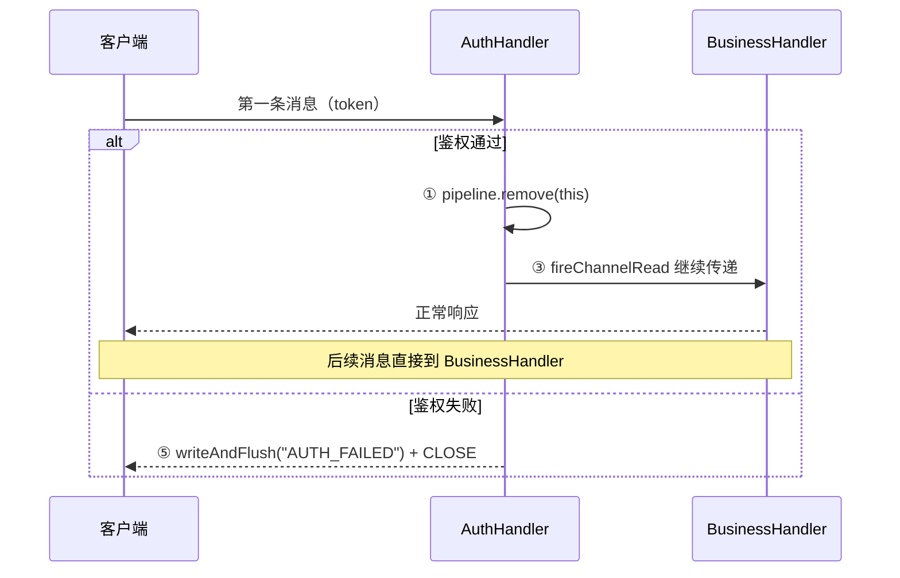

---
{"dg-publish":true,"permalink":"/01.专项学习/Netty学习/7.Netty的ChannelHandler与Context/","dg-note-properties":{}}
---


```ad-summary
title: 总结

- ChannelHandler 负责处理具体的 I/O 事件和业务逻辑，是"干活的"
- ChannelHandlerContext 是 Handler 的上下文包装，负责事件传递和管道管理，是"传话的"
- ctx.writeAndFlush() 从当前节点传播，channel.writeAndFlush() 从 Tail 开始传播
- 异常事件按 Handler 添加顺序依次向后传播，建议在 Pipeline 末尾加统一异常处理器
```

## 1. 整体结构


每创建一个 Channel 都会绑定一个新的 [[01.专项学习/Netty学习/6.Netty的ChannelPipeline\|ChannelPipeline]]，Pipeline 中每加入一个 ChannelHandler 都会绑定一个 ChannelHandlerContext。

ChannelHandlerContext 保存了 Handler 的上下文信息，通过它可以知道 Pipeline 和 Handler 的关联关系，也可以实现 Handler 之间的交互。它包含了 ChannelHandler 生命周期的所有事件，如 connect、bind、read、flush、write、close 等。

## 2. ChannelHandler 和 ChannelHandlerContext 的区别

这两个概念经常让人混淆，简单说：

- **ChannelHandler** 是"干活的"，负责处理具体的 I/O 事件和业务逻辑
- **ChannelHandlerContext** 是"传话的"，负责在 Handler 之间传递事件、管理 Pipeline

### 2.1 职责不同

| | ChannelHandler | ChannelHandlerContext |
|---|---|---|
| 职责 | 处理 I/O 事件、数据编解码、业务逻辑 | 事件传递、管道管理、访问 Channel/Pipeline |
| 类比 | 流水线上的工人 | 工人手里的工作台（提供工具和上下文） |

### 2.2 生命周期不同

- **ChannelHandler**：整个 Channel 生命周期内存在
- **ChannelHandlerContext**：Handler 加入 Pipeline 时创建，移除时销毁，与 Handler 绑定

### 2.3 写操作的区别

`ctx.writeAndFlush()` 从当前节点向前传播，`channel.writeAndFlush()` 从 Tail 开始走完整个 Pipeline，详见 [[01.专项学习/Netty学习/6.Netty的ChannelPipeline#3.1 ctx 和 channel 写操作的区别\|6.Netty的ChannelPipeline#3.1 ctx 和 channel 写操作的区别]]。


## 3. ChannelHandler 设计

整个 ChannelHandler 是围绕 I/O 事件的生命周期设计的，有两个重要子接口：

- **ChannelInboundHandler**：拦截入站事件
- **ChannelOutboundHandler**：拦截出站事件

### 3.1 ChannelInboundHandler 回调方法

| 事件回调方法 | 触发时机 |
|---|---|
| channelRegistered | Channel 被注册到 EventLoop |
| channelUnregistered | Channel 从 EventLoop 取消注册 |
| channelActive | Channel 就绪，可以读写 |
| channelInactive | Channel 非就绪 |
| channelRead | Channel 可以从远端读取数据 |
| channelReadComplete | Channel 读取数据完成 |
| userEventTriggered | 用户事件触发时 |
| channelWritabilityChanged | Channel 写状态发生变化 |

### 3.2 ChannelOutboundHandler 回调方法

每个回调方法都在相应操作执行**之前**触发，绝大部分接口包含 `ChannelPromise` 参数，操作完成时可以及时拿到通知。


## 4. 事件传播机制

入站/出站事件的传播方向和 ctx vs channel 写操作的区别，详见 [[01.专项学习/Netty学习/6.Netty的ChannelPipeline#3. 事件传播方向\|6.Netty的ChannelPipeline#3. 事件传播方向]]。

## 5. 异常传播机制

异常事件按 Handler 的添加顺序依次向后传播，与 Inbound/Outbound 无关。

如果没有任何 Handler 处理，最终会落到 TailContext 的兜底逻辑：

```java
// TailContext 兜底处理
protected void onUnhandledInboundException(Throwable cause) {
    try {
        logger.warn(
            "An exceptionCaught() event was fired, and it reached at the tail of the pipeline. " +
            "It usually means the last handler in the pipeline did not handle the exception.",
            cause);
    } finally {
        ReferenceCountUtil.release(cause);
    }
}
```

最佳实践是在 Pipeline 末尾加一个统一的异常处理器：


```java
public class ExceptionHandler extends ChannelDuplexHandler {
    @Override
    public void exceptionCaught(ChannelHandlerContext ctx, Throwable cause) {
        if (cause instanceof RuntimeException) {
            System.out.println("Handle Business Exception Success.");
        }
    }
}
```


## 6. 业务场景：登录鉴权 + 动态移除 Handler

这是 ctx 最典型的使用场景之一。连接建立后，第一条消息必须是登录包，鉴权通过后把鉴权 Handler 从 Pipeline 里移除，后续消息直接走业务 Handler，不再重复鉴权。

ctx 的核心能力在这个场景里都有体现：

| ctx 方法 | 能力 | 示例中的用途 |
|---|---|---|
| `ctx.fireChannelRead(msg)` | 事件传播控制，决定要不要把消息传给下一个 Handler | 鉴权通过后继续传递消息 |
| `ctx.pipeline().remove(this)` | Pipeline 管理，运行时动态增删 Handler | 鉴权完成后把自己移出 Pipeline |
| `ctx.writeAndFlush()` | 从当前节点出站，不走 Tail 全程 | 鉴权失败时直接回写错误响应 |
| `ctx.alloc()` | 通过 ctx 分配 ByteBuf，与 Channel 的内存分配器绑定 | 构造失败响应的 ByteBuf |
| `ctx.channel().remoteAddress()` | 访问底层 Channel 信息 | 打印客户端地址 |

```java
/**
 * 鉴权 Handler，只处理第一条消息
 * 鉴权通过后把自己从 Pipeline 移除，后续消息不再经过这里
 */
public class AuthHandler extends ChannelInboundHandlerAdapter {

    @Override
    public void channelRead(ChannelHandlerContext ctx, Object msg) throws Exception {
        String token = (String) msg;

        if (isValid(token)) {
            // ① Pipeline 管理：把自己从 Pipeline 移除，后续消息直接走业务 Handler
            ctx.pipeline().remove(this);
            // ② 访问 Channel 信息：打印客户端地址
            System.out.println("Auth success, client: " + ctx.channel().remoteAddress());
            // ③ 事件传播控制：继续把消息传给下一个 Handler
            ctx.fireChannelRead(msg);
        } else {
            // ④ ctx.alloc() 分配 ByteBuf
            ByteBuf resp = ctx.alloc().buffer();
            resp.writeBytes("AUTH_FAILED".getBytes());
            // ⑤ 从当前节点出站写响应，写完后关闭连接
            ctx.writeAndFlush(resp).addListener(ChannelFutureListener.CLOSE);
        }
    }

    private boolean isValid(String token) {
        // 实际项目中这里查 Redis 或 JWT 验签
        return "valid-token".equals(token);
    }
}

// Pipeline 组装：鉴权 Handler 放在业务 Handler 前面
pipeline.addLast(new StringDecoder());
pipeline.addLast(new AuthHandler());       // 只处理第一条消息，之后自动移除
pipeline.addLast(new BusinessHandler());   // 鉴权通过后才能到这里
pipeline.addLast(new ExceptionHandler());
```

整个流程：


