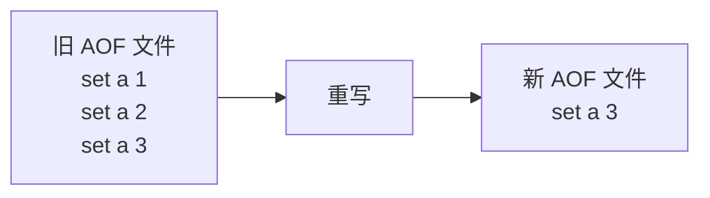
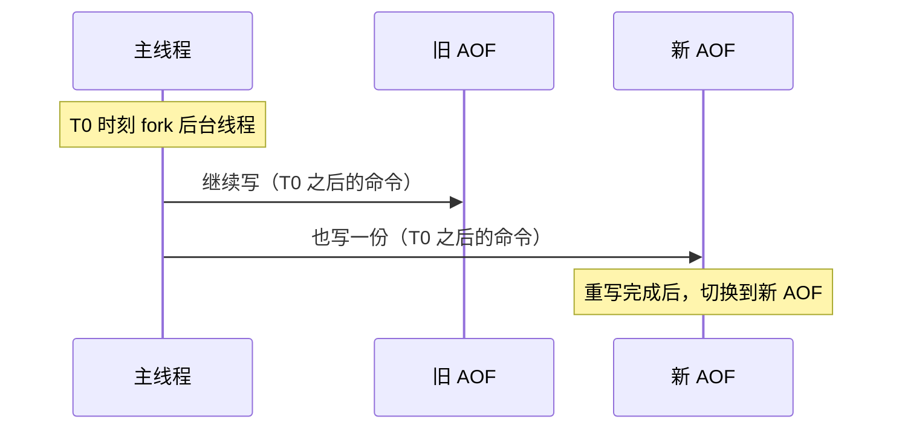
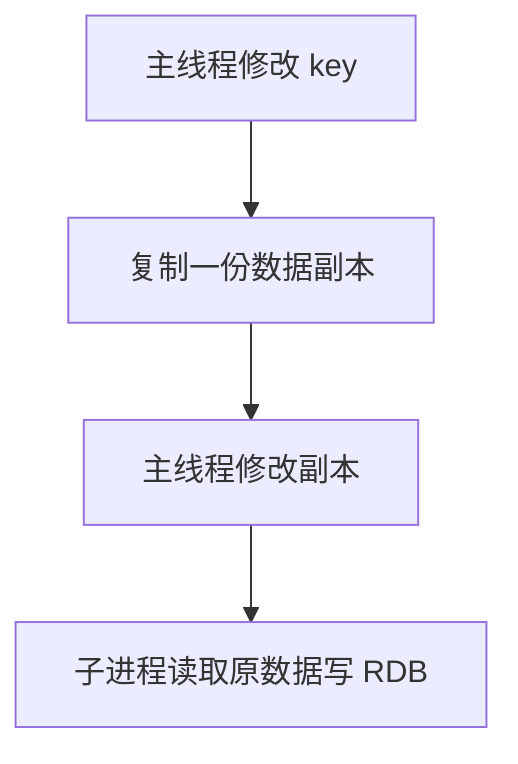

---
{"dg-publish":true,"permalink":"/66.归档发布/03.缓存/01-Redis持久化机制/","dg-note-properties":{"时间":"2026-03-23"}}
---

#redis #持久化 #数据安全

```ad-summary
title: 这篇笔记讲什么

- AOF：记录命令日志，三种写回策略，重写机制避免文件过大
- RDB：记录数据快照，bgsave 避免阻塞，写时复制支持修改
- 混合持久化：RDB + AOF，兼顾恢复速度和数据安全
- 生产推荐混合持久化 + everysec
```

## 1. 为什么需要持久化

Redis 数据存在内存中，挂了就没了。持久化就是把内存数据写到磁盘，重启后能恢复。这个在[[66.归档发布/03.缓存/02-Redis高可用与复制\|高可用]]场景下特别重要。

两种方式：
- **RDB**：定期保存全量快照
- **AOF**：记录每条写命令

## 2. AOF：记录命令日志

AOF 是**写后日志**：先执行命令写内存，再记录日志。

### 2.1 三种写回策略

| 策略 | 做法 | 可靠性 | 性能 |
|------|------|--------|------|
| Always | 每条命令都同步写 | 不丢数据 | 最差 |
| Everysec | 先写缓冲，每秒刷一次 | 丢 1 秒数据 | 折中（推荐） |
| No | 让操作系统决定 | 丢 N 秒数据 | 最好 |

**大多数场景用 Everysec 就够了。**

### 2.2 AOF 重写

AOF 文件会越来越大，里面可能有大量冗余命令（比如同一个 key 被写了 100 次）。

重写机制：**根据当前数据状态，重新生成一份精简的 AOF 文件**。



重写由后台子进程 `bgrewriteaof` 完成，不阻塞主线程。

### 2.3 重写时数据怎么处理



- **一个拷贝**：fork 时把数据拷贝一份给后台线程
- **两处日志**：T0 之后的命令同时写旧 AOF 和新 AOF

这样重写过程中不会丢数据。

### 2.4 触发条件

```conf
auto-aof-rewrite-min-size 64mb    # 文件超过 64MB 才触发
auto-aof-rewrite-percentage 100   # 且是上次重写后的 2 倍
```

## 3. RDB：记录数据快照

RDB 记录的是**某一时刻的数据快照**，不是操作命令。恢复时直接把 RDB 文件读入内存，速度很快。

### 3.1 两个命令

| 命令 | 执行方式 | 特点 |
|------|----------|------|
| save | 主线程执行 | 会阻塞 |
| bgsave | fork 子进程执行 | 不阻塞（默认） |

### 3.2 写时复制（COW）

快照时数据能修改吗？**能**。用操作系统的写时复制：



主线程要改数据时，先把原数据复制一份，改的是副本。子进程还是读原数据，互不干扰。

### 3.3 自动触发条件

```conf
save 900 1      # 900 秒内至少 1 个 key 变化
save 300 10     # 300 秒内至少 10 个 key 变化
save 60 10000   # 60 秒内至少 10000 个 key 变化
```

### 3.4 频繁快照的问题

1. **磁盘压力大**：全量数据写磁盘，带宽有限
2. **fork 阻塞**：创建子进程时会阻塞主线程，内存越大阻塞越久

## 4. 混合持久化（推荐）

**RDB 恢复快，但可能丢数据；AOF 不丢数据，但恢复慢。**

混合持久化：AOF 重写时先写 RDB 快照，再追加增量 AOF 命令。

恢复时先加载 RDB（快），再回放 AOF（补增量）。

```conf
aof-use-rdb-preamble yes    # 开启混合持久化
appendfsync everysec        # 刷盘策略
```

## 5. 怎么选

| 场景 | 推荐方案 |
|------|----------|
| 纯缓存（数据可从 DB 重建） | 关闭持久化 |
| 一般业务 | 混合持久化 + everysec |
| 不能丢数据 | AOF + always（性能下降明显） |

## 6. 对比总结

| | RDB | AOF | 混合持久化 |
|--|-----|-----|------------|
| 原理 | 全量快照 | 追加写命令 | RDB + AOF |
| 恢复速度 | 快 | 慢 | 较快 |
| 数据丢失 | 两次快照之间 | 最多 1 秒 | 最多 1 秒 |
| 文件大小 | 小 | 大（可重写） | 中等 |
| 推荐度 | ⭐⭐ | ⭐⭐⭐ | ⭐⭐⭐⭐⭐ |


