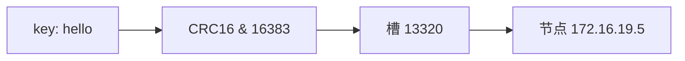

---
{"dg-publish":true,"permalink":"/66.归档发布/03.缓存/03-Redis集群与分片/","dg-note-properties":{"时间":"2026-03-23"}}
---

#redis #集群 #哈希槽 #分片

```ad-summary
title: 这篇笔记讲什么

- Redis Cluster 固定 16384 个哈希槽，key 通过 CRC16 定位槽
- MOVED：槽已迁移，更新客户端缓存；ASK：槽迁移中，不更新缓存
- Hash Tag 强制多个 key 落同一槽，但滥用会导致数据倾斜
- 节点间用 Gossip 协议传播状态，最终一致
```

## 1. 哈希槽是什么

Redis Cluster 把数据分成 16384 个哈希槽，每个键根据 CRC16 算法算出一个槽号，然后存到负责这个槽的节点上。这个跟[[66.归档发布/03.缓存/02-Redis高可用与复制\|主从复制]]不一样，它是数据分片的方案。



### 1.1 为什么是 16384

用位图存储槽信息，16384 个槽只需 2KB，心跳包传输压力小，同时也足够支撑上千个节点的集群规模。

## 2. 槽分配

手动分配：

```bash
redis-cli -h 172.16.19.3 -p 6379 cluster addslots {0..5461}
```

**注意：必须把 16384 个槽全部分配完，否则集群无法正常工作。**

用 `--cluster create` 自动平均分配：

```bash
redis-cli --cluster create \
  172.16.19.3:6379 \
  172.16.19.4:6379 \
  172.16.19.5:6379
```

## 3. 重定向机制

### 3.1 MOVED 重定向

槽已经完全迁移到新节点，返回 MOVED：

```
GET hello:key
(error) MOVED 13320 172.16.19.5:6379
```

客户端收到后**更新本地槽映射缓存**，后续同槽的请求直接打到正确节点。

### 3.2 ASK 重定向

槽正在迁移中，数据还没完全搬过去，返回 ASK：

```
GET hello:key
(error) ASK 13320 172.16.19.5:6379
```

客户端处理流程：
1. 先给目标节点发 `ASKING` 命令
2. 目标节点临时允许执行接下来的命令
3. 然后发 `GET` 读取数据

**ASK 和 MOVED 的区别：**

| | MOVED | ASK |
|--|-------|-----|
| 触发时机 | 槽已完全迁移 | 槽迁移中 |
| 更新客户端缓存 | 是 | 否 |
| 影响范围 | 后续所有请求 | 仅当前这次 |

ASK 不更新缓存，因为迁移完成后，这个槽可能还是原来的节点负责。

## 4. 槽迁移流程

扩容或缩容时需要迁移槽，步骤：

```bash
# 1. 目标节点标记为导入状态
CLUSTER SETSLOT <slot> IMPORTING <source-node-id>

# 2. 源节点标记为迁出状态
CLUSTER SETSLOT <slot> MIGRATING <target-node-id>

# 3. 批量迁移 key
CLUSTER GETKEYSINSLOT <slot> 100   # 获取该槽的 key
MIGRATE <target-ip> <target-port> <key> 0 5000

# 4. 通知所有节点更新槽归属
CLUSTER SETSLOT <slot> NODE <target-node-id>
```

迁移过程中源节点仍然可读写，新写入的 key 会返回 ASK 重定向。

## 5. Hash Tag

默认情况下多个 key 可能落在不同节点，没法做 `MGET`、`MSET` 或事务。

用 `{}` 标记可以强制让相关 key 落到同一个槽：

```bash
# {} 内的部分参与槽计算，这三个 key 都算 CRC16("user:1000")
SET {user:1000}:name "Alice"
SET {user:1000}:age 25
SET {user:1000}:email "alice@example.com"
```

**Hash Tag 要谨慎用，滥用会导致数据倾斜，大量 key 堆到同一个节点。**

## 6. 节点间通信

Redis Cluster 节点之间用 **Gossip 协议**传播状态信息。

每个节点定期随机选几个节点发送 PING 消息，消息里携带自己知道的部分节点状态，对方回 PONG 时也带上自己的状态，信息就这样在集群里扩散开了。

Gossip 是**最终一致**的，节点状态变更不会立刻同步到所有节点，有一个短暂的收敛窗口。

## 7. Cluster 的限制

- 不支持跨槽的多键操作（除非用 Hash Tag）
- 只能用 db 0，不支持多数据库
- 大量槽迁移时会影响性能
- 客户端需要支持重定向逻辑


