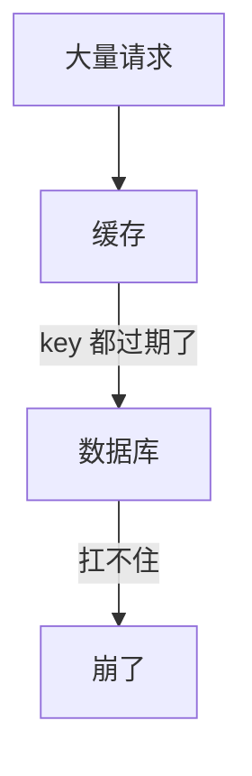
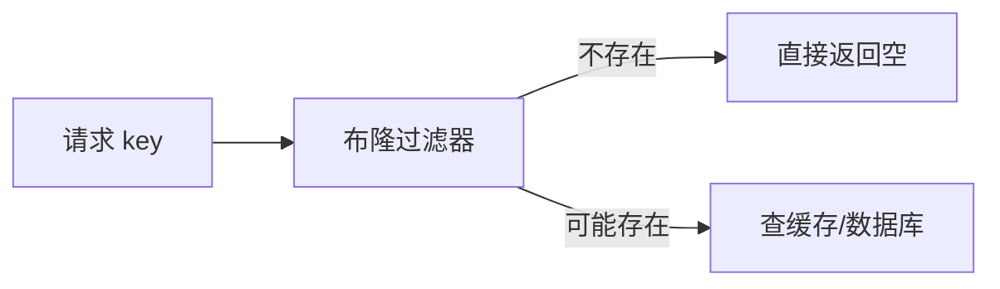

---
{"dg-publish":true,"permalink":"/66.归档发布/03.缓存/04-Redis缓存问题与解决方案/","dg-note-properties":{"时间":"2026-03-23"}}
---

#redis #缓存 #雪崩 #击穿 #穿透 #一致性

```ad-summary
title: 这篇笔记讲什么

- 雪崩：大量 key 同时过期，过期时间加随机偏移 + 多级缓存
- 击穿：热点 key 过期，互斥锁或逻辑过期解决
- 穿透：查不存在的数据，布隆过滤器拦截或缓存空值
- 数据倾斜：bigkey 和热点 key，拆分 + 本地缓存
- 缓存一致性：延迟双删或分布式锁
```

## 1. 缓存三大问题

这几个问题跟[[66.归档发布/03.缓存/05-Redis内存管理\|内存管理]]有关系，内存不够或者淘汰策略没配好，都可能引发这些问题。

### 1.1 缓存雪崩

**是什么**：大量 key 同时过期，或 Redis 宕机，请求全部打到数据库。



**怎么解决**：
- 过期时间加随机偏移，避免集中失效：`EX (3600 + random(300))`
- 热点数据永不过期
- 多级缓存（本地缓存 + Redis + DB）
- 限流降级保护数据库

### 1.2 缓存击穿

**是什么**：某个热点 key 过期了，大量请求同时打到数据库。

跟雪崩的区别：雪崩是大量 key，击穿是单个热点 key。

**怎么解决**：
- **互斥锁**：第一个请求去查数据库并重建缓存，其他请求等着
- **永不过期**：热点 key 不设过期时间，用后台任务定期更新
- **逻辑过期**：value 里存过期时间，异步更新，不真正让 key 失效

```java
// 互斥锁示例
public User getUser(Long userId) {
    String cacheKey = "user:" + userId;
    String lockKey = "lock:user:" + userId;
    
    // 先查缓存
    User user = redisTemplate.opsForValue().get(cacheKey);
    if (user != null) {
        return user;
    }
    
    // 缓存没有，加锁
    RLock lock = redissonClient.getLock(lockKey);
    boolean getLock = lock.tryLock(3, TimeUnit.SECONDS);
    if (!getLock) {
        throw new BizException("系统繁忙，请稍后重试");
    }
    
    try {
        // 双重检查，避免重复查 DB
        user = redisTemplate.opsForValue().get(cacheKey);
        if (user != null) {
            return user;
        }
        
        user = userMapper.selectById(userId);
        if (user != null) {
            redisTemplate.opsForValue().set(cacheKey, user, 30, TimeUnit.MINUTES);
        }
        return user;
    } finally {
        if (lock.isHeldByCurrentThread()) {
            lock.unlock();
        }
    }
}
```

### 1.3 缓存穿透

**是什么**：查询根本不存在的数据，缓存和 DB 都没有，每次都透传到 DB。

**怎么解决**：

| 方案 | 原理 | 缺点 |
|------|------|------|
| 布隆过滤器 | 请求先过过滤器，不存在直接返回 | 有误判率 |
| 缓存空值 | 查不到也缓存一个空值 | 占内存 |
| 入参校验 | 非法请求直接拒绝 | 只能防简单攻击 |

## 2. 布隆过滤器

用一个 bit 数组 + K 个哈希函数判断元素是否存在：
- 判断**不存在**：一定不存在
- 判断**存在**：可能存在（有误判率）



不支持删除，因为删一个 bit 会影响其他元素。需要删除场景可以用计数布隆过滤器，或定期重建。

```java
// Guava 布隆过滤器示例
BloomFilter<String> filter = BloomFilter.create(
    Funnels.stringFunnel(Charset.defaultCharset()),
    1000000,  // 预期元素数量
    0.01      // 误判率 1%
);
filter.put("key1");
filter.mightContain("key1"); // true（可能存在）
filter.mightContain("key2"); // false（一定不存在）
```

## 3. 数据倾斜

### 3.1 数据量倾斜

某个节点数据特别多，通常是 bigkey 导致。

**解决**：
- 拆分 bigkey（大 Hash 拆成多个小 Hash，大 List 分页存储）
- 用 `redis-cli --cluster rebalance` 重平衡

### 3.2 访问倾斜

某个节点访问特别频繁，热点 key 集中。

**解决**：
- 热点数据复制到多个节点，key 加后缀分散：`hot_key_1`、`hot_key_2`
- 本地缓存热点数据，减少 Redis 访问

## 4. 缓存一致性

用缓存就一定会有短暂不一致，目标是尽量缩短不一致时间。

### 4.1 延迟双删（推荐）

流程：
1. 删除缓存
2. 更新数据库
3. 延迟 100-500ms
4. 再删一次缓存

```java
public void updateUser(User user) {
    String cacheKey = "user:" + user.getId();
    
    // 1. 删除缓存
    redisTemplate.delete(cacheKey);
    
    // 2. 更新数据库
    userMapper.update(user);
    
    // 3. 延迟再删一次
    CompletableFuture.runAsync(() -> {
        try {
            Thread.sleep(500);
            redisTemplate.delete(cacheKey);
        } catch (InterruptedException e) {
            log.error("延迟双删失败", e);
        }
    });
}
```

延迟时间要大于一次读操作的耗时：
```
延迟时间 = 读数据库时间 + 写缓存时间 + 网络延迟 + 余量
建议设 100-500ms
```

### 4.2 分布式锁（强一致性）

适用于金融、库存等对一致性要求高的场景。

流程：
```
加锁 → 删缓存 → 更新数据库 → 写新缓存 → 解锁
```

### 4.3 订阅 Binlog（Canal）

不改业务代码，监听数据库变更自动删缓存：

```java
@CanalEventListener
public class CacheInvalidateListener {
    
    @ListenPoint(schema = "mydb", table = "user")
    public void onUserChange(CanalEntry.EventType eventType, CanalEntry.RowData rowData) {
        if (eventType == CanalEntry.EventType.UPDATE || 
            eventType == CanalEntry.EventType.DELETE) {
            
            String userId = rowData.getAfterColumnsList().stream()
                .filter(col -> "id".equals(col.getName()))
                .findFirst()
                .map(CanalEntry.Column::getValue)
                .orElse(null);
            
            if (userId != null) {
                redisTemplate.delete("user:" + userId);
            }
        }
    }
}
```

### 4.4 方案选择

| 场景 | 推荐方案 | 原因 |
|------|----------|------|
| 商品信息、用户资料 | 延迟双删 | 短暂不一致可接受，性能好 |
| 账户余额、库存 | 分布式锁 | 强一致性要求 |
| 不想改业务代码 | Canal + MQ | 解耦，自动同步 |

## 5. 对比总结

| 问题 | 原因 | 核心解决思路 |
|------|------|--------------|
| 雪崩 | 大量 key 同时过期 | 随机过期时间 + 多级缓存 |
| 击穿 | 热点 key 过期 | 互斥锁 / 永不过期 |
| 穿透 | 查不存在的数据 | 布隆过滤器 / 缓存空值 |
| 不一致 | 并发读写 | 延迟双删 / 分布式锁 |


