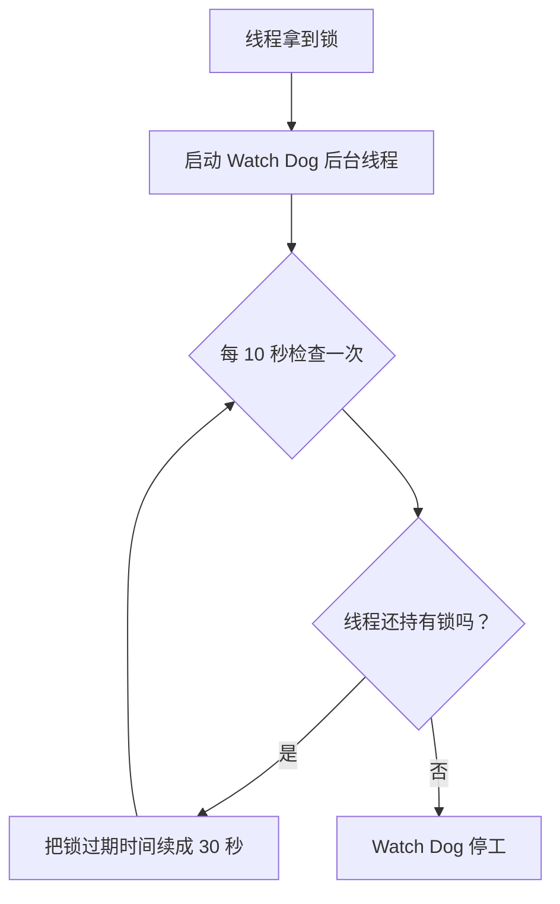

---
{"dg-publish":true,"permalink":"/66.归档发布/03.缓存/Redisson分布式锁原理/","dg-note-properties":{"时间":"2026-03-23"}}
---

#Redis #分布式锁 #Redisson #并发编程

```ad-summary
title: 总结

- 普通分布式锁有个大坑：锁过期了但业务还没跑完，别的线程就能抢到锁，数据就乱了
- Redisson 的 Watch Dog 机制会自动给锁续期，线程活着就一直续，线程挂了就自动停
- 用 Redisson 加锁，锁的 value 是个 Hash 结构，field 是客户端+线程 ID，支持可重入
- 生产环境建议用 `lock.lock()` 让 Watch Dog 自动管理，别自己设过期时间，除非你很确定业务能跑完
- 释放锁时一定要检查是不是当前线程持有的，不然会把别人的锁给放了
```

## 1. 普通分布式锁的坑在哪？

用 Redis 的 `setnx` + 过期时间搞分布式锁，看着挺美，但有个致命问题：**锁过期释放了，但业务还没执行完**。

### 1.1 具体会出什么问题？

假设这么个场景：
1. 线程 A 拿到锁，设了 30 秒过期
2. 线程 A 业务跑得慢，要 40 秒
3. 30 秒到了，锁自动释放
4. 线程 B 趁机拿到锁，开始操作共享资源
5. 线程 A 跑完了，以为自己还拿着锁，就去释放
6. 这下把线程 B 的锁给放了，B 还在操作呢

这不就乱套了吗？

### 1.2 常见的错误思路

有人想过这么解决：

**方案 1：把过期时间设长点**
```java
// 设个 5 分钟，总够了吧？
redis.setex("lock", 300, "value");
```
问题：你咋知道业务跑多久？万一出 bug 卡住了，锁占着不放，其他线程全堵死。

**方案 2：干脆不设过期时间**
```java
redis.set("lock", "value");
```
问题：程序要是崩了，锁永远没人放，死锁。

## 2. Redisson 怎么搞定的？

Redisson 靠一个叫 **Watch Dog（看门狗）** 的机制来解决这个问题。

### 2.1 Watch Dog 是干嘛的？

它就像个后台小助手，线程拿到锁后，它就默默开始工作：
- 每隔一段时间（默认 10 秒）检查一下，线程还活着不？还拿着锁不？
- 如果都正常，就把锁的过期时间再续上（续成 30 秒）
- 如果线程挂了或者主动释放了锁，它就自动停工

这样只要线程还在跑，锁就永远不会过期。

### 2.2 整个流程长啥样？



### 2.3 几个关键点

- **自动续期**：每 10 秒续一次，把过期时间改回 30 秒
- **自动停工**：线程释放锁或异常退出，Watch Dog 就停了
- **默认配置**：锁默认 30 秒过期，每 10 秒续一次。这个比例（续期间隔/过期时间 = 1/3）是经验值，留足了缓冲时间

## 3. 底层到底怎么实现的？

### 3.1 加锁用的 Lua 脚本

Redisson 加锁不是简单 `setnx`，而是用一段 Lua 脚本：

```lua
-- 如果锁不存在，就创建它，设好过期时间
if (redis.call('exists', KEYS[1]) == 0) then
    redis.call('hincrby', KEYS[1], ARGV[2], 1);
    redis.call('pexpire', KEYS[1], ARGV[1]);
    return nil;
end;

-- 如果锁存在，但当前线程已经持有（可重入），计数器+1
if (redis.call('hexists', KEYS[1], ARGV[2]) == 1) then
    redis.call('hincrby', KEYS[1], ARGV[2], 1);
    redis.call('pexpire', KEYS[1], ARGV[1]);
    return nil;
end;

-- 其他情况，返回锁的剩余过期时间，让调用者等
return redis.call('pttl', KEYS[1]);
```

**参数说明**：
- `KEYS[1]`：锁的 key，比如 `"order:123"`
- `ARGV[1]`：过期时间，单位毫秒
- `ARGV[2]`：客户端 ID + 线程 ID，像 `"8743c9c0-0795-4907-87fd-6c719a6b4586:1"`，用来区分不同线程

### 3.2 锁在 Redis 里长什么样？

不是简单的字符串，是个 **Hash 结构**：

```bash
# Redis 里看到的数据
Key:    "order:123"
Field:  "8743c9c0-0795-4907-87fd-6c719a6b4586:1"
Value:  1  # 重入次数
```

这样设计的好处是支持可重入，同一个线程再加锁，value 就加 1。

### 3.3 续期怎么实现的？

续期也是用 Lua 脚本，确保原子性：

```java
// 伪代码，实际源码更复杂
private void renewExpiration() {
    // 如果锁还被当前线程持有，就延长过期时间
    String script = 
        "if (redis.call('hexists', KEYS[1], ARGV[2]) == 1) then " +
        "    redis.call('pexpire', KEYS[1], ARGV[1]); " +
        "    return 1; " +
        "end; " +
        "return 0;";
    
    // 执行脚本，KEYS[1]是锁名，ARGV[1]是30秒，ARGV[2]是线程标识
    Long result = redis.eval(script, ...);
    if (result == 1) {
        // 续期成功，10秒后再续
        scheduleNextRenewal();
    }
    // 返回0说明锁已经不是当前线程的了，Watch Dog 停工
}
```

## 4. 生产环境怎么用？

### 4.1 推荐写法：让 Watch Dog 自己管

```java
@Service
public class OrderService {
    @Autowired
    private RedissonClient redisson;
    
    public void createOrder(String orderId) {
        RLock lock = redisson.getLock("order:" + orderId);
        
        try {
            // 不指定过期时间，让 Watch Dog 自动续期
            lock.lock();
            
            // 业务逻辑，跑多久都不用担心锁过期
            processOrder(orderId);
            
        } finally {
            // 释放锁，记得要 try-catch
            if (lock.isHeldByCurrentThread()) {
                lock.unlock();
            }
        }
    }
}
```

**经验值**：业务执行时间一般不会超过几分钟，Watch Dog 续期完全够用。如果业务真要跑很久（比如半小时），那得重新设计业务拆分了。

### 4.2 什么时候自己设过期时间？

只有当你**100% 确定**业务能在规定时间内跑完时，才自己设：

```java
// 比如你确定这个操作最多 5 秒
boolean locked = lock.tryLock(5, 10, TimeUnit.SECONDS);
```

**注意**：设了过期时间，Watch Dog 就不工作了。超时了锁就自动释放，不管业务跑没跑完。

### 4.3 怎么验证锁生效了？

```bash
# 在 Redis 里看锁的数据
redis-cli> HGETALL order:123
1) "8743c9c0-0795-4907-87fd-6c719a6b4586:1"
2) "1"

# 看锁的过期时间（毫秒）
redis-cli> PTTL order:123
(integer) 28765  # 大约 28 秒，说明刚被续过期
```

## 5. 还有哪些高级玩法？

### 5.1 公平锁：按顺序排队

普通锁谁抢到算谁的，公平锁是先来后到：

```java
RLock fairLock = redisson.getFairLock("myLock");
fairLock.lock();
try {
    // 线程会按获取锁的顺序排队执行
} finally {
    fairLock.unlock();
}
```

**什么时候用**：对执行顺序有严格要求时。但公平锁性能比普通锁差，因为要维护队列。

### 5.2 联锁：一次锁多个资源

```java
RLock lock1 = redisson.getLock("order:1");
RLock lock2 = redisson.getLock("inventory:1");
RLock lock3 = redisson.getLock("account:1");

// 要么全拿到，要么全不拿
RLock multiLock = redisson.getMultiLock(lock1, lock2, lock3);
multiLock.lock();
try {
    // 同时操作订单、库存、账户
} finally {
    multiLock.unlock();
}
```

**注意**：联锁的超期时间是最长那个锁的时间，不是加起来。

### 5.3 红锁：跨多个 Redis 实例

单个 Redis 挂了锁就没了？红锁是多个 Redis 实例都加锁：

```java
RLock redLock = redisson.getRedLock(lock1, lock2, lock3);
redLock.lock();
```

**经验值**：一般配 5 个实例，拿到 3 个以上就算成功。但红锁实现复杂，网络抖动时容易出问题，现在用的人不多了。

### 5.4 读写锁：读多写少场景

```java
RReadWriteLock rwLock = redisson.getReadWriteLock("data");

// 读锁：多个线程可以同时读
RLock readLock = rwLock.readLock();
readLock.lock();
try {
    // 读操作，不阻塞其他读线程
} finally {
    readLock.unlock();
}

// 写锁：独占，有写锁时不能读也不能写
RLock writeLock = rwLock.writeLock();
writeLock.lock();
try {
    // 写操作
} finally {
    writeLock.unlock();
}
```

## 6. 生产环境配置

### 6.1 基础配置

```java
@Configuration
public class RedissonConfig {
    @Bean
    public RedissonClient redissonClient() {
        Config config = new Config();
        
        // 单机模式
        config.useSingleServer()
            .setAddress("redis://127.0.0.1:6379")
            .setPassword("password")
            .setDatabase(0)
            // Watch Dog 超时时间，默认30秒
            // 如果业务经常超过30秒，可以调大，但别太大
            .setLockWatchdogTimeout(30000);
        
        return Redisson.create(config);
    }
}
```

**经验值**：`LockWatchdogTimeout` 默认 30 秒够用了。如果你业务真需要跑更久，考虑调到 60-120 秒，但再大就要反思业务设计了。

### 6.2 集群模式

```java
Config config = new Config();
config.useClusterServers()
    .addNodeAddress(
        "redis://127.0.0.1:7000",
        "redis://127.0.0.1:7001",
        "redis://127.0.0.1:7002"
    )
    .setPassword("password")
    // 连接池大小，一般配 CPU 核数 * 2
    .setConnectionPoolSize(32)
    // 最小空闲连接数
    .setConnectionMinimumIdleSize(8);

return Redisson.create(config);
```

## 7. 容易踩的坑

### 7.1 释放锁的正确姿势

```java
// ❌ 危险：可能释放了别人的锁
lock.unlock();

// ✅ 安全：检查是不是当前线程持有的
if (lock.isHeldByCurrentThread()) {
    lock.unlock();
}
```

**为什么重要**：假设线程 A 拿到锁，业务跑得慢，Watch Dog 给它续期。但这时候线程 B 通过某种方式（比如锁超时释放后）拿到了锁。线程 A 业务跑完了，如果不检查直接 unlock，就把线程 B 的锁给放了。

### 7.2 异常处理要到位

```java
RLock lock = redisson.getLock("myLock");
try {
    lock.lock();
    // 业务逻辑
    processBusiness();
} catch (Exception e) {
    log.error("业务执行失败", e);
    // 这里不要 unlock，让 Watch Dog 自己处理
} finally {
    // 确保锁释放
    if (lock.isHeldByCurrentThread()) {
        try {
            lock.unlock();
        } catch (Exception e) {
            log.warn("释放锁失败", e);
        }
    }
}
```

**经验**：unlock 本身也可能抛异常（比如 Redis 连接断了），所以也要 try-catch。

### 7.3 避免无限等待

```java
// 设置最大等待时间，比如 5 秒
boolean locked = lock.tryLock(5, TimeUnit.SECONDS);
if (!locked) {
    throw new RuntimeException("获取锁超时，稍后重试");
}
```

**经验值**：等待时间别设太长，不然线程池容易被耗尽。一般 1-5 秒足够，超时了说明系统可能有问题，应该快速失败而不是傻等。

## 8. 性能调优

### 8.1 锁粒度要细

```java
// ❌ 粗粒度：整个订单模块一把锁
RLock lock = redisson.getLock("order:all");

// ✅ 细粒度：每个订单一把锁
RLock lock = redisson.getLock("order:" + orderId);
```

**原则**：锁的范围越小，并发性能越好。但锁太多管理成本也高，得平衡。

### 8.2 合理设置过期时间

```java
// 根据业务特点来
// 简单操作：5-10 秒
lock.tryLock(2, 10, TimeUnit.SECONDS);

// 复杂操作：30-60 秒
lock.tryLock(5, 60, TimeUnit.SECONDS);

// 如果用 Watch Dog，就不用担心这个
lock.lock(); // 让 Watch Dog 自己管
```

### 8.3 监控锁状态

```java
// 检查锁是否被占用
boolean isLocked = lock.isLocked();

// 检查是否被当前线程持有
boolean isHeld = lock.isHeldByCurrentThread();

// 获取剩余过期时间（毫秒）
long remainTime = lock.remainTimeToLive();
if (remainTime > 0) {
    log.info("锁还剩 {} 毫秒过期", remainTime);
}
```

## 9. 怎么串起来看？

分布式锁只是 [[66.归档发布/04.并发/分布式/分布式系统常见陷阱清单\|分布式系统常见陷阱清单]] 中的一个问题。锁的底层设计思路跟 [[66.归档发布/04.并发/AQS抽象队列同步器原理\|AQS]] 有相通之处，Redis 那边的 Hash 结构、Lua 脚本这些可以参考 [[Redis数据类型与底层实现\|Redis数据类型与底层实现]]。业务场景再复杂点，比如需要事务性操作，Redis 的 Lua 脚本能帮上忙。