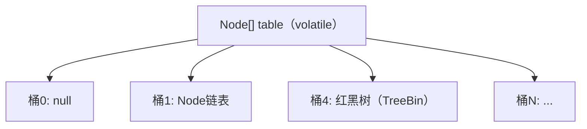

---
{"dg-publish":true,"permalink":"/66.归档发布/04.并发/ConcurrentHashMap线程安全的原理/"}
---

#面试 #锁 #并发 #最佳实践

```ad-summary
title: 总结

- JDK 7：分段锁（Segment），每段一把 ReentrantLock，最多 16 段并发
- JDK 8：锁粒度细化到单个桶，空桶用 CAS 写入，冲突用 synchronized 锁桶头节点
- `size()` 用 CounterCell 分散计数，避免单点竞争
- `volatile` 保证数组元素的可见性，读操作完全无锁
- 不允许 key/value 为 null，与 HashMap 不同
```

## 1. 为什么需要 ConcurrentHashMap

`HashMap` 在多线程下会出现死循环（JDK 7）、数据丢失等问题。`Hashtable` 虽然线程安全，但所有操作共用一把锁，并发性能极差。`ConcurrentHashMap` 在保证线程安全的同时，通过更细的锁粒度大幅提升并发吞吐量。

## 2. JDK 7：分段锁（Segment）

JDK 7 的 `ConcurrentHashMap` 由一个 `Segment` 数组组成，每个 `Segment` 继承自 `ReentrantLock`，内部维护一个 `HashEntry` 数组。

```
ConcurrentHashMap
├── Segment[0]  (ReentrantLock + HashEntry[])
├── Segment[1]  (ReentrantLock + HashEntry[])
├── ...
└── Segment[15] (ReentrantLock + HashEntry[])
```

- 默认 16 个 Segment，最多支持 16 个线程同时写入
- put 时先定位 Segment，对该 Segment 加锁，不影响其他 Segment
- get 操作利用 `volatile` 读，大多数情况无需加锁

**缺点：** Segment 数量在初始化后固定，无法动态调整；锁粒度仍然是一段数组，不够细。

## 3. JDK 8：CAS + synchronized，锁粒度到桶

JDK 8 彻底重构，抛弃 Segment，底层结构与 `HashMap` 一致：`Node[]` 数组 + 链表 + 红黑树。锁粒度细化到单个数组槽位（桶）。



### 3.1 put 流程

```java
// 简化版核心逻辑
final V putVal(K key, V value, boolean onlyIfAbsent) {
    // 1. key/value 不允许为 null
    if (key == null || value == null) throw new NullPointerException();

    int hash = spread(key.hashCode()); // 扰动函数，高低位混合

    for (Node<K,V>[] tab = table;;) {
        Node<K,V> f; int n, i, fh;

        // 2. 数组未初始化，先初始化
        if (tab == null || (n = tab.length) == 0)
            tab = initTable();

        // 3. 目标桶为空，CAS 直接写入，无需加锁
        else if ((f = tabAt(tab, i = (n - 1) & hash)) == null) {
            if (casTabAt(tab, i, null, new Node<>(hash, key, value)))
                break;
        }

        // 4. 桶头节点 hash == MOVED，说明正在扩容，协助迁移
        else if ((fh = f.hash) == MOVED)
            tab = helpTransfer(tab, f);

        // 5. 桶不为空，锁住桶头节点，串行处理
        else {
            synchronized (f) {
                // 链表插入 or 红黑树插入
            }
        }
    }
}
```

关键点：
- 空桶用 `CAS` 写入，完全无锁
- 非空桶用 `synchronized(桶头节点)` 加锁，只锁这一个桶
- 不同桶的操作互不干扰，并发度等于桶的数量（默认 16，最大可达数组长度）

### 3.2 get 流程（完全无锁）

```java
public V get(Object key) {
    Node<K,V>[] tab; Node<K,V> e, p; int n, eh; K ek;
    int h = spread(key.hashCode());
    if ((tab = table) != null && (n = tab.length) > 0 &&
        (e = tabAt(tab, (n - 1) & h)) != null) {  // volatile 读
        if ((eh = e.hash) == h) {
            if ((ek = e.key) == key || (ek != null && key.equals(ek)))
                return e.val;  // 命中桶头
        }
        else if (eh < 0)
            return (p = e.find(h, key)) != null ? p.val : null; // 红黑树查找
        while ((e = e.next) != null) { // 链表遍历
            if (e.hash == h && ((ek = e.key) == key || key.equals(ek)))
                return e.val;
        }
    }
    return null;
}
```

`tabAt` 底层用 `Unsafe.getObjectVolatile` 保证可见性，读操作全程无锁。

## 4. volatile 的作用

`Node[]` 数组本身用 `volatile` 修饰，`Node` 的 `val` 和 `next` 也是 `volatile`：

```java
transient volatile Node<K,V>[] table;

static class Node<K,V> {
    volatile V val;
    volatile Node<K,V> next;
}
```

这保证了一个线程写入后，其他线程立即可见，读操作不需要加锁。

## 5. size() 的实现：CounterCell 分散计数

直接用一个 `AtomicLong` 计数会在高并发下产生严重竞争。JDK 8 借鉴 `LongAdder` 的思路，用 `CounterCell` 数组分散计数：

```
baseCount（无竞争时直接 CAS 更新）
CounterCell[]（竞争时，每个线程映射到一个 Cell 累加）

size = baseCount + sum(CounterCell[])
```

- 写入时先尝试 CAS 更新 `baseCount`，失败则找一个 `CounterCell` 累加
- `size()` 汇总所有 Cell 的值，是一个近似值（非强一致）

## 6. 扩容：多线程协助迁移

扩容时容量翻倍，多个线程可以同时参与数据迁移（`helpTransfer`）：

- 每个线程认领一段桶区间，迁移完成后在原桶放置 `ForwardingNode`（hash = MOVED）
- 其他线程 put 时遇到 `ForwardingNode`，会加入协助迁移，而不是等待
- 迁移完成后 `table` 引用切换到新数组

## 7. JDK 7 vs JDK 8 对比

| 维度 | JDK 7 | JDK 8 |
|---|---|---|
| 数据结构 | Segment + HashEntry[] | Node[] + 链表/红黑树 |
| 锁机制 | ReentrantLock（段级别） | CAS + synchronized（桶级别） |
| 最大并发度 | 16（Segment 数量） | 数组长度（默认 16，可更大） |
| 读操作 | 大多无锁 | 完全无锁 |
| 扩容 | 单线程 | 多线程协助 |
| 计数 | 分段求和 | CounterCell（类 LongAdder） |

## 8. 为什么不允许 null

`HashMap` 允许 null key/value，但 `ConcurrentHashMap` 不允许，原因是多线程下无法区分"key 不存在"和"key 对应的 value 是 null"这两种情况，会引发歧义。单线程的 `HashMap` 可以用 `containsKey` 二次确认，但并发场景下两次操作之间状态可能已经改变。

## 9. 面试高频问题

**Q：ConcurrentHashMap 是强一致性的吗？**
不是。`size()`、`isEmpty()`、`containsValue()` 等聚合操作在并发修改时返回的是近似值，不保证强一致。单个 `get`/`put` 操作是原子的。

**Q：synchronized 不是重量级锁吗，JDK 8 为什么用它？**
JDK 6 之后 synchronized 引入了偏向锁、轻量级锁、自旋等优化，低竞争下性能与 ReentrantLock 相当，且不需要额外的对象开销，代码也更简洁。

**Q：和 Hashtable 的区别？**
Hashtable 对整个对象加锁（方法级 synchronized），所有操作串行；ConcurrentHashMap 锁粒度是单个桶，并发度远高于 Hashtable。
