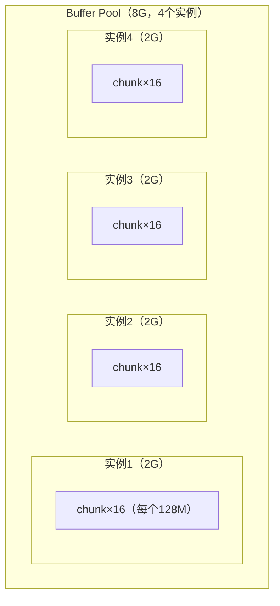

---
{"dg-publish":true,"permalink":"/66.归档发布/06.数据库/Buffer Pool配置调优/","dg-note-properties":{"时间":"2026-03-21"}}
---

#mysql #数据库 #调优 #最佳实践

```ad-summary
title: 总结

- Buffer Pool 是 InnoDB 的内存缓存，读写数据都先过这里，大小直接影响性能
- 多实例减少锁竞争：内存 >= 1G 才能配多个实例，建议每个实例 1G 左右
- chunk 是动态扩容的最小单位（默认 128M），扩容时不需要申请连续大块内存
- 生产环境推荐分配机器内存的 50%~60%，size 必须是 chunk_size × instances 的整数倍
```

## 1. 为什么要配多个 Buffer Pool 实例？

多线程访问 Buffer Pool 是要加锁的，虽然都是内存操作、微秒级别，但高并发下锁竞争还是会有影响。

解决办法就是分多个 Buffer Pool 实例，每个实例有自己独立的锁，并发请求打到不同实例上，竞争就分散了。

```ini
[server]
innodb_buffer_pool_size = 8G
innodb_buffer_pool_instances = 4
```

这样 8G 内存分给 4 个实例，每个 2G，各自管各自的 free、flush、lru 链表。

有个限制要注意：**总大小小于 1G 时，MySQL 只会给你一个实例**，配了也没用。

## 2. chunk 是怎么支持动态扩容的？

Buffer Pool 内部由多个 chunk 组成，每个 chunk 默认 128M，由 `innodb_buffer_pool_chunk_size` 控制。



假设要从 8G 扩到 16G，传统做法是申请一块 16G 的连续内存，再把原来的数据 copy 过去，代价很大。

有了 chunk 就不一样了：

1. 分批申请 64 个独立的 128M chunk（申请小块连续内存比大块容易得多）
2. 把这 64 个 chunk 平均分给 4 个实例，每个实例从 16 个 chunk 变成 32 个 chunk
3. 总大小从 8G 变成 16G，搞定

## 3. 生产环境怎么配？

推荐分配机器内存的 **50%~60%**，留够给操作系统和其他进程。

配置时有个约束要满足：

> `innodb_buffer_pool_size` 必须是 `chunk_size × instances` 的整数倍

不满足的话 MySQL 会自动向上取整，实际分配的内存可能比你设的大，容易踩坑。

**以 12G 内存的机器为例，分配 8G 给 Buffer Pool：**

```
chunk_size = 128M（默认）
instances  = 8（每个实例约 1G，合理）

分配单元 = 128M × 8 = 1G
目标 8G = 8 × 1G  ✓ 整除，符合规则
```

对应配置：

```ini
[mysqld]
innodb_buffer_pool_size = 8G
innodb_buffer_pool_instances = 8
# innodb_buffer_pool_chunk_size = 128M（默认，不用改）
```

实例数的经验值：**每个实例 1G 左右**，8G 就配 8 个，16G 就配 16 个，别超过 64 个。

配完可以用 [[66.归档发布/06.数据库/JDBC连接参数优化方法\|JDBC连接参数优化方法]] 里的连接池参数配合调优，让连接数和 Buffer Pool 实例数匹配，减少跨实例竞争。
