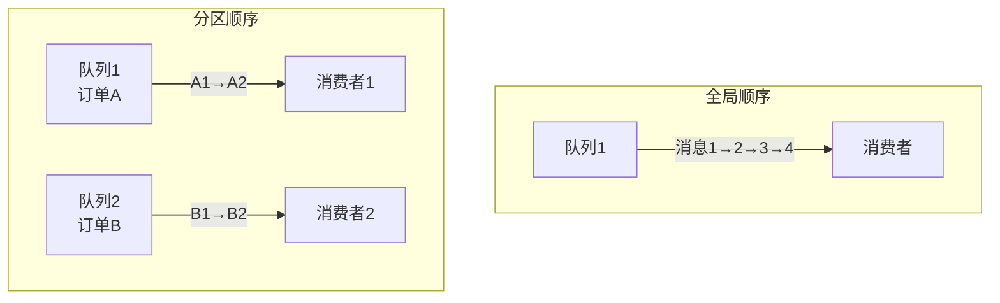
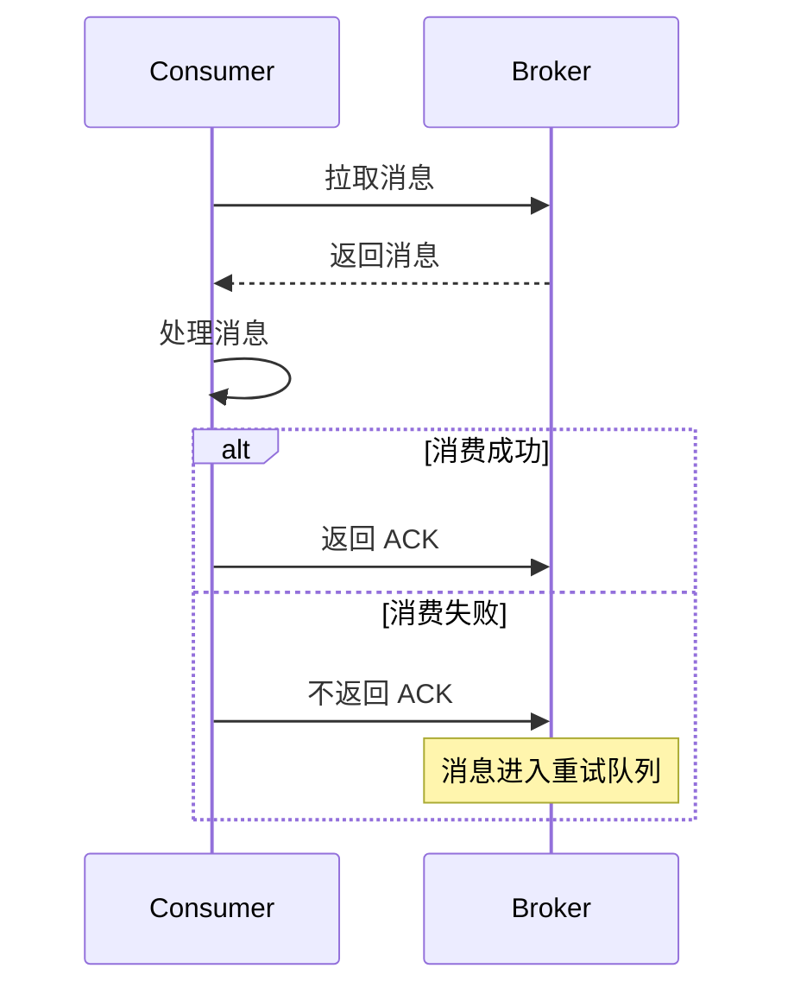
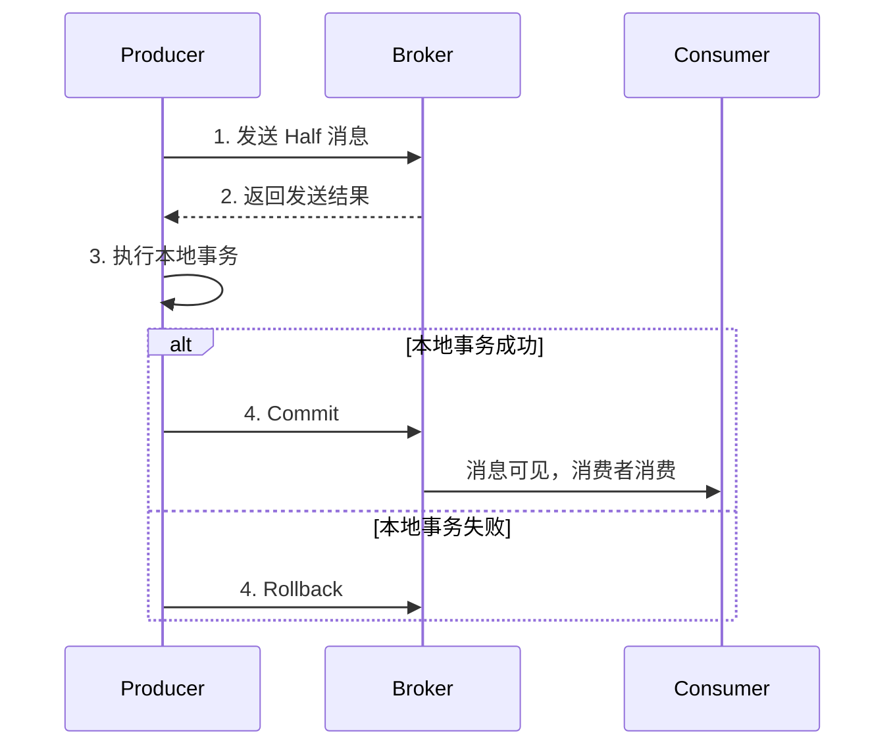
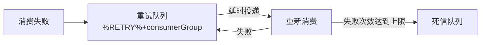

---
{"dg-publish":true,"permalink":"/66.归档发布/08.消息队列/RockerMQ特性/","dg-note-properties":{"时间":"2026-03-23"}}
---

#RocketMQ #消息队列 #特性 #最佳实践

```ad-summary
title: 总结

- 顺序消息：全局顺序（单队列，慢）和分区顺序（多队列，快）
- 消息可靠性：同步双写能完全避免单点故障，但会降低性能
- 消息重试：重试次数越多，延时越大，最终进入死信队列
- 事务消息：保证本地事务和消息发送的最终一致性
```

## 1. 订阅与发布

这是消息队列最基本的功能：

- **发布**：Producer 往 Topic 发消息
- **订阅**：Consumer 订阅 Topic，根据 Tag 过滤消息

消费者订阅时可以指定 Tag：

```java
// 订阅所有消息
consumer.subscribe("ORDER_TOPIC", "*");

// 只订阅支付成功的消息
consumer.subscribe("ORDER_TOPIC", "PAY");

// 订阅多个 Tag
consumer.subscribe("ORDER_TOPIC", "PAY || CANCEL");
```

## 2. 消息顺序

顺序消息有两种模式，详细实现原理见 [[66.归档发布/08.消息队列/RocketMQ中基本概念\|RocketMQ中基本概念]]：

| 模式 | 说明 | 性能 | 适用场景 |
|------|------|------|----------|
| 全局顺序 | 同一个 Topic 所有消息严格 FIFO | 低 | 对顺序要求极高 |
| 分区顺序 | 按 Sharding Key 分区，分区内 FIFO | 高 | 大多数场景 |

**全局顺序**：只能有一个队列，所有消息串行处理，吞吐量低。

**分区顺序**：按 Sharding Key 分成多个队列，同一个 Key 的消息在同一个队列里有序。



> Sharding Key 和普通消息的 Key 是完全不同的概念。Sharding Key 用来决定消息进哪个队列，Key 用来查询消息。

## 3. 消息过滤

消费者可以用 Tag 过滤，也支持自定义属性过滤。

过滤在 **Broker 端**实现，好处是不用把所有消息都发给消费者，减少网络传输。坏处是 Broker 负担重，实现复杂。

## 4. 消息可靠性

消息会不会丢？取决于几种故障场景：

| 故障类型 | 能否恢复 | 会不会丢消息 |
|----------|----------|--------------|
| Broker 非正常关闭 | 能 | 不会或少量丢失 |
| Broker 异常 Crash | 能 | 不会或少量丢失 |
| OS Crash | 能 | 不会或少量丢失 |
| 机器掉电（能立即恢复） | 能 | 不会或少量丢失 |
| 机器无法开机 | 不能 | 可能丢失 1% |
| 磁盘损坏 | 不能 | 可能丢失 1% |

**怎么保证不丢？**

- 前四种情况：依赖刷盘方式，同步刷盘不丢，异步刷盘可能丢少量
- 后两种情况：单点故障，无法恢复。**同步双写**能完全避免，但会降低性能

> 同步双写适合跟钱相关的业务，比如支付、订单。一般业务用异步复制就够了。

## 5. 至少一次（At Least Once）

每个消息至少投递一次。

流程：Consumer 拉消息到本地 → 消费成功 → 返回 ACK。没消费成功就不返回 ACK，消息会重试。



## 6. 回溯消费

已经消费过的消息，业务上需要重新消费。

比如 Consumer 挂了，恢复后需要重新消费 1 小时前的数据。RocketMQ 支持按时间回溯，**精确到毫秒**。

## 7. 事务消息

保证本地事务和消息发送的最终一致性，类似 XA 分布式事务，详细原理见 [[66.归档发布/08.消息队列/RocketMQ事务消息\|RocketMQ事务消息]]：

流程：
1. 发送 Half 消息（半消息，消费者看不到）
2. 执行本地事务
3. 根据本地事务结果 Commit 或 Rollback



## 8. 定时消息（延时消息）

消息发送后不会立即被消费，等一段时间后再投递。

比如下单后 30 分钟未支付，自动取消订单。

## 9. 消息重试

消费失败后会自动重试，重试次数越多延时越大。如果你在面试中被问到消费重试机制，可以重点准备 [[66.归档发布/08.消息队列/RocketMQ面试题\|RocketMQ面试题]] 中的消费者重试相关问题。

RocketMQ 会为每个消费组创建一个重试队列：`%RETRY%+consumerGroup`。



## 10. 消息重投

生产者发送失败会重试：

| 发送方式 | 重试策略 | 会不会丢消息 |
|----------|----------|--------------|
| 同步发送 | 重试 2 次，换 Broker | 不会 |
| 异步发送 | 重试，不换 Broker | 可能丢 |
| 单向发送 | 不重试 | 可能丢 |

同步发送失败会自动换一个 Broker 重试，最大程度保证不丢。

> 重投可能导致消息重复，这是 RocketMQ 无法避免的问题。业务端要做好幂等处理。

## 11. 流量控制

- **生产者流控**：Broker 处理能力到瓶颈，生产者会被限流
- **消费者流控**：消费能力到瓶颈，降低拉取频率

生产者流控不会重试，消费者流控会降低拉取频率。

## 12. 死信队列

消息重试达到最大次数后还消费失败，就进入死信队列。

死信队列名称：`%DLQ%+consumerGroup`

消息进死信队列后不会自动删除，可以通过控制台重新投递，让消费者再消费一次。
