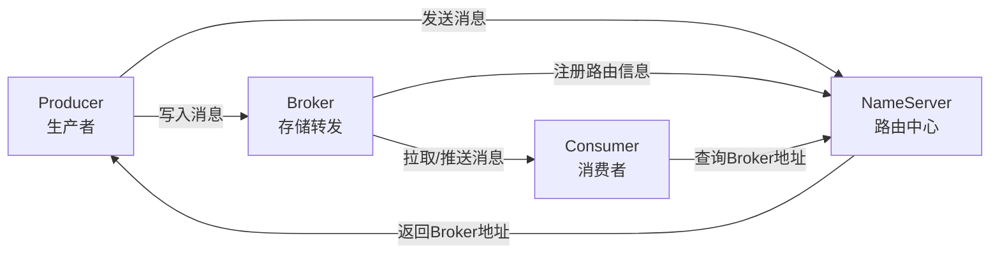
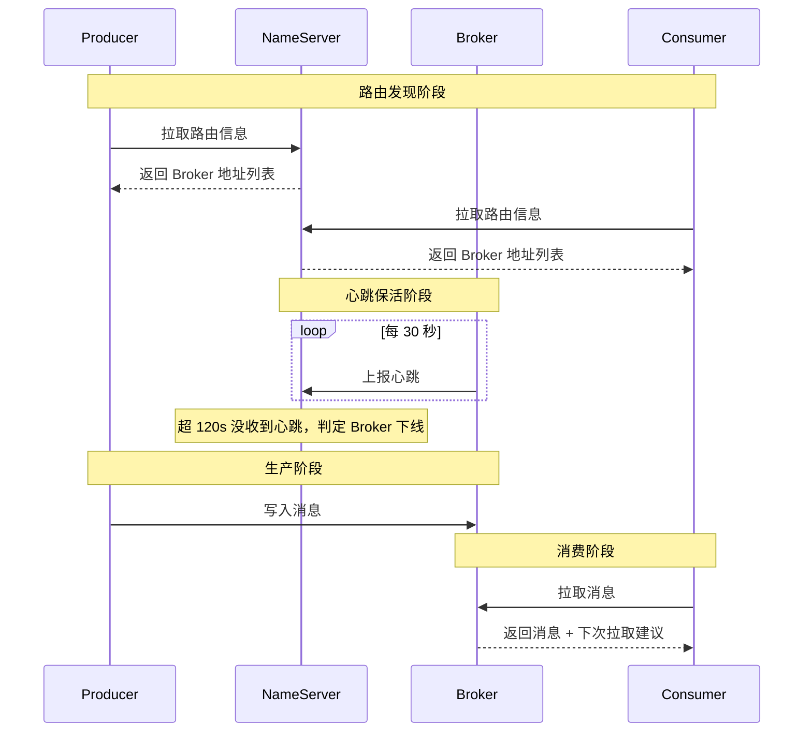
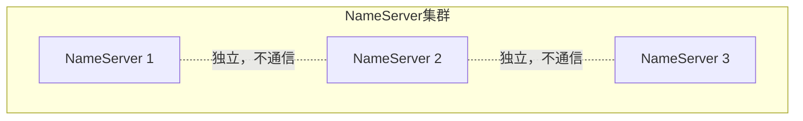
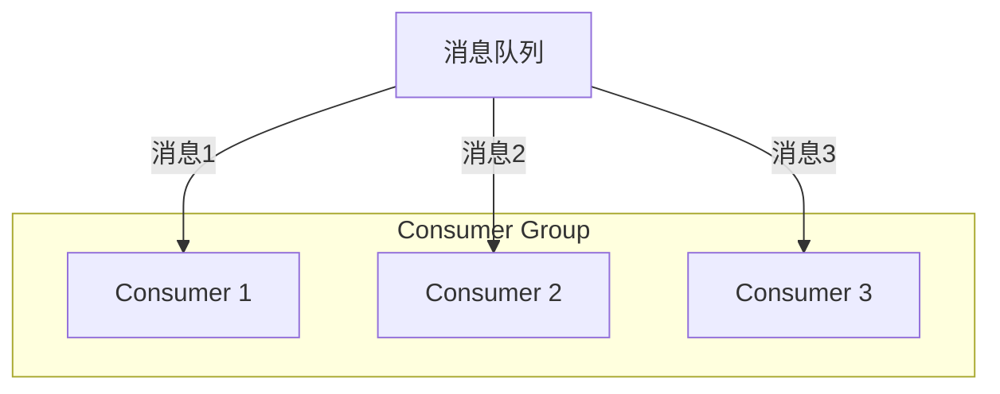
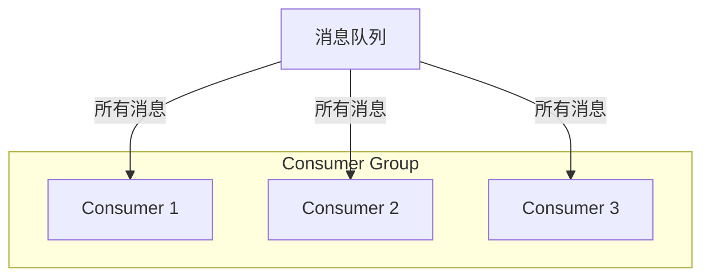

---
{"dg-publish":true,"permalink":"/66.归档发布/08.消息队列/RocketMQ中基本概念/","dg-note-properties":{"时间":"2026-03-23"}}
---

#RocketMQ #消息队列 #架构 #基本概念

```ad-summary
title: 总结

- 核心四组件：Producer、Broker、NameServer、Consumer
- 消费模式：集群消费（分摊消息）和广播消费（全量消息）
- 消费方式：Push（实时性高）和 Pull（应用控制）
- 顺序消费：普通顺序（同队列有序）和严格顺序（全局有序）
```

## 1. 整体架构长什么样

RocketMQ 由四个核心组件组成：



- **Producer**：生产消息，扔进队列
- **Broker**：存储和转发消息，相当于中转站
- **NameServer**：管理路由信息，告诉生产者和消费者找哪个 Broker
- **Consumer**：消费消息，从队列里取

### 1.1 组件之间怎么交互

用一张时序图看清楚：



几个关键点：

- **Producer 和 Consumer 主动拉取**：不是 NameServer 推送，而是客户端主动去拉路由信息
- **Broker 心跳**：每隔 30s 上报一次，跟 NameServer 保持 TCP 长连接
- **NameServer 检测下线**：每隔 10s 检查心跳，超过 120s 没收到就认为 Broker 挂了
- **Master-Slave 同步**：Slave 主动去 Master 拉数据，不是 Master 推给 Slave
- **消费时有建议**：消费者拉消息时，Broker 会返回下次拉取的建议，提高效率


## 2. 核心组件详解

### 2.1 Producer（生产者）

发送消息有四种方式：

| 方式 | 特点 | 适用场景 |
|------|------|----------|
| 同步发送 | 等 Broker 确认，可靠 | 重要消息，不能丢 |
| 异步发送 | 不等确认，回调通知 | 追求吞吐量 |
| 单向发送 | 发了就走，不管结果 | 日志、监控等可丢场景 |
| 顺序发送 | 保证消息顺序 | 订单状态变更 |

> 同步和异步都需要 Broker 返回确认，单向发送不需要，速度最快但可能丢消息。

### 2.2 Broker（代理服务器）

Broker 是消息的中转角色，负责两件事：**存储消息**和**转发消息**。

除了消息本身，Broker 还存储元数据：
- 消费者组信息
- 消费进度偏移量
- Topic 和 Queue 的映射关系

一个 Broker 可以存储多个 Topic 的消息，一个 Topic 的消息也可以分散在多个 Broker 上。

### 2.3 NameServer（名字服务）

NameServer 是路由中心，生产者和消费者通过它查找 Broker 地址。

多个 NameServer 组成集群，但**相互独立，不交换数据**。这样设计的好处是简单，挂一个不影响其他的。



### 2.4 Consumer（消费者）

从应用角度有两种消费形式：

| 方式 | 谁主动 | 实时性 | 适用场景 |
|------|--------|--------|----------|
| Push（推） | Broker 主动推 | 高 | 实时性要求高 |
| Pull（拉） | 应用主动拉 | 可控 | 批量处理、流控 |

Push 其实底层也是 Pull，只是封装了一层，看起来像推。

## 3. 消息相关概念

### 3.1 Topic（主题）

Topic 是消息的分类单位，**一个 Topic 包含一类消息**。

- 每条消息必须属于一个 Topic
- Topic 是订阅的基本单位
- 生产者往 Topic 发消息，消费者订阅 Topic 收消息

### 3.2 Tag（标签）

Tag 是 Topic 下的细分，用来区分同一类消息的不同类型。

```
Topic: 订单消息
├── Tag: 创建订单
├── Tag: 支付成功
└── Tag: 取消订单
```

消费者可以根据 Tag 过滤，只消费自己关心的消息类型。

### 3.3 Message（消息）

消息是生产和消费的最小单位，必须包含：
- **Topic**：属于哪个主题
- **Body**：消息内容
- **Message ID**：全局唯一标识
- **Key**：业务标识，方便查询

## 4. 消费模式

### 4.1 集群消费（Clustering）

同一个 Consumer Group 的多个实例**分摊消息**，每个实例只消费一部分。



适用场景：大多数业务，需要负载均衡。

### 4.2 广播消费（Broadcasting）

同一个 Consumer Group 的每个实例都收到**全量消息**。



适用场景：本地缓存刷新、配置同步等。

> 注意：同一个 Consumer Group 的所有实例必须订阅完全相同的 Topic。

## 5. 顺序消费

### 5.1 普通顺序消费

同一个队列里的消息有序，不同队列之间可能无序。

比如订单消息：同一个订单的"创建→支付→完成"有顺序，但不同订单之间没关系。

### 5.2 严格顺序消费

所有消息都按顺序消费，全局有序。

代价很大：只能单线程消费，吞吐量会下降。一般用不到，除非业务真的需要全局顺序。

## 相关笔记

- [[66.归档发布/08.消息队列/RocketMQ面试题\|RocketMQ面试题]] - 常见面试题汇总
- [[66.归档发布/08.消息队列/RocketMQ消息发送样例\|RocketMQ消息发送样例]] - 代码示例
- [[66.归档发布/08.消息队列/生产者最佳实践\|生产者最佳实践]] - 生产端最佳实践
