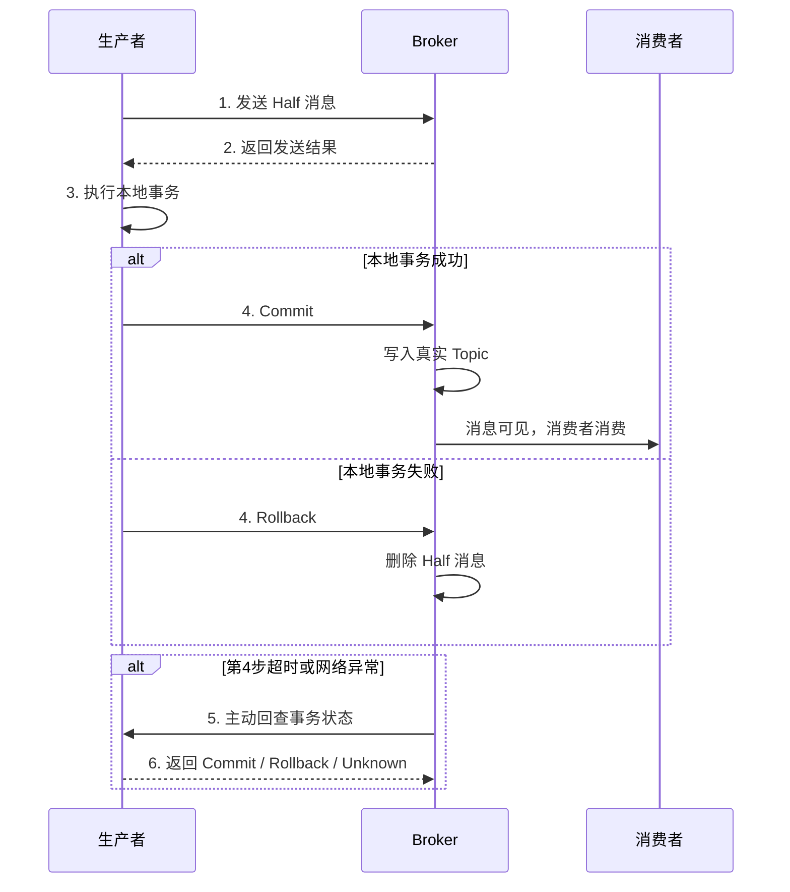

---
{"dg-publish":true,"permalink":"/66.归档发布/08.消息队列/RocketMQ事务消息/"}
---

#rocketmq #消息队列 #分布式事务

```ad-summary
title: 总结

- 事务消息解决本地事务和消息发送的最终一致性，不是强一致
- 流程：Half 消息 → 本地事务 → Commit/Rollback；超时则 Broker 主动回查，最多 15 次
- 回查靠事务日志表：业务操作和写日志放同一个 @Transactional，回查时查表判断
- 消费者消费失败是另一个问题，靠 MQ 重试和死信队列处理
```

## 1. 事务消息解决什么问题？

分布式场景下，本地数据库操作和发消息这两件事没法放在同一个事务里。比如下单成功后要发消息通知库存服务，如果先写库再发消息，写库成功但消息发失败了，库存就不会扣；如果先发消息再写库，消息发出去了但写库失败了，库存被错误扣减。

RocketMQ 事务消息通过 Half 消息 + 本地事务 + 回查机制，保证本地事务和消息发送的最终一致性。

## 2. 整体流程



Half 消息发出去后消费者看不到，它被写入 Broker 内部的 `RMQ_SYS_TRANS_HALF_TOPIC`，只有收到 Commit 后才会转写到真实 Topic，消费者才能消费。

## 3. 回查机制

Broker 长时间（默认 6 秒）没收到 Commit 或 Rollback，会主动向生产者发起回查，询问本地事务的执行结果。

回查最多 15 次，还是拿不到明确状态就默认 Rollback 丢弃消息。

消息状态有三种：
- `COMMIT_MESSAGE`：提交，消费者可见
- `ROLLBACK_MESSAGE`：回滚，消息丢弃
- `UNKNOW`：未知，等待下次回查

## 4. 回查怎么实现？

本地事务执行完了，Broker 来回查时怎么知道事务有没有成功？

常见做法是写一张事务日志表，本地业务操作和写事务日志放在同一个 `@Transactional` 方法里，保证原子性：

```java
@Transactional
public void doLocalTransaction(String txId) {
    // 执行业务操作
    orderService.createOrder(...);
    // 同时写事务日志
    txLogMapper.insert(new TxLog(txId, LocalDateTime.now()));
}
```

回查时查这张表，有记录就 Commit，没有就 Rollback：

```java
@Override
public LocalTransactionState checkLocalTransaction(MessageExt msg) {
    String txId = msg.getTransactionId();
    TxLog log = txLogMapper.selectById(txId);
    if (log != null) {
        return LocalTransactionState.COMMIT_MESSAGE;
    }
    return LocalTransactionState.ROLLBACK_MESSAGE;
}
```

## 5. 完整代码示例

```java
@Component
public class OrderTransactionProducer {

    private TransactionMQProducer producer;

    @PostConstruct
    public void init() throws MQClientException {
        producer = new TransactionMQProducer("order-tx-group");
        producer.setNamesrvAddr("localhost:9876");
        // 回查线程池
        producer.setExecutorService(Executors.newFixedThreadPool(5));
        producer.setTransactionListener(new OrderTransactionListener());
        producer.start();
    }

    public void sendOrderMessage(String orderId) throws Exception {
        Message msg = new Message("ORDER_TOPIC", "order",
            orderId.getBytes(StandardCharsets.UTF_8));
        // 发送事务消息
        producer.sendMessageInTransaction(msg, orderId);
    }

    class OrderTransactionListener implements TransactionListener {

        @Override
        public LocalTransactionState executeLocalTransaction(Message msg, Object arg) {
            String orderId = (String) arg;
            try {
                // 执行本地事务（业务操作 + 写事务日志，同一个 @Transactional）
                orderService.createOrderWithTxLog(orderId);
                return LocalTransactionState.COMMIT_MESSAGE;
            } catch (Exception e) {
                log.error("本地事务执行失败, orderId={}", orderId, e);
                return LocalTransactionState.ROLLBACK_MESSAGE;
            }
        }

        @Override
        public LocalTransactionState checkLocalTransaction(MessageExt msg) {
            String orderId = new String(msg.getBody(), StandardCharsets.UTF_8);
            // 查事务日志表判断本地事务是否成功
            boolean exists = txLogMapper.exists(orderId);
            return exists
                ? LocalTransactionState.COMMIT_MESSAGE
                : LocalTransactionState.ROLLBACK_MESSAGE;
        }
    }
}
```

## 6. 异常场景分析

| 场景 | 结果 |
|------|------|
| Half 消息发送失败 | 生产者直接感知，本地事务不执行，流程终止 |
| 本地事务执行失败 | 发送 Rollback，消息丢弃，数据一致 |
| Commit/Rollback 发送超时 | Broker 回查，查事务日志表补偿 |
| 回查 15 次仍 UNKNOW | Broker 默认 Rollback，消息丢弃 |
| 消费者消费失败 | 走 MQ 重试机制，与事务消息无关 |

注意事务消息只保证生产者本地事务和消息发送的一致性，消费者消费失败需要靠 MQ 的重试和死信队列处理，这是两个独立的问题。

## 7. 和其他分布式事务方案对比

| 方案 | 一致性 | 性能 | 实现复杂度 |
|------|--------|------|-----------|
| RocketMQ 事务消息 | 最终一致 | 高 | 中 |
| Seata AT | 强一致 | 中 | 低 |
| TCC | 最终一致 | 高 | 高 |
| 本地消息表 | 最终一致 | 高 | 中 |

RocketMQ 事务消息本质上和本地消息表思路一样，只是把消息暂存的职责交给了 Broker，不需要自己维护消息表和定时任务。

## 相关链接

- [[66.归档发布/04.并发/分布式/分布式系统常见陷阱清单\|分布式系统常见陷阱清单]]
- [[66.归档发布/03.缓存/缓存一致性解决方案\|缓存一致性解决方案]]
