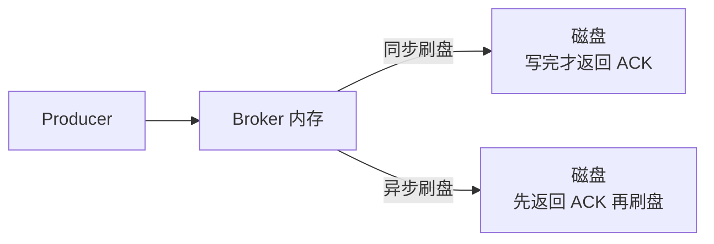

---
{"dg-publish":true,"permalink":"/66.归档发布/08.消息队列/RocketMQ消息持久化/","dg-note-properties":{"时间":"2026-03-15"}}
---

#rocketmq #消息队列 #持久化

## 1. 为什么要持久化？

MQ 作为分布式系统的核心组件，消息不能只存内存，断电就没了。持久化到磁盘后：
- 服务重启或宕机后消息不丢失
- 存储容量不受内存限制，可以堆积大量消息
- 支持消息回溯，消费者可以重新消费历史消息


## 2. 存储结构

RocketMQ 的消息存储由三个文件配合完成，读取性能优化靠的是零拷贝技术，详细原理见 [[66.归档发布/08.消息队列/RocketMQ高性能读写原理\|RocketMQ高性能读写原理]]：


### 2.1 CommitLog

消息真正的物理存储文件，所有 Topic 的消息混合顺序写入同一个 CommitLog，单个文件默认 1 GB，写满后新建下一个。

顺序写是 RocketMQ 高吞吐的关键，磁盘顺序写性能接近内存随机写。

**为什么单文件限制 1 GB？**

CommitLog 读取消息时用的是 `mmap`（内存映射文件）技术，把文件直接映射到进程的虚拟地址空间，读取时不需要从内核态拷贝到用户态，减少了一次数据复制，这就是 RocketMQ 用到的零拷贝技术之一。

但 `mmap` 有个问题：映射的文件越大，发生缺页中断（page fault）时需要加载的数据越多，延迟抖动越明显。1 GB 是经验值，在映射效率和文件管理之间取得平衡。文件太大还会导致内存映射区域占用过多虚拟地址空间，在 32 位系统上尤其是问题（64 位系统上限制放宽了很多，但 1 GB 的设计沿用下来）。

**零拷贝技术**

RocketMQ 的零拷贝是高性能的关键，详细原理见 [[66.归档发布/08.消息队列/RocketMQ高性能读写原理\|RocketMQ高性能读写原理]]。消息写入 CommitLog 时用的是 `mmap`（内存映射文件）技术，把文件直接映射到进程的虚拟地址空间，读取时不需要从内核态拷贝到用户态。

### 2.2 ConsumerQueue

逻辑队列，相当于 CommitLog 的索引。每个 Topic 下的每个 MessageQueue 都有一个对应的 ConsumerQueue 文件，存储的是消息在 CommitLog 中的偏移量（offset）、消息大小、消息 Tag 的哈希值。

消费流程：
```
订阅 Topic
  → 找到对应的 ConsumerQueue
  → 获取消息 offset
  → 根据 offset 从 CommitLog 读取消息内容
```

ConsumerQueue 文件很小，可以全量加载进内存，消费时只需一次随机读 CommitLog，效率高。

### 2.3 IndexFile

为消息查询提供按 Key 或时间区间检索的能力，底层是哈希索引结构。只用于查询，不影响消息发送和消费的主流程。

## 3. 刷盘策略

消息写入后需要从内存刷到磁盘，RocketMQ 提供两种方式：



**同步刷盘**：消息写入磁盘后才返回 ACK 给 Producer，数据不丢，但吞吐量低，延迟高。适合金融、支付等对数据可靠性要求极高的场景。

**异步刷盘**：消息写入内存后立即返回 ACK，由后台线程批量刷盘，吞吐量高，但 Broker 宕机时内存中未刷盘的消息会丢失。大部分业务场景选这个。

```conf
# broker.conf
# 同步刷盘
flushDiskType=SYNC_FLUSH
# 异步刷盘（默认）
flushDiskType=ASYNC_FLUSH
```

## 4. 主从同步

单 Broker 即使同步刷盘，机器硬件故障还是可能丢数据。生产环境一般部署主从架构，消息写入主节点后同步到从节点。

主从同步也有两种模式：
- **同步复制（SYNC_MASTER）**：主节点等从节点确认收到后才返回 ACK，数据不丢，但延迟略高
- **异步复制（ASYNC_MASTER）**：主节点写完立即返回，后台异步同步到从节点，性能好，主节点宕机可能丢少量数据

```conf
# broker.conf
brokerRole=SYNC_MASTER   # 同步复制
brokerRole=ASYNC_MASTER  # 异步复制（默认）
brokerRole=SLAVE         # 从节点
```

可靠性要求高的场景：同步刷盘 + 同步复制，双重保障，性能代价最大。
一般业务：异步刷盘 + 异步复制，性能最好，极端情况下可能丢少量消息。

## 6. 消息过期清理

CommitLog 文件默认保留 72 小时，过期后自动删除，不管消息有没有被消费。所以消费者要及时消费，别让消息堆积太久。

```conf
# 消息保留时间，单位小时，默认 72
fileReservedTime=72
# 每天几点触发清理，默认凌晨 4 点
deleteWhen=04
```

## 7. 相关内容

如果你在面试中被问到 RocketMQ 的持久化机制，可以重点准备 [[66.归档发布/08.消息队列/RocketMQ面试题\|RocketMQ面试题]] 中的消息存储和高可用相关问题。事务消息的半消息机制也依赖于持久化，详见 [[66.归档发布/08.消息队列/RocketMQ事务消息\|RocketMQ事务消息]]。
