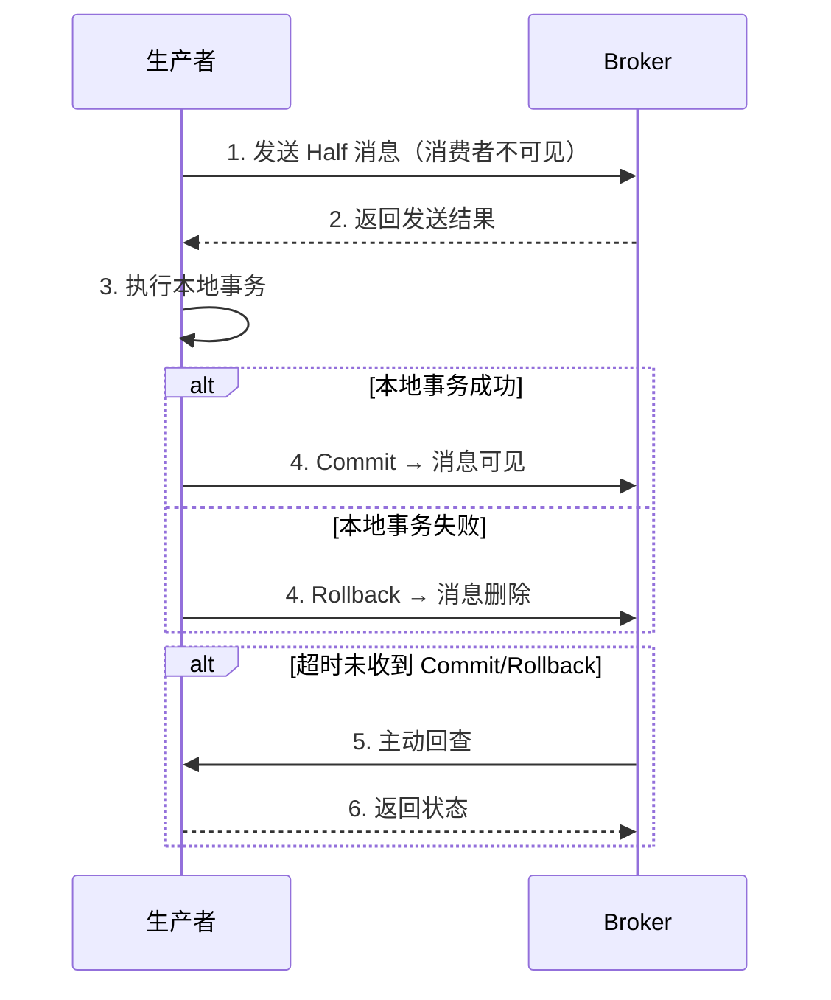

---
{"dg-publish":true,"permalink":"/66.归档发布/08.消息队列/RocketMQ面试题/","dg-note-properties":{"时间":"2026-03-23"}}
---

#RocketMQ #消息队列 #面试题 #Java

```ad-summary
title: 总结

- RocketMQ 由 Producer、Broker、NameServer、Consumer 四组件组成，NameServer 负责路由
- 消息存储用 CommitLog（顺序写）+ ConsumerQueue（索引），零拷贝用 mmap
- 高可用：同步/异步刷盘 + 主从复制，金融级需要同步刷盘+同步复制
- 顺序消息靠 MessageQueueSelector 发到同一队列，消费用 MessageListenerOrderly
- 事务消息：Half 消息 → 本地事务 → Commit/Rollback，超时回查最多 15 次
- 消费重试：默认 16 次，失败进死信队列
- 重复消费：RocketMQ 不保证幂等，要业务方自己实现
```

## 1. 基础概念

### 1.1 RocketMQ 整体架构是怎样的？

RocketMQ 由四部分组成：

- **Producer（生产者）**：发消息，和 NameServer 通信获取 Broker 地址
- **NameServer（路由中心）**：管理 Broker 信息，生产者和消费者通过它获取路由。多个 NameServer 相互独立，不通信
- **Broker（代理服务器）**：存储消息，接受 Producer 写入，推消息给 Consumer。每个 Broker 有 Master 和 Slave
- **Consumer（消费者）**：消费消息，分 Push 和 Pull 两种方式

### 1.2 消息消费模式有哪些？

**集群消费**：同 Consumer Group 的多个实例分摊消息，每条消息只被一个实例消费。适合大部分业务场景。

**广播消费**：同 Consumer Group 的每个实例都收到全量消息。适合配置刷新、缓存更新等场景。

### 1.3 Push 和 Pull 消费有什么区别？

Push 是 Broker 主动推消息给消费者，实时性高，但消费者可能来不及处理。底层其实是 Pull，只是封装成了 Push 的接口。

Pull 是消费者主动拉消息，优点是消费速度可控，适合批量处理或需要流控的场景。

## 2. 消息存储

### 2.1 RocketMQ 的消息存储结构是什么？

RocketMQ 用三个文件配合存储：

- **CommitLog**：物理存储文件，所有 Topic 的消息都顺序写入同一个文件，单文件默认 1G。这是 RocketMQ 高吞吐的关键——顺序写磁盘速度接近内存随机写。
- **ConsumerQueue**：逻辑队列，相当于 CommitLog 的索引。每个 Topic 下的每个 MessageQueue 有一个 ConsumerQueue，存消息在 CommitLog 中的偏移量、消息大小、Tag 哈希值。消费时先读 ConsumerQueue 拿到 offset，再读 CommitLog 取消息。
- **IndexFile**：按 Key 或时间区间检索消息用的哈希索引。

### 2.2 为什么 CommitLog 单文件限制 1G？

因为用了 mmap（内存映射文件）技术，mmap 单次映射有 1.5G~2G 的上限，RocketMQ 取 1G 留余量。

文件太大会导致缺页中断时加载数据过多，延迟抖动明显。

### 2.3 零拷贝是怎么实现的？

RocketMQ 用两种零拷贝：

- **mmap + write**：CommitLog 写入时用 `MappedByteBuffer`，文件直接映射到内存，省去用户态和内核态之间的拷贝
- **sendfile**：消息发送给消费者时，数据从 PageCache 直接到网卡，不经过用户态，只有两次拷贝

传统 IO 要经过 4 次拷贝和 4 次上下文切换，零拷贝大幅提升了吞吐量。详见 [[66.归档发布/00.Linux/Linux中的零拷贝技术\|Linux中的零拷贝技术]]。

### 2.4 同步刷盘和异步刷盘有什么区别？

**同步刷盘**：消息写入磁盘后才返回 ACK，可靠性最高但吞吐量低，适合金融、支付等强一致性场景。

**异步刷盘**：消息写入内存就返回 ACK，后台线程批量刷盘，吞吐量高但 Broker 挂了可能丢未刷盘的消息。大部分业务选这个。

## 3. 高可用

### 3.1 主从同步有哪些模式？

- **同步复制（SYNC_MASTER）**：主节点等从节点确认后才返回 ACK，数据不丢，但延迟略高
- **异步复制（ASYNC_MASTER）**：主节点写完立即返回，后台异步同步到从节点，性能好但主节点挂了可能丢少量数据

### 3.2 怎么选刷盘和主从策略？

| 场景 | 刷盘策略 | 主从策略 | 说明 |
|------|----------|----------|------|
| 金融级 | 同步刷盘 | 同步复制 | 数据绝对不丢，性能代价最大 |
| 普通业务 | 异步刷盘 | 异步复制 | 性能最好，极端情况可能丢少量消息 |
| 高吞吐允许少量丢失 | 异步刷盘 | 异步复制 | 追求吞吐量 |

### 3.3 消息过期会怎样？

CommitLog 默认保留 72 小时，超时自动删除，不管消息有没有被消费。所以消费者要及时消费，别让消息堆积太久。

## 4. 顺序消息

### 4.1 怎么保证消息顺序？

RocketMQ 支持两种顺序：

- **分区有序**：同一个队列里的消息有序，不同队列之间无序。通过 `MessageQueueSelector` 把同一业务的消息发到同一个队列实现。
- **全局有序**：所有消息都有序，只能用一个队列，单线程消费，吞吐量很低，一般不用。

消费端用 `MessageListenerOrderly` 而不是 `MessageListenerConcurrently`。

### 4.2 顺序消息怎么实现？

生产者用 `MessageQueueSelector` 按业务 ID 选择队列：

```java
producer.send(msg, new MessageQueueSelector() {
    @Override
    public MessageQueue select(List<MessageQueue> mqs, Message msg, Object arg) {
        long orderId = (long) arg;
        return mqs.get(orderId % mqs.size());
    }
}, orderId);
```

消费者用 `MessageListenerOrderly`，一个队列只有一个线程消费。

## 5. 事务消息

### 5.1 事务消息的流程是什么？



关键点：
- Half 消息写入 `RMQ_SYS_TRANS_HALF_TOPIC`，消费者看不到
- 本地事务执行完后根据结果 Commit 或 Rollback
- 超时没收到状态，Broker 会主动回查，最多 15 次

### 5.2 回查机制怎么实现？

本地事务执行完后，Broker 来回查时怎么知道事务有没有成功？

常用做法是写事务日志表，业务操作和写日志放在同一个 `@Transactional` 里：

```java
@Transactional
public void createOrder(String orderId) {
    orderMapper.insert(...);
    txLogMapper.insert(txId, orderId);  // 事务日志
}
```

回查时查这张表，有记录就 Commit，没有就 Rollback。

### 5.3 事务消息有哪些限制？

- 不支持延时消息和批量消息
- 单个消息默认最多回查 15 次，超过就丢弃
- ProducerGroup 不能和其他类型消息共用
- 事务消息可能被检查或消费多次

### 5.4 事务消息和 Seata AT 模式有什么区别？

| 对比项 | RocketMQ 事务消息 | Seata AT |
|--------|------------------|----------|
| 一致性 | 最终一致 | 强一致 |
| 侵入性 | 需要改代码 | 无感 |
| 性能 | 高 | 中等 |
| 复杂度 | 中 | 低（官方案例多） |

Seata AT 通过undo_log 表实现自动回滚，对业务代码无侵入，适合强一致性场景。RocketMQ 事务消息是最终一致，适合消息通知类场景。

## 6. 消息消费

### 6.1 消费重试机制是怎样的？

消费失败后，RocketMQ 会重试。默认重试 16 次，间隔时间递增：

| 重试次数 | 间隔 | 重试次数 | 间隔 |
|----------|------|----------|------|
| 1 | 10s | 9 | 7min |
| 2 | 30s | 10 | 8min |
| 3 | 1min | 11 | 9min |
| ... | ... | 16 | 不再重试 |

16 次都失败后消息进死信队列（Dead Letter Queue），不再自动重试。

### 6.2 怎么保证消息不重复消费？

**RocketMQ 不保证消息不重复**，要业务方自己实现幂等。

常用方案：
- **数据库去重**：用业务唯一标识（如订单 ID）做唯一索引
- **Redis 去重**：用 Set 或 Bitmap 记录已处理的 Key
- **幂等表**：记录消息 ID，已处理则跳过

### 6.3 消息积压怎么办？

消息积压通常是消费者消费能力不足或消费逻辑卡住：

1. **紧急扩容**：增加消费者实例（注意一个 Consumer Group 的实例数不要超过队列数，否则多余的实例会闲置）
2. **检查消费逻辑**：是不是有慢查询、RPC 调用卡住等
3. **临时跳过**：可以先重置消费位点，跳过积压的消息，先消费新消息
4. **监控报警**：提前发现积压趋势

### 6.4 消费者怎么选择集群消费还是广播消费？

**集群消费**（默认）：消息分摊，一个实例消费一部分。适合大多数业务，需要负载均衡。

**广播消费**：每个实例都消费全量消息。适合本地缓存刷新、配置同步等场景，一个实例消费不影响其他实例。

## 7. 生产实践

### 7.1 Topic 和 Tag 怎么设计？

**一个应用一个 Topic**，用 Tag 区分消息子类型：

```
Topic: ORDER
├── Tag: CREATE  → 订单创建
├── Tag: PAY    → 支付成功
└── Tag: CANCEL → 订单取消
```

消费者按 Tag 过滤，Broker 端直接过滤，不把无关消息拉到客户端。

### 7.2 消息 Key 怎么设置？

每个消息设 `keys`，放业务唯一标识（如订单 ID）。作用：

- 方便排查：消息丢失时可以用 `topic + key` 精确定位
- Broker 会建哈希索引，查询速度快

### 7.3 发送结果怎么判断？

`send()` 方法不抛异常不代表没问题，要注意返回状态：

| 状态 | 含义 | 会不会丢消息 |
|------|------|--------------|
| SEND_OK | 发送成功，已刷盘或同步到 Slave | 不会 |
| FLUSH_DISK_TIMEOUT | 发送成功，刷盘超时 | Broker 挂了会丢 |
| FLUSH_SLAVE_TIMEOUT | 发送成功，同步 Slave 超时 | Broker 挂了会丢 |
| SLAVE_NOT_AVAILABLE | 发送成功，Slave 不可用 | Broker 挂了会丢 |

重要消息要求 `SEND_OK`，其他状态当失败处理。

### 7.4 怎么调优？

- **刷盘策略**：高可靠场景用同步刷盘
- **主从复制**：高可靠场景用同步复制
- **mmap 大小**：默认 1G，可以改但别超过 2G
- **PageCache 预热**：启动时预热热点数据，启动后读取更快
- **消费者实例数**：等于队列数时吞吐量最大

## 8. 进阶问题

### 8.1 RocketMQ 和 Kafka 有什么区别？

| 对比项 | RocketMQ | Kafka |
|--------|----------|-------|
| 架构 | NameServer 做路由中心 | Zookeeper 做协调 |
| 消息持久化 | CommitLog + ConsumeQueue | 顺序写入 partition |
| 顺序消息 | 支持分区/全局顺序 | 只支持 partition 内有序 |
| 事务消息 | 原生支持 | 事务接口较弱 |
| 消息堆积 | 支持亿级堆积 | 支持亿级堆积 |
| 延迟 | 毫秒级 | 毫秒级 |

### 8.2 为什么 RocketMQ 不使用 Zookeeper？

RocketMQ 的 NameServer 是去中心化的，各个节点独立，不互相通信。设计更简单，运维成本低。相比 Kafka 用 Zookeeper 做元数据管理，RocketMQ 少了依赖，部署更轻量。

### 8.3 消息轨迹怎么追查？

RocketMQ 支持消息轨迹功能：

```java
// 生产者开启消息轨迹
producer.setTraceEnabled(true);
```

开启后可以在控制台查看消息的发送时间、耗时、是否被消费等信息。

### 8.4 怎么实现延迟队列？

RocketMQ 支持延时消息，用 `message.setDelayTimeLevel(level)` 设置：

```java
// 延时等级 1-18，对应 1s 到 2h
message.setDelayTimeLevel(3);  // 10秒
```

不支持任意时间延时，只有 18 个固定等级。这是性能优化的权衡，太多不同延时时间会让存储和投递变复杂。

## 相关笔记

- [[66.归档发布/08.消息队列/RocketMQ消息发送样例\|RocketMQ消息发送样例]] - 代码示例
- [[66.归档发布/08.消息队列/RocketMQ中基本概念\|RocketMQ中基本概念]] - 架构和核心概念
- [[66.归档发布/08.消息队列/RocketMQ高性能读写原理\|RocketMQ高性能读写原理]] - 零拷贝和顺序写
- [[66.归档发布/08.消息队列/RocketMQ消息持久化\|RocketMQ消息持久化]] - 存储结构和刷盘策略
- [[66.归档发布/08.消息队列/RocketMQ事务消息\|RocketMQ事务消息]] - 事务消息详解
- [[66.归档发布/08.消息队列/生产者最佳实践\|生产者最佳实践]] - 生产端最佳实践