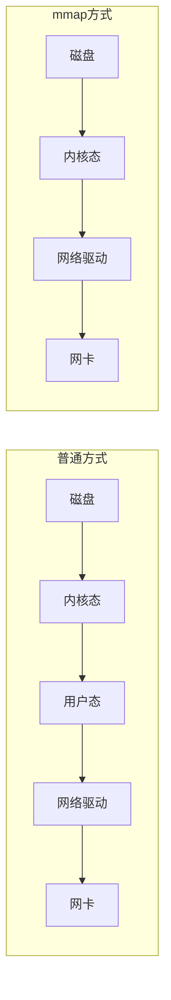

---
{"dg-publish":true,"permalink":"/66.归档发布/08.消息队列/RocketMQ高性能读写原理/","dg-note-properties":{"时间":"2026-03-23"}}
---

#RocketMQ #消息队列 #高性能 #零拷贝

```ad-summary
title: 总结

- 写入用顺序写，速度 600M/s，比随机写快 6000 倍
- 读取用 mmap 零拷贝，省去用户态复制，CommitLog 限制 1G 就是因为这个
- 生产环境调 mmap 大小和 PageCache 预热能进一步提升性能
```

## 1. 写入为什么这么快

RocketMQ 写消息用的是**顺序写**，不是随机写。区别有多大？

| 写入方式 | 速度 | 差距 |
|----------|------|------|
| 顺序写 | 600M/s | 快 6000 倍 |
| 随机写 | 100KB/s | 基准 |

顺序写快的原因：磁头不用来回跳，顺着写就行。就像抄书，一页一页抄比翻来翻去找页码快多了。


## 2. 读取怎么优化的

普通方式读数据，要经历 4 次复制：

```
磁盘 → 内核态 → 用户态 → 网络驱动 → 网卡 → 发送
```

每多一次复制，就多一次 CPU 开销。数据量大的时候，这个开销很可观。

RocketMQ 用 [[66.归档发布/00.Linux/Linux中的零拷贝技术\|mmap 零拷贝]] 来优化，省掉了"内核态 → 用户态"这一步：



**普通方式**：4 次复制，用户态是多余的中间层
**mmap 方式**：3 次复制，少了用户态这一层

Java 里用 `MappedByteBuffer` 实现 mmap，代码很简单：

```java
// 映射文件到内存
MappedByteBuffer buffer = fileChannel.map(
    FileChannel.MapMode.READ_ONLY, 
    0, 
    fileSize
);
// 直接从 buffer 读，不用先拷到用户态
byte[] data = new byte[1024];
buffer.get(data);
```

## 3. CommitLog 为什么限制 1G

用 mmap 映射文件时，单次映射有上限，一般是 **1.5G~2G**。

RocketMQ 选了 1G 作为 CommitLog 大小，留了点余量，避免映射失败。

> 如果消息写入速度很快，1G 的文件很快就会写满，然后创建新文件继续写。这就是为什么 RocketMQ 的 CommitLog 是由很多 1G 文件组成的。

## 4. 怎么调优

### 4.1 mmap 大小

默认是 1G，可以改，但别超过 2G：

```ini
# broker.conf
mapedFileSizeCommitLog=1073741824  # 1G，默认值
```

改大一点能减少文件切换次数，但别超过系统限制。

### 4.2 PageCache 预热

RocketMQ 启动时会预热 PageCache，把热点数据加载到内存。这个过程会阻塞启动，但启动后读取更快。

```ini
# 开启预热
warmMapedFileEnable=true
```

预热时间取决于数据量，一般几秒到几十秒。

### 4.3 怎么验证性能

写入性能看这个指标：

```bash
# 查看 Broker 统计
mqadmin brokerStatus -n localhost:9876 -b 192.168.1.100:10911

# 关注：msgPutTotalTodayNow（今日写入量）
# 关注：putTps（写入 TPS）
```

读取性能看这个指标：

- `getTransferedTps`：消费 TPS
- `getFoundTps`：命中率，越高越好

如果 TPS 上不去，先检查是不是磁盘 IO 瓶颈：

```bash
# 查看磁盘 IO
iostat -x 1

# 关注 %util，超过 80% 说明磁盘是瓶颈
```

## 6. 相关内容

RocketMQ 的高性能离不开消息存储机制的配合，详细说明见 [[66.归档发布/08.消息队列/RocketMQ消息持久化\|RocketMQ消息持久化]]。如果你在面试中被问到RocketMQ的原理，可以重点准备 [[66.归档发布/08.消息队列/RocketMQ面试题\|RocketMQ面试题]] 中的高性能和高可用相关问题。

## 7. 零拷贝还有哪些方式

除了 mmap，[[66.归档发布/00.Linux/Linux中的零拷贝技术\|零拷贝]] 还有 sendfile 方式，适合纯转发场景：

| 方式 | 适用场景 | 复制次数 |
|------|----------|----------|
| mmap | 需要处理数据（RocketMQ 用这个） | 3 次 |
| sendfile | 纯转发，不修改数据 | 2 次 |
| splice | 管道传输 | 2 次 |

RocketMQ 选 mmap 是因为消费者可能需要修改消息（比如加索引），sendfile 做不到。
