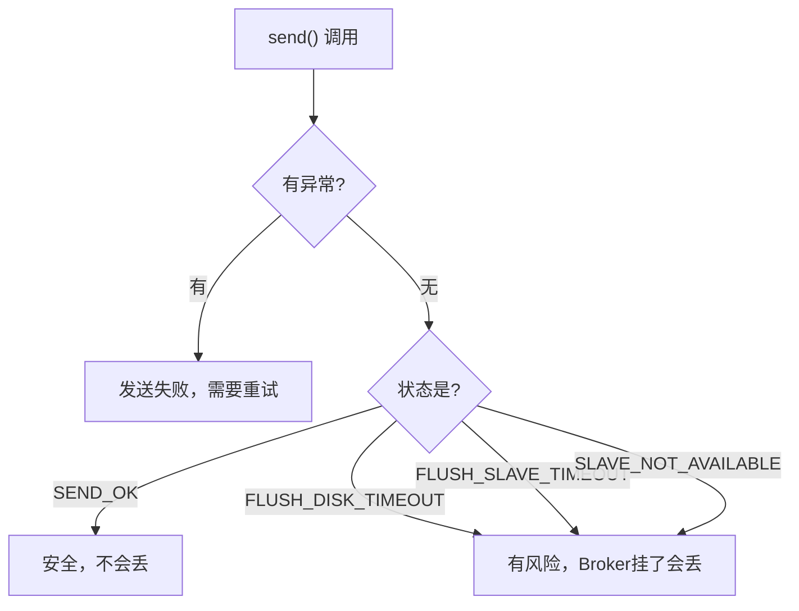

---
{"dg-publish":true,"permalink":"/66.归档发布/08.消息队列/生产者最佳实践/","dg-note-properties":{"时间":"2026-03-23"}}
---

#RocketMQ #消息队列 #生产者 #最佳实践

```ad-summary
title: 总结

- 一个应用一个 Topic，消息子类型用 Tag 区分
- 业务唯一标识写到 keys，方便排查消息丢失
- 发送结果除了 SEND_OK，其他状态都要警惕，可能丢消息
```

## 1. Topic 怎么设计

**一个应用尽量只用一个 Topic**，消息子类型用 Tag 来区分。

比如订单系统：

```
Topic: ORDER_TOPIC
├── Tag: CREATE     → 创建订单
├── Tag: PAY        → 支付成功
└── Tag: CANCEL     → 取消订单
```

好处：代码里只维护一个 Topic，通过 Tag 过滤，结构清晰。

消费者订阅时可以用 Tag 过滤，Broker 端直接过滤，不用把所有消息都拉下来再筛：

```java
// 订阅时指定 Tag
consumer.subscribe("ORDER_TOPIC", "PAY || CANCEL");
```

## 2. Key 怎么用

每个消息都要设 `keys`，放业务层面的唯一标识，比如订单 ID。

```java
// 设置业务唯一标识
String orderId = "20034568923546";
message.setKeys(orderId);
```

**为什么要设 Key？**

- 方便排查消息丢失问题：用 `topic + key` 就能查到消息内容和消费情况
- Broker 会为每个 Key 建哈希索引，查询速度快

> Key 要尽量唯一，避免哈希冲突。如果多个消息用同一个 Key，查出来一堆，不好定位。

## 3. 日志怎么打

消息发送成功或失败，都要打印日志。**必须包含这两个字段**：

- **sendResult**：发送结果
- **key**：业务标识

```java
SendResult sendResult = producer.send(message);
log.info("发送结果: {}, key: {}", sendResult.getSendStatus(), message.getKeys());
```

不打日志的话，出了问题查都没法查。

## 5. 相关内容

发送是消息流程的起点，消费是终点，详见 [[66.归档发布/08.消息队列/RocketMQ中基本概念\|RocketMQ中基本概念]] 中的消费者部分。如果你在面试中被问到 RocketMQ 的发送机制，可以重点准备 [[66.归档发布/08.消息队列/RocketMQ面试题\|RocketMQ面试题]] 中的生产者实践相关问题。

## 6. 发送结果怎么看

调用 `send` 方法不抛异常就代表发送成功，但成功有不同状态：

| 状态 | 含义 | 会不会丢消息 |
|------|------|--------------|
| SEND_OK | 发送成功，已刷盘或同步到 Slave | 不会 |
| FLUSH_DISK_TIMEOUT | 发送成功，但刷盘超时 | Broker 挂了会丢 |
| FLUSH_SLAVE_TIMEOUT | 发送成功，但同步到 Slave 超时 | Broker 挂了会丢 |
| SLAVE_NOT_AVAILABLE | 发送成功，但 Slave 不可用 | Broker 挂了会丢 |



**怎么处理？**

- 重要消息：要求 `SEND_OK`，其他状态当失败处理，重试
- 不重要消息：`SEND_OK` 和其他成功状态都可以接受
