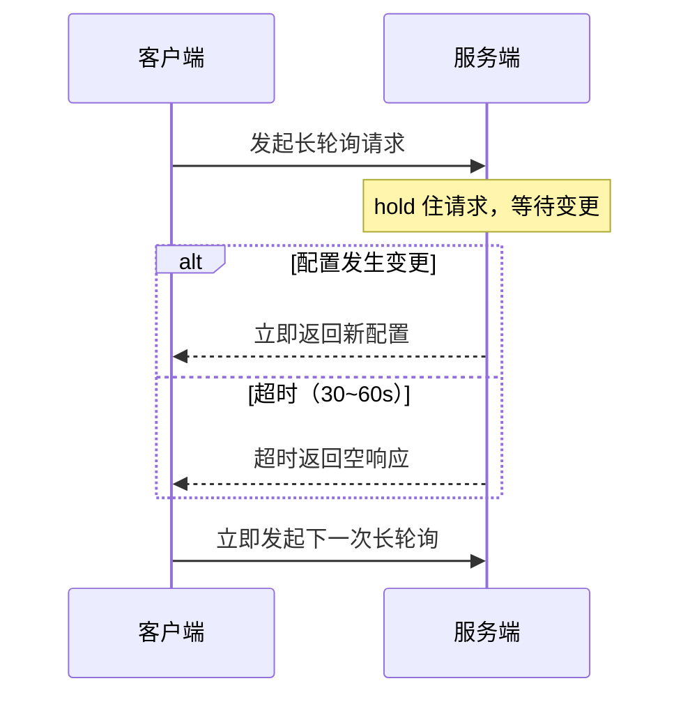

---
{"dg-publish":true,"permalink":"/66.归档发布/09.微服务/配置中心如何实现实时推送/"}
---

#分布式 #最佳实践

```ad-summary
title: 总结

- 配置中心用**长轮询**而不是普通轮询：服务端 hold 住请求直到数据变更或超时，兼顾实时性和服务端压力
- 长轮询设超时时间（30~60s）是为了保证可用性，以及让新增的配置监听能被捎带上
- push 模式及时但不知道客户端消费能力；pull 模式可控但延迟高；长轮询是两者的折中
```

> 来源：[认识长轮询：配置中心是如何实现推送的？](https://developer.aliyun.com/article/781914)

## 1. push vs pull

| | push 推模式 | pull 拉模式 |
|--|------------|------------|
| 原理 | 服务端通过长连接主动推送 | 客户端主动发请求拉取 |
| 实时性 | 高，变更立即感知 | 低，取决于拉取频率 |
| 缺点 | 不知道客户端消费能力，可能积压 | 频率低则延迟高，频率高则压力大 |

## 2. 轮询有什么问题？

普通轮询是客户端每隔固定时间拉一次，不管数据有没有变：

- **推送延迟**：每 5s 拉一次，配置刚变更就可能等 4s 才感知到
- **服务端压力大**：配置大部分时间不变，频繁请求全是无效的
- **两者无法兼顾**：缩短间隔延迟低但压力大，拉长间隔压力小但延迟高

## 3. 长轮询怎么解决的？

客户端发起请求，服务端**数据没变就 hold 住不返回**，直到数据变更或超时（一般 30~60s）才响应。客户端收到响应后立即发起下一次长轮询。



这样服务端压力小（请求间隔长），实时性也高（变更立即返回）。

## 4. 为什么不让服务端一直 hold 住？

两个原因：

**可用性**：长轮询底层走 TCP，服务端 Full GC、假死、重启时，没有应用层心跳机制，仅靠 TCP 保活不可靠。设置超时时间能保证客户端定期重连。

**新增监听**：用户可能随时新增配置监听，而此时长轮询已经发出，新监听没法加进去。超时返回后，客户端重新发起长轮询时才能把新增的监听带上。如果没有超时，配置一直不变就一直 hold 着，新增的监听就永远没法生效。
