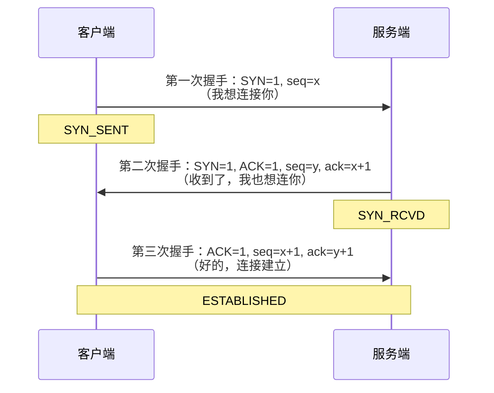
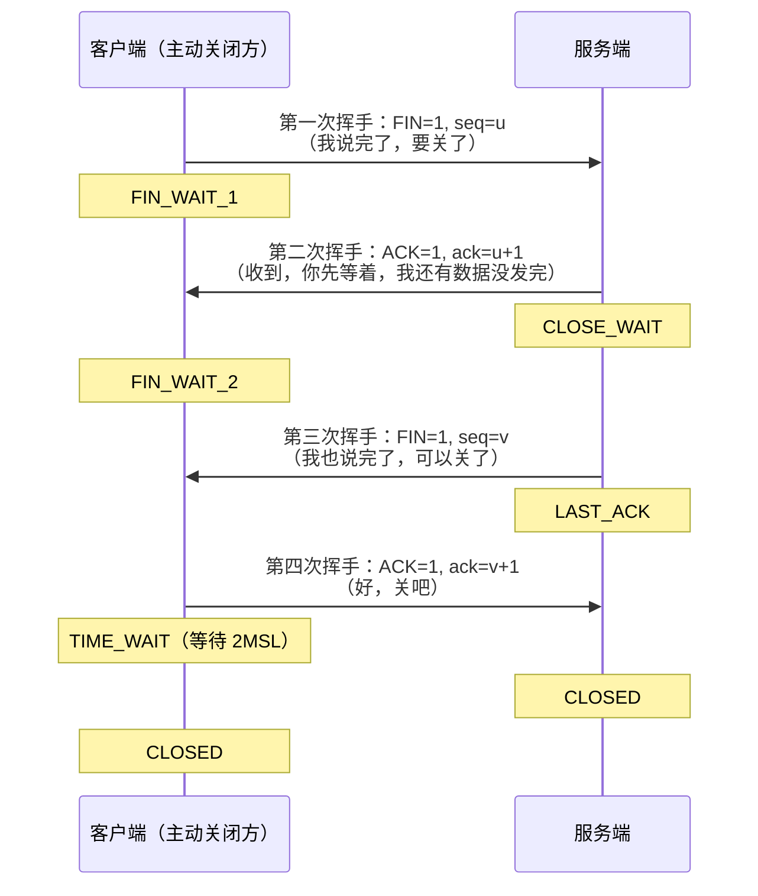

---
{"dg-publish":true,"permalink":"/66.归档发布/10.网络/TCP三次握手、四次挥手/","dg-note-properties":{"时间":"2026-03-21"}}
---

#网络 #TCP #面试

```ad-summary
title: 总结

- 三次握手建立连接：SYN → SYN-ACK → ACK，核心是双方互相确认收发能力
- 两次握手不够：无法防止历史连接和服务端资源浪费
- 四次挥手断开连接：FIN → ACK → FIN → ACK，多一次是因为 TCP 全双工，两个方向独立关闭
- TIME_WAIT 等待 2MSL：确保最后一个 ACK 到达，防止旧连接数据干扰新连接
```

## 1. 三次握手




**口诀：一呼、二应、三成交**

- 第一次：客户端发 SYN，进入 `SYN_SENT` 状态
- 第二次：服务端回 SYN-ACK，进入 `SYN_RCVD` 状态
- 第三次：客户端发 ACK，双方进入 `ESTABLISHED` 状态，连接建立

### 为什么是三次，不是两次？

两次握手有两个问题：

**问题一：无法防止历史连接**

网络延迟可能导致一个旧的 SYN 包在连接关闭后才到达服务端。如果只有两次握手，服务端收到旧 SYN 就直接建立连接，浪费资源。三次握手时，客户端收到服务端的 SYN-ACK 后，发现序号不对，会发 RST 让服务端释放资源。

**问题二：无法确认双方收发能力**

两次握手只能确认：服务端能收、客户端能发。客户端能收、服务端能发，需要第三次握手才能确认。

### 为什么不是四次？

第二次握手服务端把 SYN 和 ACK 合并成一个包发送，没必要拆成两次，三次已经足够。

## 2. 四次挥手




TCP 是全双工的，客户端和服务端各有一个独立的发送通道，关闭时需要各自发 FIN 确认。

- 第二次和第三次挥手之间有间隔：服务端收到 FIN 后，可能还有数据没发完，先 ACK 告知客户端"我知道了"，等数据发完再发 FIN
- 这就是四次挥手比三次握手多一次的原因

### TIME_WAIT 为什么要等 2MSL？

MSL（Maximum Segment Lifetime）是报文在网络中的最大存活时间，一般为 60 秒。

等待 2MSL 有两个目的：

1. **确保最后一个 ACK 到达服务端**：如果服务端没收到最后的 ACK，会重发 FIN，客户端在 2MSL 内还能响应
2. **防止旧连接数据干扰新连接**：等待 2MSL 后，这条连接的所有报文都已在网络中消失，新连接不会收到旧数据

### 为什么挥手是四次，不能像握手一样合并？

握手时服务端的 SYN 和 ACK 可以合并，因为服务端收到 SYN 后立刻就能响应。

挥手时不行：服务端收到客户端的 FIN，只能先 ACK，因为服务端可能还有数据没发完，不能立刻发 FIN。等数据发完才能发 FIN，所以必须分两次。

## 3. 连接状态速查

| 状态 | 出现在 | 含义 |
|---|---|---|
| `SYN_SENT` | 客户端 | 已发 SYN，等待服务端响应 |
| `SYN_RCVD` | 服务端 | 收到 SYN，已回 SYN-ACK |
| `ESTABLISHED` | 双方 | 连接已建立，正常通信 |
| `FIN_WAIT_1` | 主动关闭方 | 已发 FIN，等待 ACK |
| `FIN_WAIT_2` | 主动关闭方 | 收到 ACK，等待对方 FIN |
| `CLOSE_WAIT` | 被动关闭方 | 收到 FIN，等待本端数据发完 |
| `LAST_ACK` | 被动关闭方 | 已发 FIN，等待最后的 ACK |
| `TIME_WAIT` | 主动关闭方 | 等待 2MSL，防止旧报文干扰 |
| `CLOSED` | 双方 | 连接完全关闭 |

TCP 连接建立后，数据传输阶段涉及的滑动窗口、流量控制等机制详见 [[66.归档发布/10.网络/TCP传输中粘包拆包问题\|TCP传输中粘包拆包问题]]。HTTPS 在 TCP 三次握手完成后还会进行 TLS 握手，详见 [[66.归档发布/10.网络/https原理\|https原理]]。
