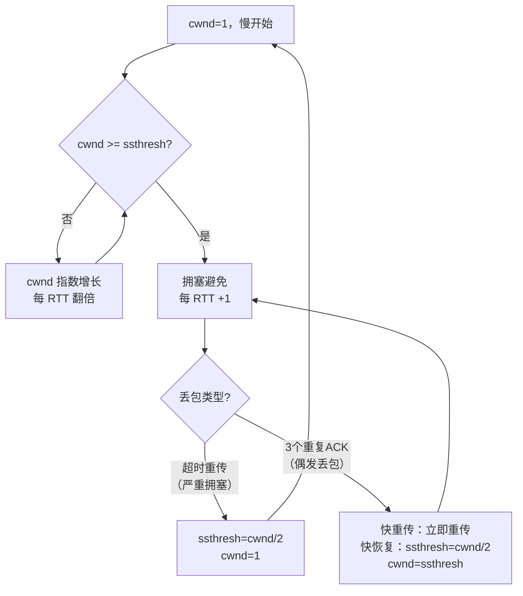

---
{"dg-publish":true,"permalink":"/66.归档发布/10.网络/TCP的拥塞算法/","dg-note-properties":{"时间":"2026-03-21"}}
---

#网络 #TCP #面试

```ad-summary
title: 总结

- TCP 拥塞控制有四个算法：慢开始、拥塞避免、快重传、快恢复
- cwnd（拥塞窗口）和 ssthresh（慢开始门限）是两个核心状态变量
- 慢开始：cwnd 指数增长；拥塞避免：cwnd 线性 +1
- 超时重传（严重拥塞）：ssthresh 减半，cwnd 归 1，重新慢开始
- 收到 3 个重复 ACK（轻微丢包）：快重传 + 快恢复，cwnd 降到 ssthresh，不归 1
```

## 1. 两个核心变量

- **cwnd（拥塞窗口）**：发送方根据网络状况动态调整的发送窗口，控制每次能发多少数据
- **ssthresh（慢开始门限）**：区分慢开始和拥塞避免两种算法的阈值

两者的关系决定使用哪种算法：

| 条件 | 使用算法 |
|---|---|
| `cwnd < ssthresh` | 慢开始（指数增长） |
| `cwnd > ssthresh` | 拥塞避免（线性增长） |
| `cwnd = ssthresh` | 两者均可 |

## 2. 慢开始


名字叫"慢开始"，其实增长很快——每收到一个 ACK，cwnd +1，每经过一个 RTT，cwnd 翻倍，是**指数增长**。

```
cwnd 变化：1 → 2 → 4 → 8 → 16 ...
```

"慢"指的是初始 cwnd 从 1 开始，而不是增长慢。

## 3. 拥塞避免

当 cwnd 增长到 ssthresh 时，切换为拥塞避免算法：每经过一个 RTT，cwnd **线性 +1**，增长变缓，探测网络是否还有余量。

```
cwnd 变化：16 → 17 → 18 → 19 → 20 ...（假设 ssthresh=16）
```

## 4. 超时重传：严重拥塞的处理

如果发送方等待 ACK 超时，说明网络可能发生了严重拥塞，处理方式最激进：

1. **ssthresh = cwnd / 2**（减半）
2. **cwnd 归 1**
3. 重新执行慢开始算法

```
假设 cwnd=24 时超时：
ssthresh = 24 / 2 = 12
cwnd = 1，重新慢开始
```

## 5. 快重传


超时重传的问题：超时等待时间较长，吞吐量下降明显。但很多时候丢包只是偶发的，并不代表网络真的拥塞。

快重传的触发条件：**收到 3 个连续的重复 ACK**（即接收方连续三次确认同一个序号），发送方立刻重传对应报文段，不等超时。

> 接收方收到乱序报文时，会立即发送重复 ACK 告知发送方期望的序号。连续 3 个重复 ACK 说明后续包到了但中间某个包丢了，大概率是偶发丢包而非拥塞。

## 6. 快恢复


快重传之后配合快恢复，不像超时重传那样把 cwnd 归 1：

1. **ssthresh = cwnd / 2**（减半）
2. **cwnd = ssthresh**（直接降到新门限，而不是归 1）
3. 执行拥塞避免算法（线性增长）

```
假设 cwnd=24 时收到 3 个重复 ACK：
ssthresh = 24 / 2 = 12
cwnd = 12，直接进入拥塞避免
```

相比超时重传，快恢复保留了更大的 cwnd，恢复速度快得多。

## 7. 两种丢包处理对比

| | 超时重传 | 快重传 + 快恢复 |
|---|---|---|
| 触发条件 | ACK 超时 | 收到 3 个重复 ACK |
| 判断 | 严重拥塞 | 偶发丢包 |
| ssthresh | 减半 | 减半 |
| cwnd | 归 1 | 降到新 ssthresh |
| 后续算法 | 慢开始 | 拥塞避免 |
| 恢复速度 | 慢 | 快 |

## 8. 完整流程


